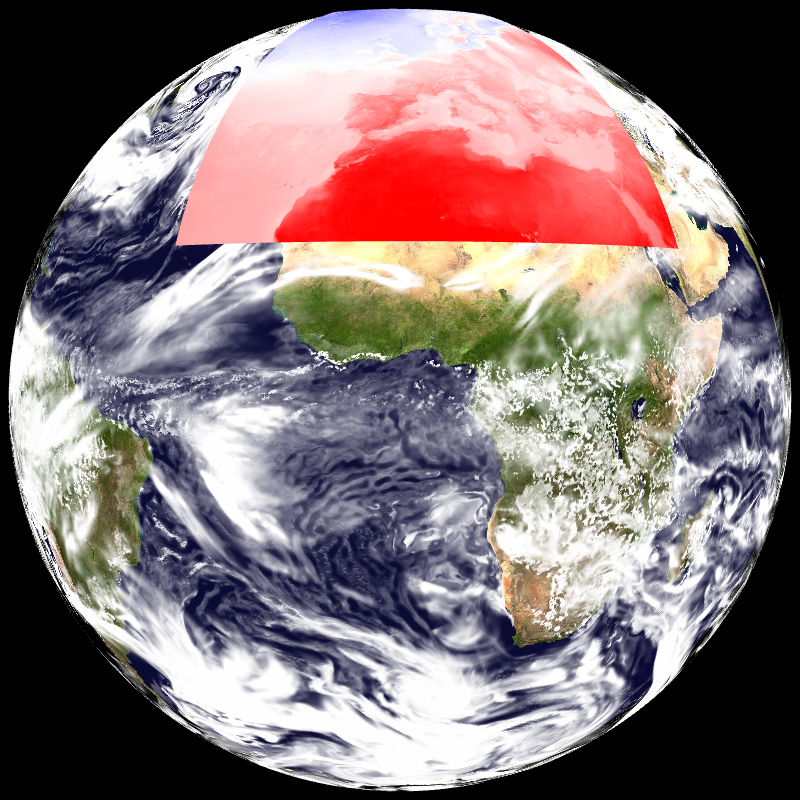

## Clouds, 3 layers, t1198c2.2 -- t1198_3l


```
    --landscape.on --landscape.grid.path share/data/t1198c2.2/Z.grb 
    --field[0].path share/data/t1198c2.2/SURFNEBUL.BASSE.grb 
    --field[1].path share/data/t1198c2.2/SURFNEBUL.MOYENN.grb 
    --field[2].path share/data/t1198c2.2/SURFNEBUL.HAUTE.grb 
    --field[0].scale 1.03 --field[1].scale 1.04 --field[2].scale 1.05 
    --field[0].palette.name cloud --field[1].palette.name cloud 
    --field[2].palette.name cloud 
```
## Clouds, 3 layers, t1798c2.2 -- t1798_3l


```
    --landscape.on --landscape.grid.path share/data/t1798/Z.grb 
    --field[0].path share/data/t1798/SURFNEBUL.BASSE.grb --field[1].path 
    share/data/t1798/SURFNEBUL.MOYENN.grb --field[2].path 
    share/data/t1798/SURFNEBUL.HAUTE.grb --field[0].scale 1.03 
    --field[1].scale 1.04 --field[2].scale 1.05 --field[0].palette.name 
    cloud --field[1].palette.name cloud --field[2].palette.name cloud 
```
## Temperature field on Europe, over global cloud fields -- eurat01


```
    --landscape.on --landscape.grid.path share/data/t1198c2.2/Z.grb 
    --field[0].path share/data/t1198c2.2/N.grb --field[1].path 
    share/data/eurat01/lfpw_0_0_0_pl_1000_t.grib2 --field[0].scale 1.02 
    --field[1].scale 1.03 --field[0].palette.name cloud_auto 
    --field[1].palette.name cold_hot 
```
