## Medium-res contour and raster, global geometry -- contour_latlon4


```
    --render.width 1024 --render.height 1024 --field[0].path 
    share/data/glob025/lfpw_0_0_0_pl_1000_t.grib2 --field[1].path 
    share/data/glob025/lfpw_0_0_0_pl_1000_t.grib2 
    --field[1].palette.colors black --field[1].type CONTOUR 
    --field[1].scale 1.001 
```
## Low-res contour -- contour1
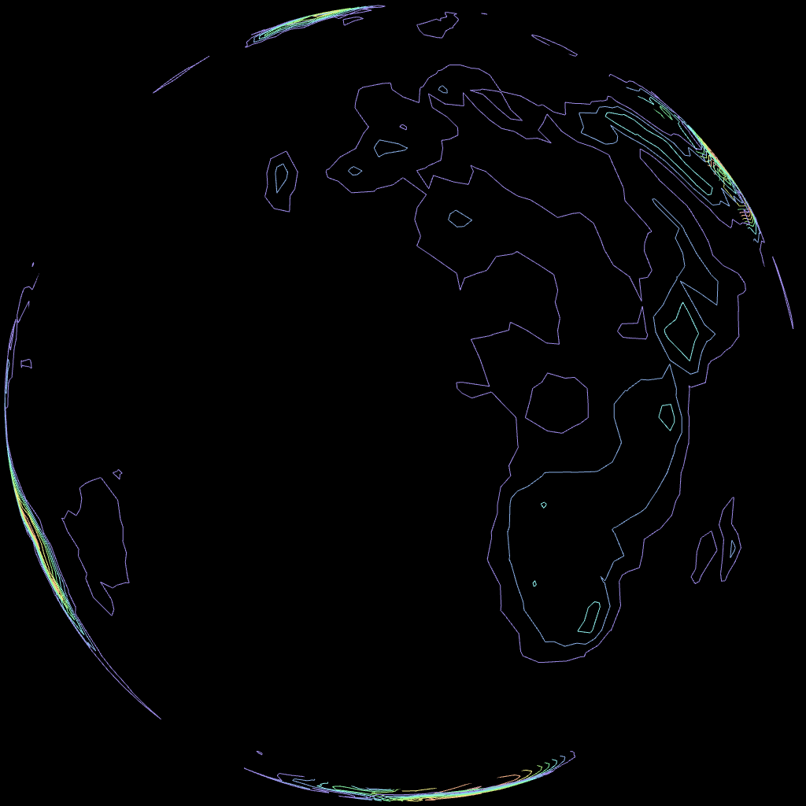

```
    --render.width 1024 --render.height 1024 --landscape.on 
    --landscape.path landscape/black.bmp --field[0].path 
    share/data/contour/t0049.grb --field[0].scale 1.03 --field[0].type 
    CONTOUR 
```
## Medium-res contour -- contour2
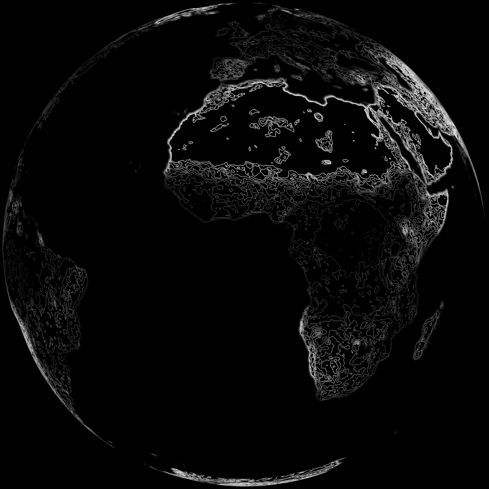

```
    --render.width 1024 --render.height 1024 --landscape.on 
    --landscape.path landscape/black.bmp --field[0].path 
    share/data/contour/t0479.grb --field[0].scale 1.03 --field[0].type 
    CONTOUR 
```
## High-res contour -- contour3
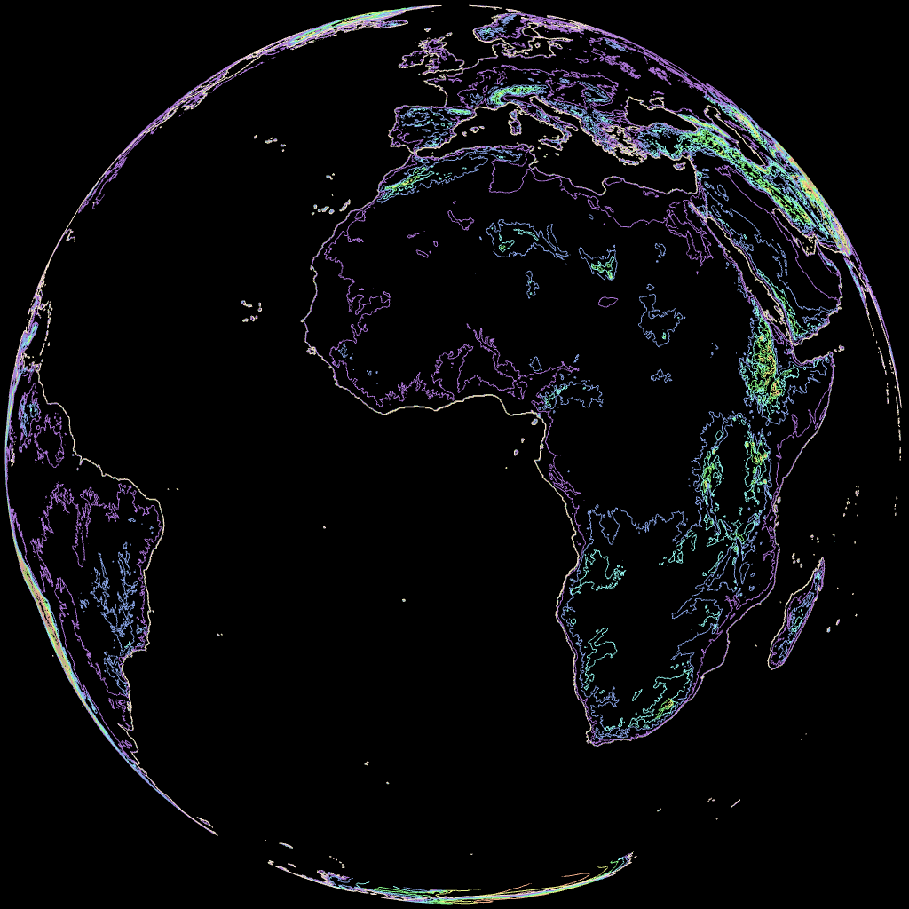

```
    --render.width 1024 --render.height 1024 --landscape.on 
    --landscape.path landscape/black.bmp --field[0].path 
    share/data/contour/t1798.grb --field[0].scale 1.03 --field[0].type 
    CONTOUR 
```
## Contour & raster, Lambert geometry -- contour_aro1
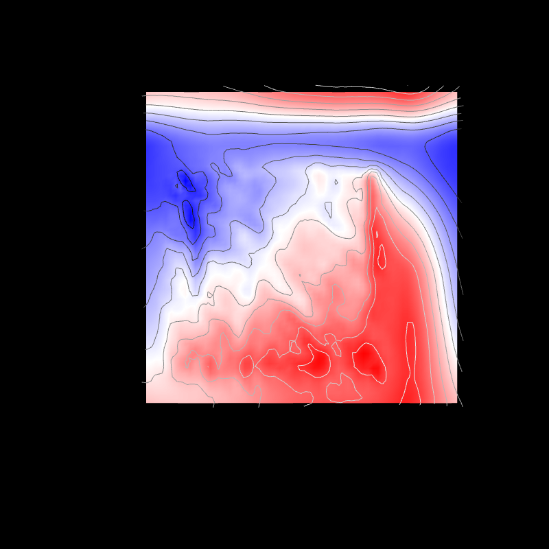

```
    --field[0].path share/data/aro_small/S041WIND.U.PHYS.grb 
    --field[0].scale 1.00 --field[0].palette.name cold_hot --field[1].path 
    share/data/aro_small/S041WIND.U.PHYS.grb --field[1].scale 1.03 
    --field[1].type CONTOUR --view.lon 26.64 --view.lat 67.36 --view.fov 
    0.5 --coast.on --grid.on 
```
## Contour & raster, Lambert geometry -- contour_aro2
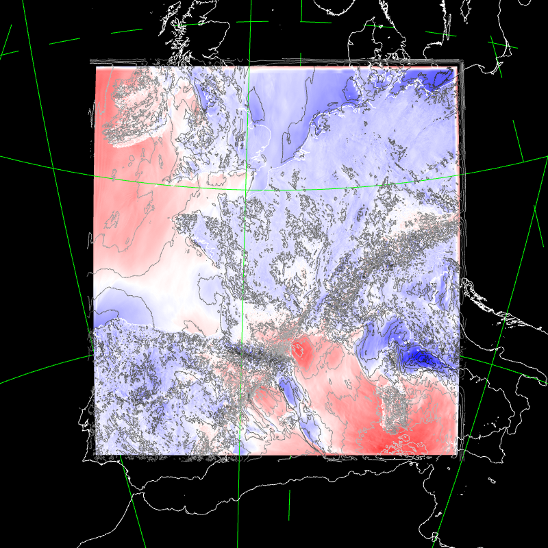

```
    --field[0].path share/data/aro2.5/S090WIND.U.PHYS.grb --field[0].scale 
    1.00 --field[0].palette.name cold_hot --field[1].path 
    share/data/aro2.5/S090WIND.U.PHYS.grb --field[1].scale 1.03 
    --field[1].type CONTOUR --view.lat 46.2 --view.lon 2.0 --view.fov 5 
    --coast.on --grid.on 
```
## Low-res simple contour, limited area lat/lon geometry -- contour_latlon1
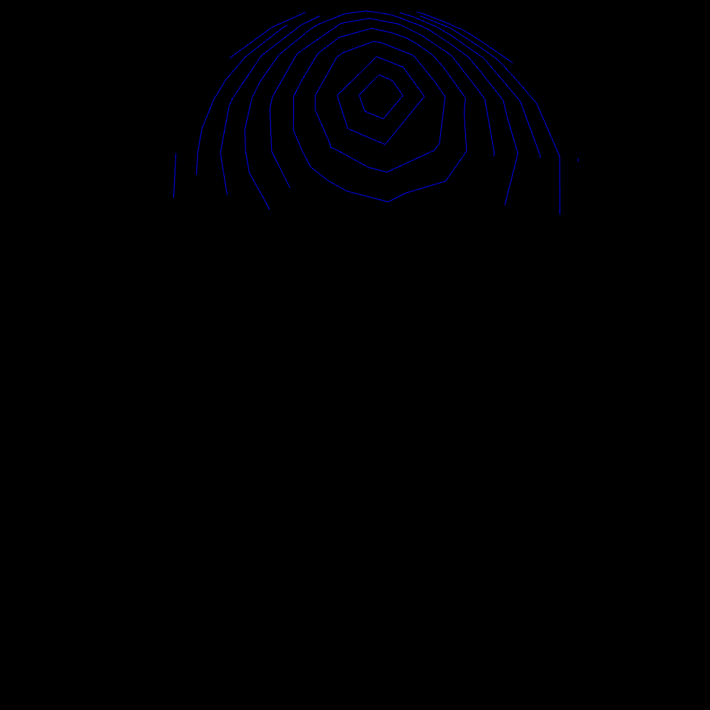

```
    --render.width 1024 --render.height 1024 --landscape.on 
    --landscape.path landscape/black.bmp --field[0].path 
    share/data/contour/latlon9x6.grb --field[0].scale 1.03 --field[0].type 
    CONTOUR 
```
## Low-res simple contour, limited area lat/lon geometry -- contour_latlon2
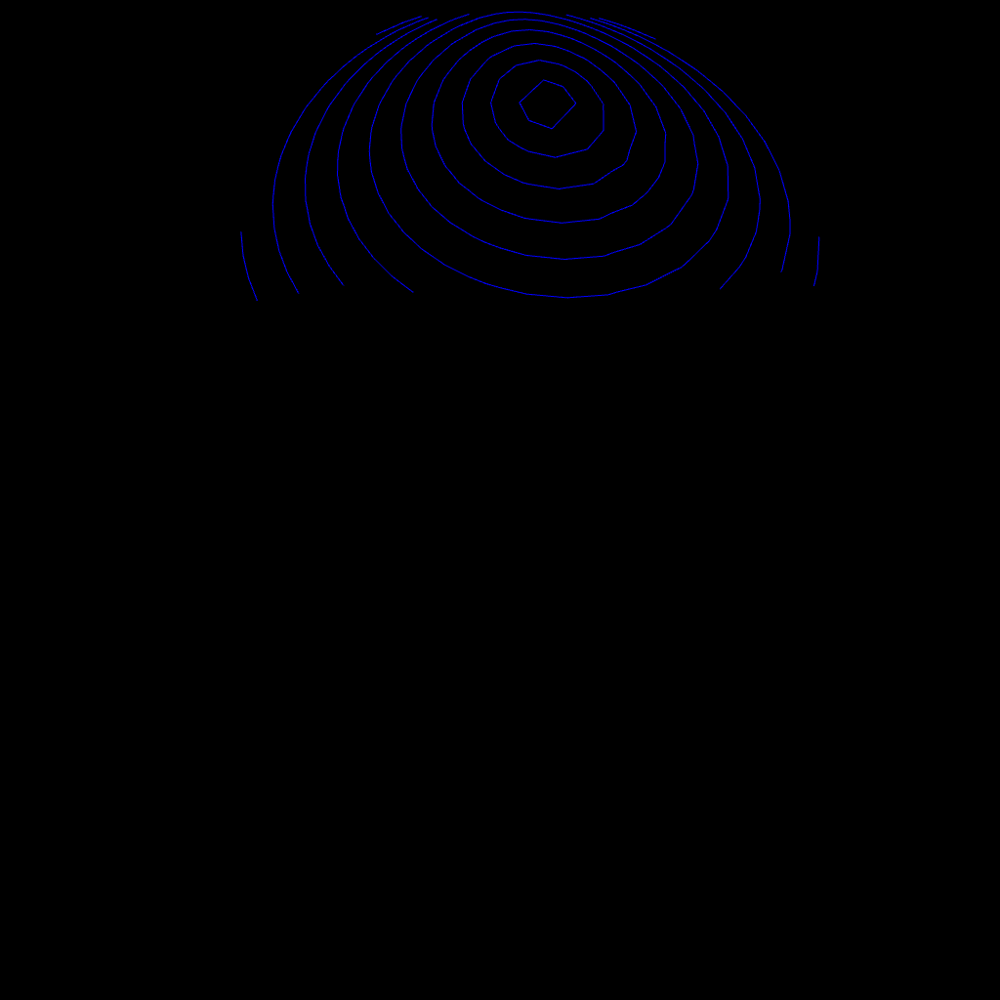

```
    --render.width 1024 --render.height 1024 --landscape.on 
    --landscape.path landscape/black.bmp --field[0].path 
    share/data/contour/latlon18x13.grb --field[0].scale 1.03 
    --field[0].type CONTOUR 
```
## Medium-res contour, limited area lat/lon geometry -- contour_latlon3
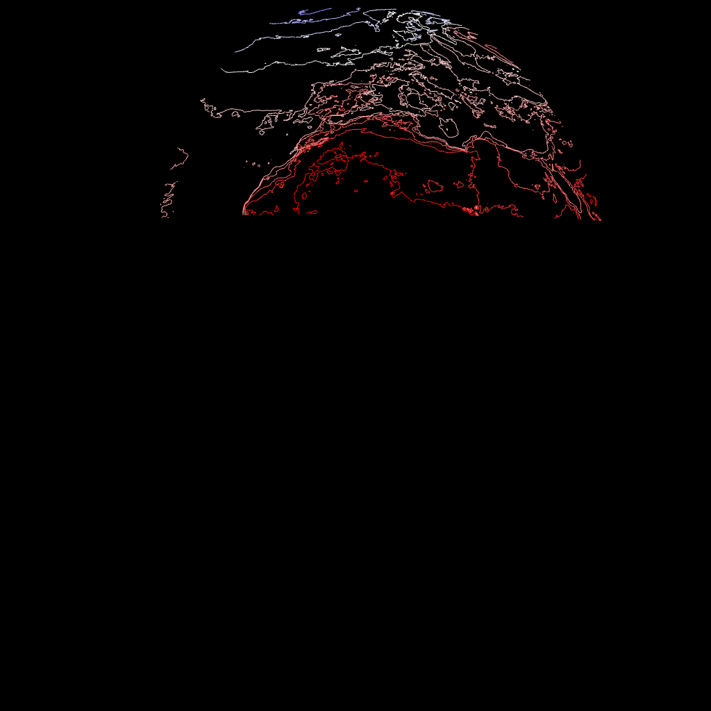

```
    --render.width 1024 --render.height 1024 --landscape.on 
    --landscape.path landscape/black.bmp --field[0].path 
    share/data/eurat01/lfpw_0_0_0_pl_1000_t.grib2 --field[0].scale 1.03 
    --field[0].type CONTOUR 
```
## Contour on stretched/rotated gaussian geometry -- contour_stretched
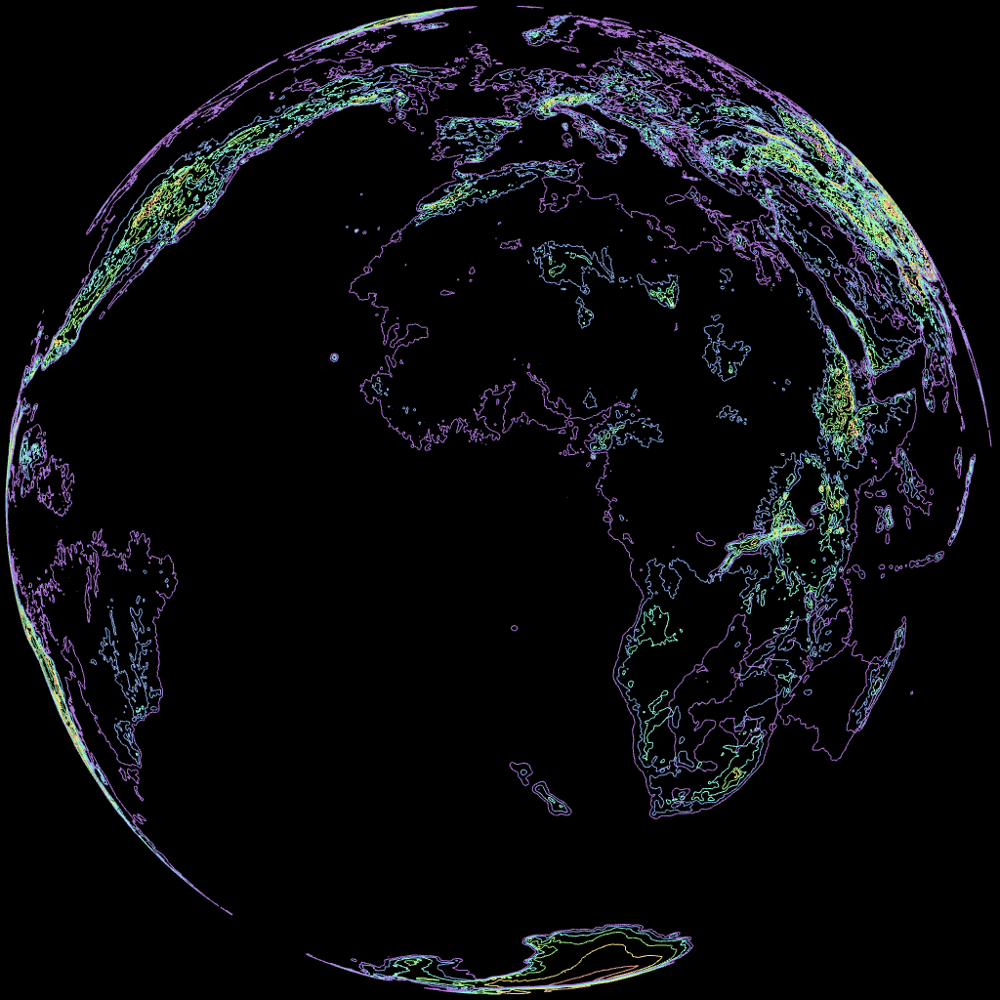

```
    --render.width 1024 --render.height 1024 --field[0].path 
    share/data/t1198c2.2/Z.grb --field[0].scale 1.03 --field[0].type 
    CONTOUR 
```
## Contour with dashed lines, gaussian geometry -- dashed1
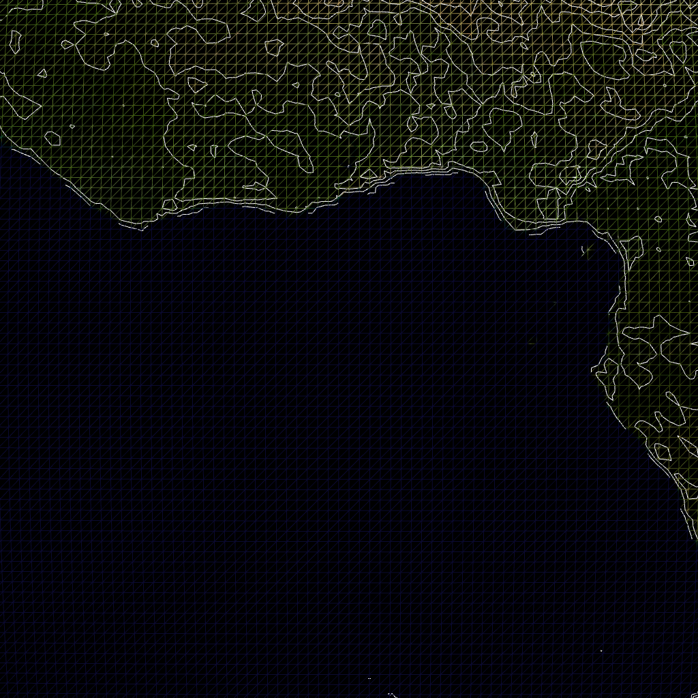

```
    --landscape.on --landscape.wireframe.on --landscape.grid.path 
    share/data/contour/t0479.grb --render.width 1024 --render.height 1024 
    --field[0].palette.colors white --field[0].path 
    share/data/contour/t0479.grb --field[0].scale 1.00 --field[0].type 
    CONTOUR --field[0].contour.lengths 100 --field[0].contour.patterns X- 
    --view.fov 5 
```
## Contour with dashed thick lines, gaussian geometry -- dashed2
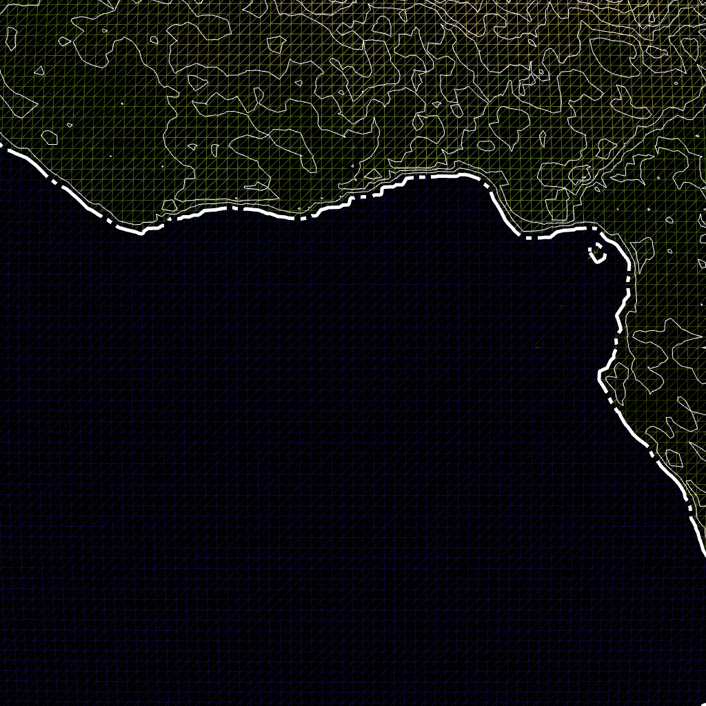

```
    --landscape.on --landscape.wireframe.on --landscape.grid.path 
    share/data/contour/t0479.grb --render.width 1024 --render.height 1024 
    --field[0].palette.colors white --field[0].path 
    share/data/contour/t0479.grb --field[0].scale 1.01 --field[0].type 
    CONTOUR --field[0].contour.lengths 100 --field[0].contour.patterns 
    XXXXXXXXX-X- --view.fov 5 --field[0].contour.widths 5 
```
## Contour with dashed thick colored lines, gaussian geometry -- dashed3
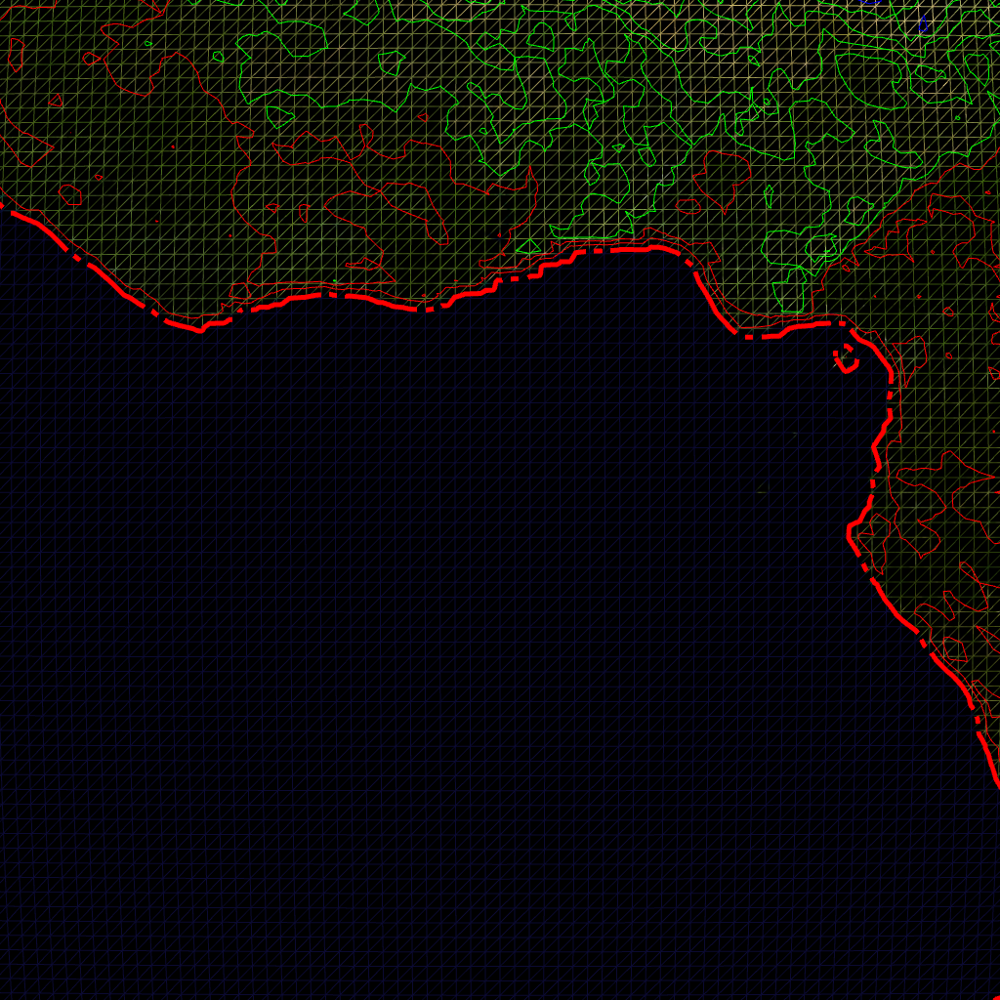

```
    --landscape.on --landscape.wireframe.on --landscape.grid.path 
    share/data/contour/t0479.grb --render.width 1024 --render.height 1024 
    --field[0].path share/data/contour/t0479.grb --field[0].scale 1.01 
    --field[0].type CONTOUR --field[0].contour.lengths 100 
    --field[0].contour.patterns XXXXXXXXX-X- --view.fov 5 
    --field[0].contour.widths 5 --field[0].palette.colors red green blue 
```
## Contour shading -- contour5
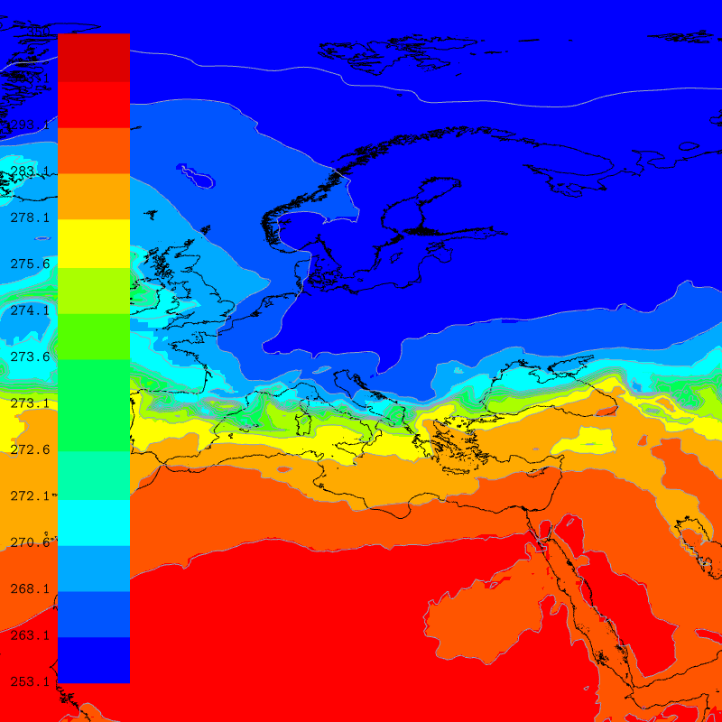

```
    --field[0].path share/data/t850.grb --field[0].palette-{ --colors 
    #0000ff #0055ff #00aaff #00ffff #00ffaa #00ff55 #00ff55 #55ff00 
    #aaff00 #ffff00 #ffaa00 #ff5500 #ff0000 #dd0000 --values 253.15 263.15 
    268.15 270.65 272.15 272.65 273.15 273.65 274.15 275.65 278.15 283.15 
    293.15 303.15 350 }- --coast.on --coast.lines.color black 
    --view.projection LATLON --view.lat 46.7 --view.lon 15 --view.fov 4 
    --field[1].path share/data/t850.grb --field[1].type contour 
    --field[1].palette.colors #95a3c0 --colorbar.on 
    --colorbar.font.color.foreground black --field[1].contour.levels 
    253.15 263.15 268.15 270.65 272.15 272.65 273.15 273.65 274.15 275.65 
    278.15 283.15 293.15 303.15 --field[0].palette.linear.on 
```
## 2m temperature -- contour9
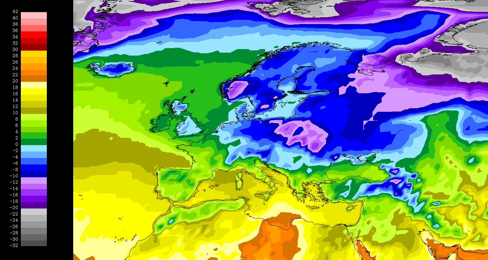

```
    --field[0]-{ --path share/data/2m_temperature.grib --palette.values 
    241.15 243.15 245.15 247.15 249.15 251.15 253.15 255.15 257.15 259.15 
    261.15 263.15 265.15 267.15 269.15 271.15 273.15 275.15 277.15 279.15 
    281.15 283.15 285.15 287.15 289.15 291.15 293.15 295.15 297.15 299.15 
    301.15 303.15 305.15 307.15 309.15 311.15 313.15 315.15 
    --palette.colors #4c4c4cff #666666ff #7f7f7fff #999999ff #b2b2b2ff 
    #ccccccff #590099ff #7f00e5ff #9933ffff #bf66ffff #d899ffff #0000bfff 
    #0000ffff #3366ffff #66b2ffff #99e5ffff #008c30ff #26bf19ff #7fd800ff 
    #a5f200ff #ccff33ff #a5a500ff #cccc00ff #eaea00ff #ffff00ff #ffff99ff 
    #d87200ff #ff7f00ff #ff9e00ff #ffbc00ff #ffd800ff #990000ff #cc0000ff 
    #ff0000ff #ff6666ff #ff9999ff #ffbfbfff --palette.offset -273.15 
    --palette.linear.on }- --colorbar.on --coast.on --coast.lines.color 
    black --view.projection LATLON --render.width 1500 --view.lon 10 
    --view.lat 52 --view.fov 3 --view.clip.xmin 0.15 
```
## Z500, T850 -- z500t850
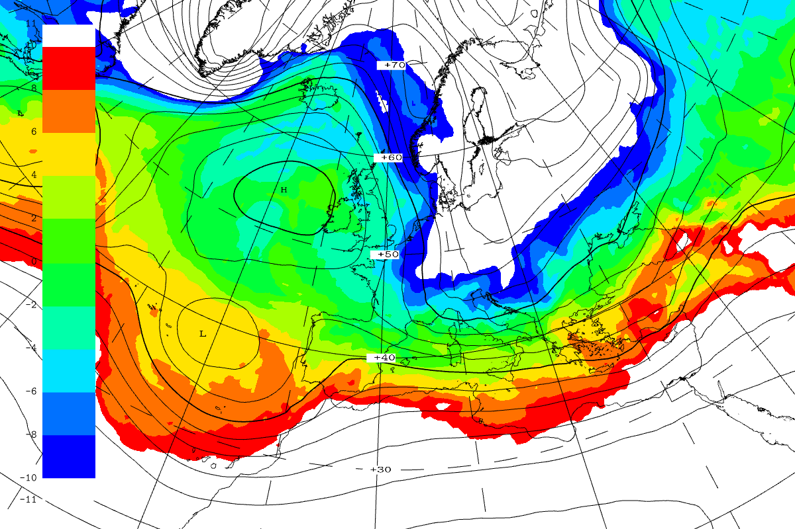

```
    --coast.lines.color black --coast.on --colorbar.font.color.foreground 
    black --colorbar.on --field[0].palette.colors #ffffffff #0000ffff 
    #0071ffff #00e3ffff #00ffaaff #00ff39ff #39ff00ff #aaff00ff #ffe300ff 
    #ff7100ff #ff0000ff #ffffffff --field[0].palette.offset -273.15 
    --field[0].palette.values 262.15 263.15 265.15 267.15 269.15 271.15 
    273.15 275.15 277.15 279.15 281.15 283.15 284.15 --field[0].path 
    share/data/t850.grb --field[1].contour.levels 47000 47500 48000 48500 
    49000 49500 50000 50500 51000 51500 52000 52500 53000 53500 54000 
    54500 55000 55500 56000 56500 57000 57500 --field[1].contour.widths 0 
    0 0 0 0 0 0 0 0 0 0 0 1 0 0 0 1 0 0 0 0 0 0 
    --field[1].hilo.font.color.foreground black 
    --field[1].hilo.font.bitmap.scale 0.02 --field[1].hilo.on 
    --field[1].palette.colors black --field[1].path share/data/z500.grb 
    --field[1].type CONTOUR --grid.color black 
    --grid.labels.font.color.background white 
    --grid.labels.font.color.foreground black 
    --grid.labels.font.bitmap.scale 0.02 --grid.labels.on --grid.on 
    --grid.resolution 18 --view.fov 5 --view.lat 49 --view.lon 2 
    --view.projection POLAR_NORTH --render.width 1200 
```
## Joachim storm -- joachim
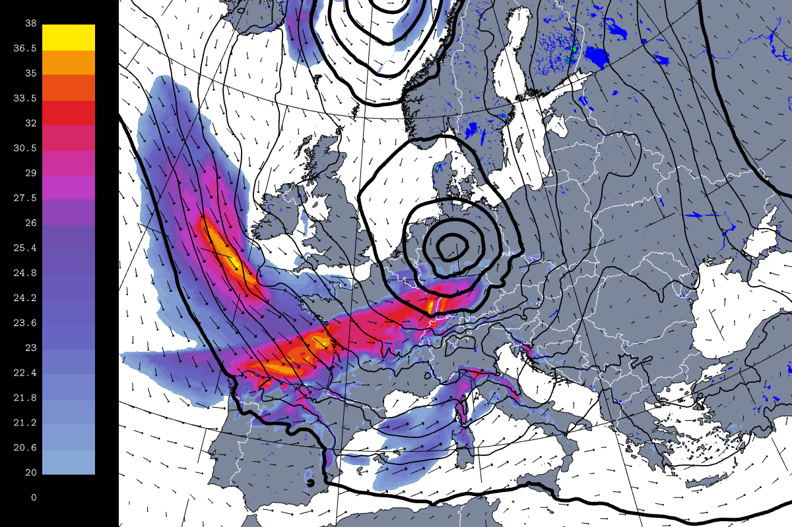

```
    --field[0].scale 1.0005 --field[0].path 
    share/data/joachim_surf.grib%stepRange="18-24",shortName="10fg6" 
    --field[0].palette.values 0 20 20.6 21.2 21.8 22.4 23 23.6 24.2 24.8 
    25.4 26 27.5 29 30.5 32 33.5 35 36.5 38 --field[0].palette.colors 
    #00000000 #88a8d6ff #819cd2ff #7a8fceff #7382caff #6c74c6ff #6666c2ff 
    #6760bdff #6959b8ff #6b53b4ff #6e4fadff #9045b8ff #bf3bc2ff #cc319dff 
    #d62869ff #e11e28ff #eb4e14ff #f5960aff #ffea01ff 
    --field[0].palette.linear.on --colorbar.on --field[1].path 
    share/data/joachim_surf.grib%stepRange=24,shortName="10u" 
    share/data/joachim_surf.grib%stepRange=24,shortName="10v" 
    --field[1].scale 1.001 --field[1].type vector 
    --field[1].vector.norm.off --field[1].vector.arrow.color black 
    --field[1].vector.density 20 --field[2].path 
    share/data/joachim_surf.grib%stepRange=24,shortName="msl" 
    --field[2].scale 1.001 --field[2].type contour 
    --field[2].palette.colors black --field[2].contour.levels 97000 97500 
    98000 98500 99000 99500 100000 100500 101000 101500 102000 
    --field[2].contour.widths 3 3 3 3 1 1 1 1 1 1 3 --render.width 1200 
    --grid.on --grid.color black --grid.resolution 18 --coast.on 
    --coast.lines.color black --coast.lines.path 
    coastlines/gshhg/GSHHS_bin/gshhs_i.b --border.on --border.lines.path 
    coastlines/gshhg/WDBII_bin/wdb_borders_i.b --view.clip.xmin 0.15 
    --view.projection POLAR_NORTH --land.on --land.layers[0].color 
    #7c879cff --land.layers[0].path coastlines/shp/GSHHS_i_L1.shp 
    --land.layers[1].path coastlines/shp/GSHHS_i_L2.shp 
    --land.layers[2].path coastlines/shp/GSHHS_i_L3.shp 
    --land.layers[3].path coastlines/shp/GSHHS_i_L5.shp --landscape.on 
    --landscape.path  --landscape.color white --landscape.scale 0.999 
    --view.lon 4 --view.lat 51 --view.fov 3 
```
## Precipitations Europe -- precipeurope
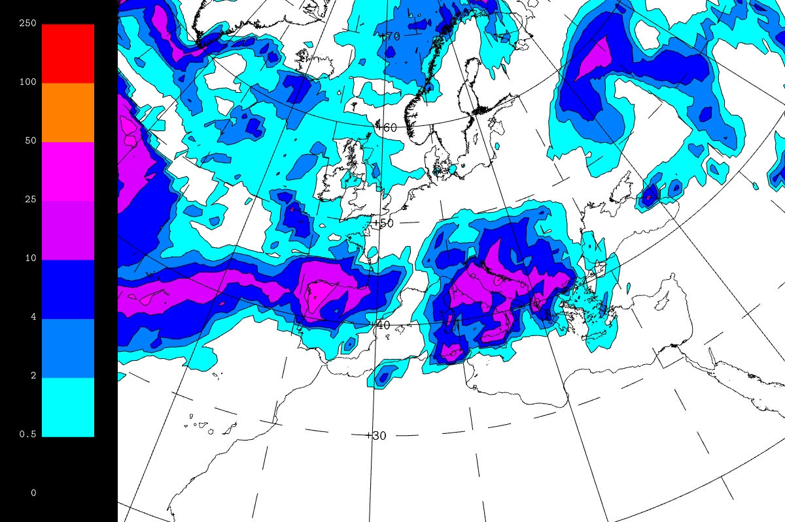

```
    --field[0].path share/data/total_precipitation.grib --coast.on 
    --coast.lines.color black --landscape.color white --landscape.scale 
    0.999 --landscape.on --field[0].palette.colors #00000000 #00ffff 
    #0080ff #0000ff #da00ff #ff00ff #ff8000 #ff0000 
    --field[0].palette.values 0. 0.0005 0.002 0.004 0.010 0.025 0.050 
    0.100 0.250 --colorbar.on --field[0].palette.linear.on --field[0].type 
    ISOFILL --render.width 1200 --field[0].isofill.levels 0. 0.0005 0.002 
    0.004 0.010 0.025 0.050 0.100 0.250 --field[1].type CONTOUR 
    --field[1].path share/data/total_precipitation.grib --field[1].scale 
    1.001 --field[1].contour.levels 0. 0.0005 0.002 0.004 0.010 0.025 
    0.050 0.100 0.250 --field[1].palette.colors black 
    --colorbar.font.color.foreground white --view.lon 2 --view.lat 46.2 
    --view.fov 5 --view.projection POLAR_NORTH --grid.on --grid.color 
    black --grid.labels.on --grid.labels.font.color.foreground black 
    --grid.labels.font.bitmap.scale 0.03 --grid.resolution 18 
    --field[0].palette.scale 1000 --colorbar.font.color.background black 
    --view.clip.xmin 0.15 
```
## Precipitations Europe (precise, with fixed palette) -- precipfixed
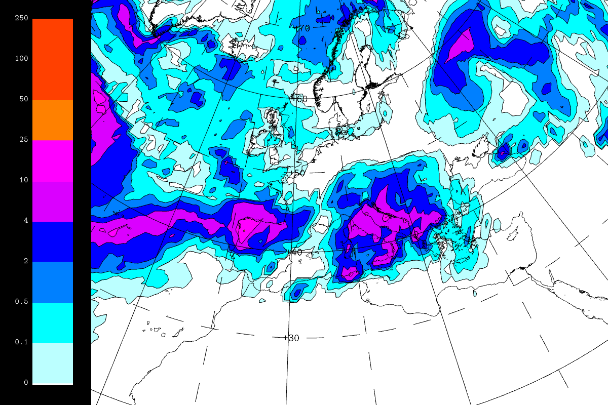

```
    --field[0].path share/data/total_precipitation.grib 
    --field[0].palette.colors #00000000 #bbffff #00ffff #0080ff #0000ff 
    #da00ff #ff00ff #ff8000 #ff0000 --field[0].palette.values 0. 0.0001 
    0.0005 0.002 0.004 0.010 0.025 0.050 0.100 0.250 
    --field[0].palette.linear.on --field[0].type ISOFILL 
    --field[0].palette.fixed.on --field[0].isofill.levels 0. 0.0001 0.0005 
    0.002 0.004 0.010 0.025 0.050 0.100 0.250 --coast.on 
    --coast.lines.color black --landscape.color white --landscape.scale 
    0.999 --landscape.on --render.width 1200 --grid.labels.on 
    --grid.labels.font.color.foreground black 
    --grid.labels.font.bitmap.scale 0.03 --grid.resolution 18 
    --field[0].palette.scale 1000 --view.lon 2 --view.lat 46.2 --view.fov 
    5 --view.projection POLAR_NORTH --grid.on --grid.color black 
    --colorbar.on --colorbar.font.color.background black --view.clip.xmin 
    0.15 --colorbar.font.color.foreground white --field[1].type CONTOUR 
    --field[1].path share/data/total_precipitation.grib --field[1].scale 
    1.001 --field[1].contour.levels 0. 0.0001 0.0005 0.002 0.004 0.010 
    0.025 0.050 0.100 0.250 --field[1].palette.colors black 
```
## Z500 -- z500europe
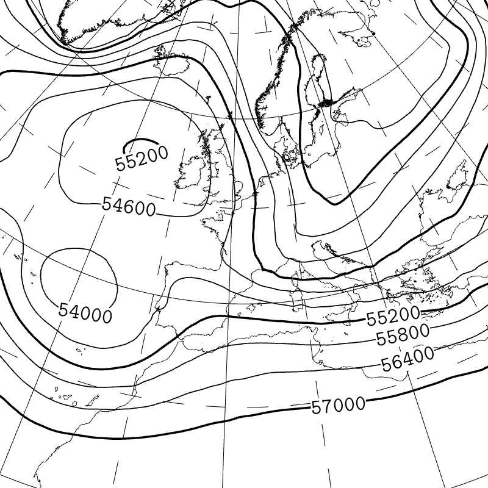

```
    --field[0]-{ --contour.labels.format %5.0f --contour.widths 1 2 1 1 2 
    1 1 2 1 1 2 --path share/data/z500.grb --type CONTOUR --palette.colors 
    black --contour.labels.on --contour.labels.font.color.foreground black 
    --contour.labels.font.color.background white --contour.levels 51000 
    51600 52200 52800 53400 54000 54600 55200 55800 56400 57000 }- 
    --landscape.on --landscape.scale 0.999 --landscape.color white 
    --coast.on --coast.lines.color black --view.lat 46.2 --view.lon 2 
    --view.fov 5 --grid.on --grid.color black --grid.resolution 18 
    --view.projection POLAR_NORTH 
```
## Temperature, contour, colors -- tempcontour
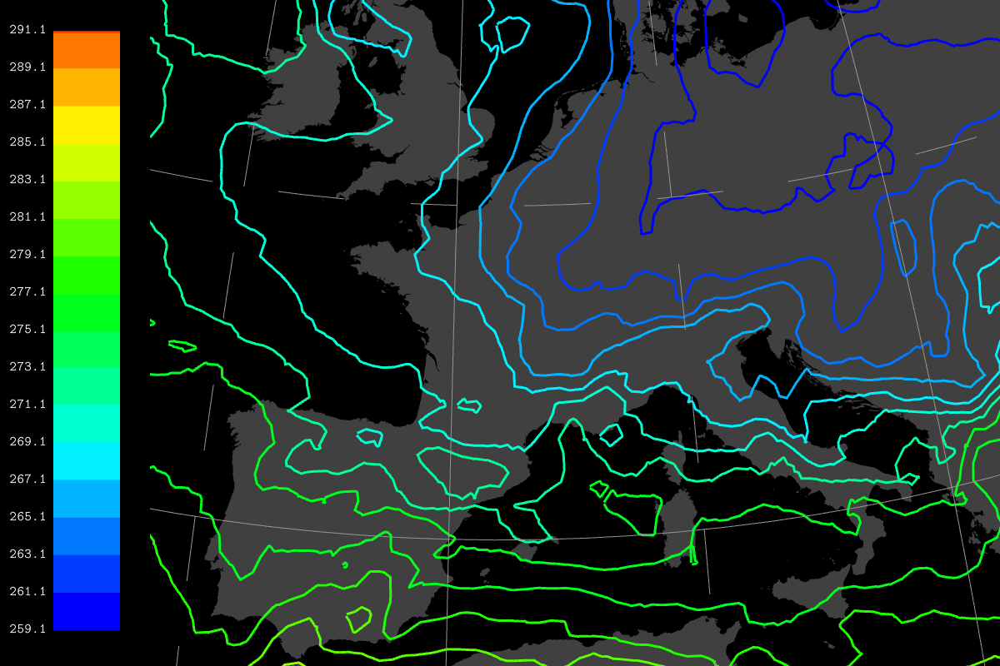

```
    --field[0].scale 1.001 --field[0].path share/data/t850.grib 
    --field[0].palette.colors #0000ff #003cff #0078ff #00b4ff #00f0ff 
    #00ffd2 #00ff96 #00ff5a #00ff1e #1eff00 #5aff00 #96ff00 #d2ff00 
    #fff000 #ffb400 #ff7800 #ff3c00 #ff0000 --field[0].palette.values 
    259.15 261.15 263.15 265.15 267.15 269.15 271.15 273.15 275.15 277.15 
    279.15 281.15 283.15 285.15 287.15 289.15 291.15 --colorbar.on 
    --render.width 1200 --field[0].type CONTOUR --field[0].contour.levels 
    259.15 261.15 263.15 265.15 267.15 269.15 271.15 273.15 275.15 277.15 
    279.15 281.15 283.15 285.15 287.15 289.15 --landscape.on 
    --landscape.color black --landscape.scale 0.999 --land.on --view.lon 2 
    --view.lat 46.2 --view.fov 4 --field[0].contour.widths 3 3 3 3 3 3 3 3 
    3 3 3 3 3 3 3 3 --land.layers[0].path coastlines/shp/GSHHS_h_L1.shp 
    --land.layers[0].color #404040 --view.clip.xmin 0.15 --grid.color grey 
    --grid.resolution 18 --grid.on 
```
