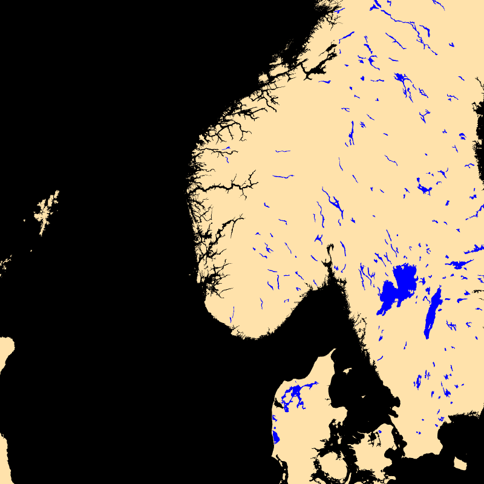
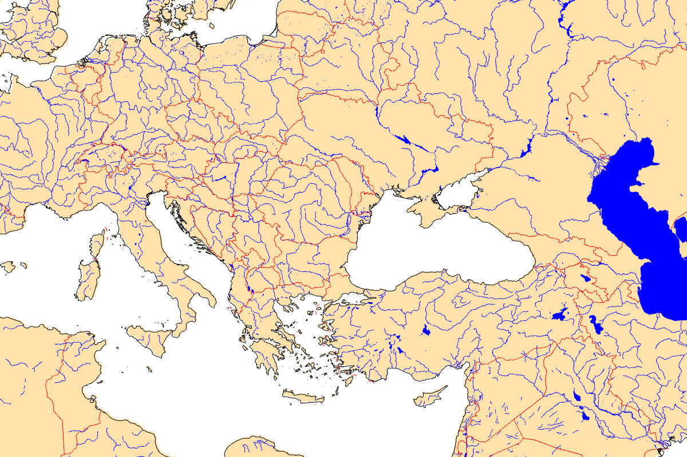

## Display land surface                                              -- land


```
    --land.on 
```
## Display land surface (high resolution)                            -- land_high


```
    --land.on --land.layers[0].path coastlines/shp/GSHHS_h_L1.shp 
    --land.layers[1].path coastlines/shp/GSHHS_h_L2.shp 
    --land.layers[2].path coastlines/shp/GSHHS_h_L3.shp 
    --land.layers[3].path coastlines/shp/GSHHS_h_L5.shp --view.lon 7 
    --view.lat 60 --view.fov 2 
```
## Coastlines                                                        -- coastlines


```
    --landscape.on --landscape.scale 0.999 --land.on --landscape.color 
    white --rivers.on --rivers.lines.color blue --border.on 
    --border.lines.color red --coast.on --coast.lines.color black 
    --coast.lines.path coastlines/gshhg/GSHHS_bin/gshhs_i.b 
    --land.layers[0].path coastlines/shp/GSHHS_i_L1.shp 
    --land.layers[1].path coastlines/shp/GSHHS_i_L2.shp --view.fov 5 
    --view.lat 44.5394 --view.lon 27.5924 --render.width 1200 
```
