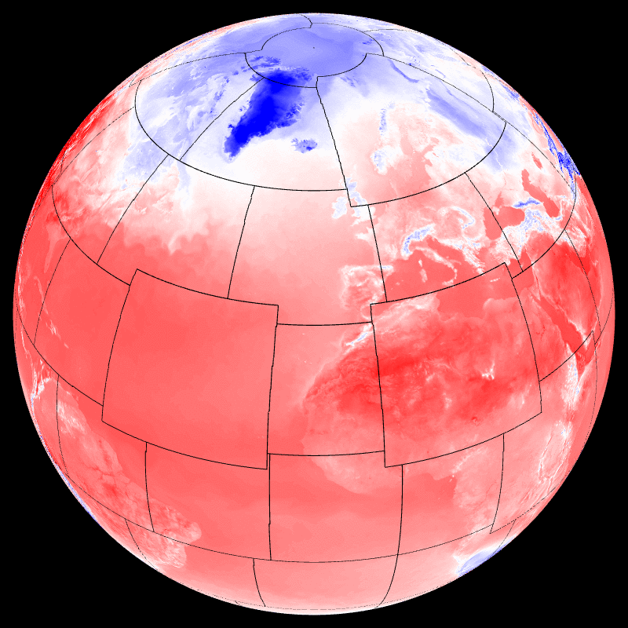

## Display sphere partitionning (t1198) -- myproc


```
    --field[0].scalar.discrete.on --field[0].path 
    share/data/discrete/MYPROC.grb --field[0].palette.colors green 
    --field[0].scalar.discrete.missing_color black 
    --field[0].palette.colors #00000000 --field[1].path 
    share/data/discrete/SURFTEMPERATURE.grb --field[1]-{ --palette.max 
    313.15 --palette.min 253.15 --palette.name cold_hot_temp }- --view.lat 
    36 --view.lon -15 
```
## Display sphere partitionning (t1192c2.2) -- myproc22


```
    --field[0].scalar.discrete.on --field[0].path 
    share/data/discrete_stretched/MYPROC.grb --field[0].palette.colors 
    green --field[0].scalar.discrete.missing_color black 
    --field[0].palette.colors #00000000 --field[1].path 
    share/data/discrete_stretched/SURFTEMPERATURE.grb --field[1]-{ 
    --palette.max 313.15 --palette.min 253.15 --palette.name cold_hot_temp 
    }- 
```
## MPI view -- mpiview


```
    --field[0].path share/data/discrete/SURFTEMPERATURE.grb 
    --field[0].mpiview.on --field[0].mpiview.path 
    share/data/discrete/MYPROC.grb --field[0].mpiview.scale 0.2 --view.lon 
    31 --view.lat 41 
```
## MPI halo -- mpihalo


```
    --field[0].scalar.widen.on --field[0].scalar.widen.values 24.0 69.0 
    19.0 75.0 42.0 8.0 71.0 41.0 --field[0].scalar.widen.radius 20 
    --field[0].scalar.discrete.on --field[0].path 
    share/data/discrete/MYPROC.grb --field[0].palette.colors green 
    --field[0].scalar.discrete.missing_color black 
    --field[0].palette.colors #00000000 --field[1].path 
    share/data/discrete/SURFTEMPERATURE.grb --field[1]-{ --palette.max 
    313.15 --palette.min 253.15 --palette.name cold_hot_temp }- --view.lat 
    36 --view.lon -15 
```
## MPI transpositions -- mpitrans


```
    --field[0].scalar.discrete.on --field[0].path 
    share/data/discrete/MYPROC.grb 
    --field[0].scalar.discrete.missing_color black 
    --field[0].palette.colors #00000000 --field[1].path 
    share/data/discrete/SURFTEMPERATURE.grb --field[1]-{ --palette.max 
    313.15 --palette.min 253.15 --palette.name cold_hot_temp }- --view.lat 
    36 --view.lon -15 
```
