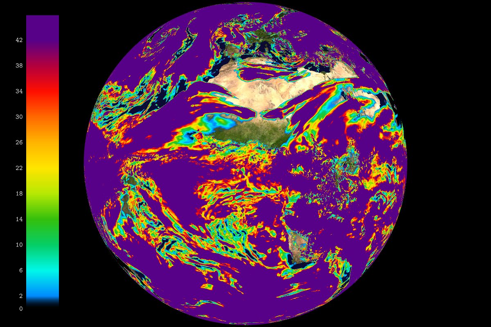
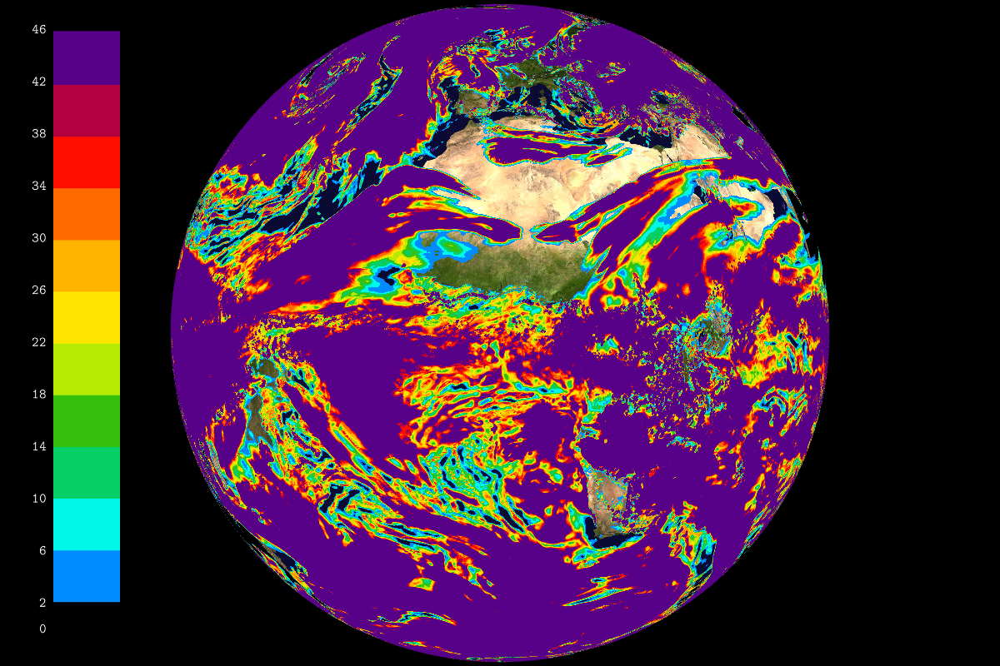

## Select palette automatically                                      -- bw


```
    --landscape.on --landscape.grid.path share/data/t1198c2.2/Z.grb 
    --field[0].path share/data/t1198c2.2/N.grb --field[0].scale 1.03 
```
## Display field with palette gradient color                         -- palette_values_grad


```
    --landscape.on --landscape.grid.path share/data/t1198c2.2/Z.grb 
    --field[0].path share/data/t1198c2.2/N.grb --field[0].scale 1.03 
    --field[0].palette-{ --colors #00000000 #008bff #01f8e9 #05cf66 
    #34c00c #b6e904 #ffe600 #ffb500 #ff6900 #ff0f00 #b3003e #570088 
    --values 0 2 6 10 14 18 22 26 30 34 38 42 --min 0 --max 46 }- 
    --colorbar.on --render.width 1200 
```
## Display field with discrete palette                               -- palette_values


```
    --landscape.on --landscape.grid.path share/data/t1198c2.2/Z.grb 
    --field[0].path share/data/t1198c2.2/N.grb --field[0].scale 1.03 
    --field[0].palette-{ --colors #00000000 #008bff #01f8e9 #05cf66 
    #34c00c #b6e904 #ffe600 #ffb500 #ff6900 #ff0f00 #b3003e #570088 
    --values 0 2 6 10 14 18 22 26 30 34 38 42 46 --min 0 --max 46 }- 
    --colorbar.on --render.width 1200 
```
