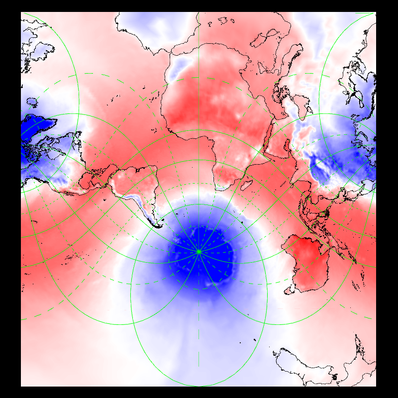
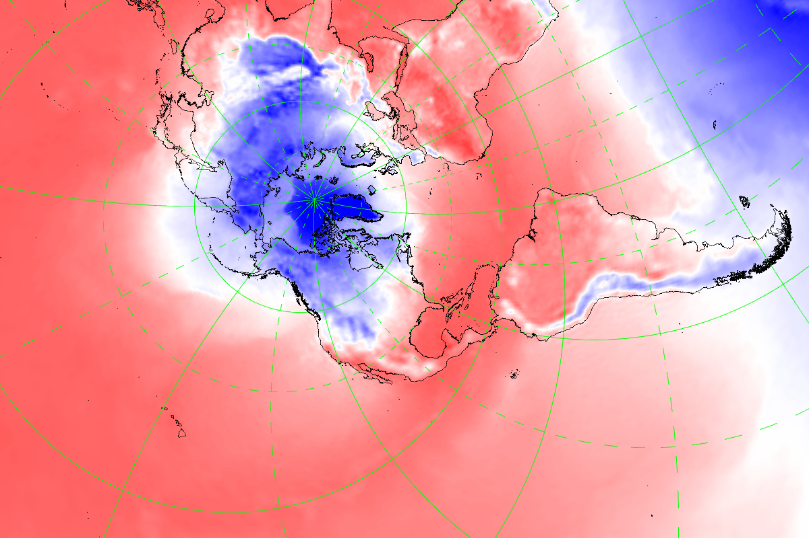

## Display contour field using Mercator projection -- mercator


```
    --field[0].diff.on --field[0].user_pref.off --field[0].type CONTOUR 
    --field[0].path share/data/glob01/lfpw_0_3_1_sfc_0_prmsl+0000.grib2 
    share/data/glob01/lfpw_0_3_1_sfc_0_prmsl+0102.grib2 --field[0].scale 
    1.01 --view.projection MERCATOR --landscape.on 
```
## Display contour field using different origin -- mercator_origin


```
    --field[0].path ./share/data/wind+temp/t0224/S105TEMPERATURE.grb 
    --grid.on --coast.on --coast.lines.color black --view.projection 
    MERCATOR --view.transformation PERSPECTIVE --view.lon 0 --view.lat -45 
    --view.roll 0 --view.pitch 0 --view.yaw 0 --view.fov 20 
    --view.distance 6 --view.center.on --view.clip --view.clip.on 
    --view.clip.dlon 10 --view.clip.dlat 5 --view.clip.xmin 0 
    --view.clip.xmax 1 --view.clip.ymin 0 --view.clip.ymax 1 --view.zoom 
    --view.zoom.off --view.zoom.lon 2 --view.zoom.lat 46.7 
    --view.zoom.stretch 0.5 --view.trans.on --view.trans.matrix 
    0.707106781186548 0 0.707106781186548 0 1 0 -0.707106781186548 0 
    0.707106781186548 
```
## Display contour field using different origin -- polar_origin


```
    --field[0].path ./share/data/wind+temp/t0224/S105TEMPERATURE.grb 
    --grid.on --coast.on --coast.lines.color black --render.width 1200 
    --render.height 800 --view.projection POLAR_NORTH 
    --view.transformation PERSPECTIVE --view.lon -73.4742 --view.lat 
    43.9614 --view.roll 0 --view.pitch 0 --view.yaw -2 --view.fov 21 
    --view.distance 6 --view.center.on --view.clip --view.clip.on 
    --view.clip.dlon 10 --view.clip.dlat 5 --view.clip.xmin 0 
    --view.clip.xmax 1 --view.clip.ymin 0 --view.clip.ymax 1 --view.zoom 
    --view.zoom.off --view.zoom.lon 2 --view.zoom.lat 46.7 
    --view.zoom.stretch 0.5 --view.trans.on --view.trans.matrix 
    0.707106781186548 0 0.707106781186548 0 1 0 -0.707106781186548 0 
    0.707106781186548 
```
