Display GRIB2 fields with OpenGL. Raster, contour, vector, colorbar, mapscale, coastlines, borders. Lat/lon, lambert, gaussian grid.
  ## Clouds, 3 layers, t1198c2.2                                       -- t1198_3l


```
    --landscape.on --landscape.geometry_path testdata/t1198c2.2/Z.grb 
    --field[0].path testdata/t1198c2.2/SURFNEBUL.BASSE.grb --field[1].path 
    testdata/t1198c2.2/SURFNEBUL.MOYENN.grb --field[2].path 
    testdata/t1198c2.2/SURFNEBUL.HAUTE.grb --field[0].scale 1.03 
    --field[1].scale 1.04 --field[2].scale 1.05 --field[0].palette.name 
    cloud --field[1].palette.name cloud --field[2].palette.name cloud 
```
## Clouds, 3 layers, t1798c2.2                                       -- t1798_3l


```
    --landscape.on --landscape.geometry_path testdata/t1798/Z.grb 
    --field[0].path testdata/t1798/SURFNEBUL.BASSE.grb --field[1].path 
    testdata/t1798/SURFNEBUL.MOYENN.grb --field[2].path 
    testdata/t1798/SURFNEBUL.HAUTE.grb --field[0].scale 1.03 
    --field[1].scale 1.04 --field[2].scale 1.05 --field[0].palette.name 
    cloud --field[1].palette.name cloud --field[2].palette.name cloud 
```
## AROME, Lambert geometry                                           -- aro


```
    --field[0].path testdata/aro2.5/SURFIND.TERREMER.grb 
    --field[0].palette.name cold_hot --field[0].scale 1.00 --view.lat 46.2 
    --view.lon 2.0 --view.fov 5 --coast.on --grid.on 
```
## AROME, Lambert geometry, polar stereo                             -- aro_polar
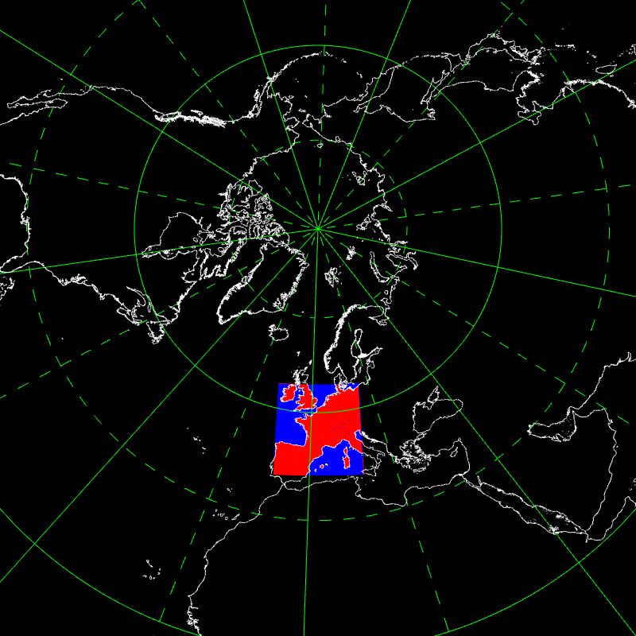

```
    --field[0].path testdata/aro2.5/SURFIND.TERREMER.grb 
    --field[0].palette.name cold_hot --field[0].scale 1.00 --view.lat 46.2 
    --view.lon 2.0 --view.fov 5 --coast.on --grid.on --view.projection 
    POLAR_NORTH --view.lat 70 --view.fov 12 
```
## Font background color                                             -- background


```
    --landscape.on --landscape.geometry_path testdata/t1198c2.2/Z.grb 
    --field[0].path testdata/t1198c2.2/N.grb --field[0].scale 1.03 
    --scene.date.on --scene.date.font.scale 0.03 
    --scene.date.font.color.foreground red 
    --scene.date.font.color.background white 
```
## Enable debug mode                                                 -- debug


```
    --landscape.on --landscape.geometry_path testdata/t1198c2.2/Z.grb 
    --field[0].path testdata/t1198c2.2/N.grb --field[0].scale 1.03 
    --window.debug.on 
```
## Select palette automatically                                      -- bw


```
    --landscape.on --landscape.geometry_path testdata/t1198c2.2/Z.grb 
    --field[0].path testdata/t1198c2.2/N.grb --field[0].scale 1.03 
```
## Cities                                                            -- cities


```
    --landscape.on --cities.on --cities.points.scale 1.01 
    --cities.points.size.value 1 --cities.points.size.variable.on 
    --view.lat 46.7 --view.lon 2 --view.fov 2 --cities.points.size.value 2 
    --cities.labels.on --cities.labels.font.color.foreground red 
    --cities.labels.font.scale 0.04 
```
## Colorbar                                                          -- colorbar


```
    --landscape.on --landscape.geometry_path testdata/t1198c2.2/Z.grb 
    --field[0].path testdata/t1198c2.2/N.grb --field[0].scale 1.03 
    --colorbar.on --colorbar.font.color.foreground green --window.width 
    1000 
```
## Low-res contour                                                   -- contour1


```
    --window.width 1024 --window.height 1024 --landscape.on 
    --landscape.path landscape/black.bmp --field[0].path 
    testdata/contour/t0049.grb --field[0].scale 1.03 --field[0].type 
    CONTOUR 
```
## Medium-res contour                                                -- contour2


```
    --window.width 1024 --window.height 1024 --landscape.on 
    --landscape.path landscape/black.bmp --field[0].path 
    testdata/contour/t0479.grb --field[0].scale 1.03 --field[0].type 
    CONTOUR 
```
## High-res contour                                                  -- contour3


```
    --window.width 1024 --window.height 1024 --landscape.on 
    --landscape.path landscape/black.bmp --field[0].path 
    testdata/contour/t1798.grb --field[0].scale 1.03 --field[0].type 
    CONTOUR 
```
## Contour & raster, Lambert geometry                                -- contour_aro1


```
    --field[0].path testdata/aro_small/S041WIND.U.PHYS.grb 
    --field[0].scale 1.00 --field[0].palette.name cold_hot --field[1].path 
    testdata/aro_small/S041WIND.U.PHYS.grb --field[1].scale 1.03 
    --field[1].type CONTOUR --view.lon 26.64 --view.lat 67.36 --view.fov 
    0.5 --coast.on --grid.on 
```
## Contour & raster, Lambert geometry                                -- contour_aro2


```
    --field[0].path testdata/aro2.5/S090WIND.U.PHYS.grb --field[0].scale 
    1.00 --field[0].palette.name cold_hot --field[1].path 
    testdata/aro2.5/S090WIND.U.PHYS.grb --field[1].scale 1.03 
    --field[1].type CONTOUR --view.lat 46.2 --view.lon 2.0 --view.fov 5 
    --coast.on --grid.on 
```
## Contour in diff mode, global lat/lon geometry                     -- contour_diff


```
    --field[0].diff.on --field[0].type CONTOUR --field[0].path 
    testdata/glob01/lfpw_0_3_1_sfc_0_prmsl+0000.grib2 
    testdata/glob01/lfpw_0_3_1_sfc_0_prmsl+0102.grib2 --field[0].scale 
    1.01 
```
## Low-res simple contour, limited area lat/lon geometry             -- contour_latlon1


```
    --window.width 1024 --window.height 1024 --landscape.on 
    --landscape.path landscape/black.bmp --field[0].path 
    testdata/contour/latlon9x6.grb --field[0].scale 1.03 --field[0].type 
    CONTOUR 
```
## Low-res simple contour, limited area lat/lon geometry             -- contour_latlon2


```
    --window.width 1024 --window.height 1024 --landscape.on 
    --landscape.path landscape/black.bmp --field[0].path 
    testdata/contour/latlon18x13.grb --field[0].scale 1.03 --field[0].type 
    CONTOUR 
```
## Medium-res contour, limited area lat/lon geometry                 -- contour_latlon3


```
    --window.width 1024 --window.height 1024 --landscape.on 
    --landscape.path landscape/black.bmp --field[0].path 
    testdata/eurat01/lfpw_0_0_0_pl_1000_t.grib2 --field[0].scale 1.03 
    --field[0].type CONTOUR 
```
## Medium-res contour and raster, global geometry                    -- contour_latlon4


```
    --window.width 1024 --window.height 1024 --field[0].path 
    testdata/glob025/lfpw_0_0_0_pl_1000_t.grib2 --field[1].path 
    testdata/glob025/lfpw_0_0_0_pl_1000_t.grib2 --field[1].palette.colors 
    black --field[1].type CONTOUR --field[1].scale 1.001 
```
## Contour on stretched/rotated gaussian geometry                    -- contour_stretched


```
    --window.width 1024 --window.height 1024 --field[0].path 
    testdata/t1198c2.2/Z.grb --field[0].scale 1.03 --field[0].type CONTOUR 
```
## Contour with dashed lines, gaussian geometry                      -- dashed1


```
    --landscape.on --landscape.wireframe.on --landscape.geometry_path 
    testdata/contour/t0479.grb --window.width 1024 --window.height 1024 
    --field[0].palette.colors white --field[0].path 
    testdata/contour/t0479.grb --field[0].scale 1.00 --field[0].type 
    CONTOUR --field[0].contour.lengths 100 --field[0].contour.patterns X- 
    --view.fov 5 
```
## Contour with dashed thick lines, gaussian geometry                -- dashed2


```
    --landscape.on --landscape.wireframe.on --landscape.geometry_path 
    testdata/contour/t0479.grb --window.width 1024 --window.height 1024 
    --field[0].palette.colors white --field[0].path 
    testdata/contour/t0479.grb --field[0].scale 1.01 --field[0].type 
    CONTOUR --field[0].contour.lengths 100 --field[0].contour.patterns 
    XXXXXXXXX-X- --view.fov 5 --field[0].contour.widths 5 
```
## Contour with dashed thick colored lines, gaussian geometry        -- dashed3


```
    --landscape.on --landscape.wireframe.on --landscape.geometry_path 
    testdata/contour/t0479.grb --window.width 1024 --window.height 1024 
    --field[0].path testdata/contour/t0479.grb --field[0].scale 1.01 
    --field[0].type CONTOUR --field[0].contour.lengths 100 
    --field[0].contour.patterns XXXXXXXXX-X- --view.fov 5 
    --field[0].contour.widths 5 --field[0].palette.colors red green blue 
```
## Display French departements                                       -- departements


```
    --departements.on --departements.lines.color blue 
    --departements.lines.selector 
    code_insee = 23 or code_insee = 19 or code_insee = 87 --view.lon 2 
    --view.lat 46.7 --view.fov 5 --coast.on 
```
## Temperature field on Europe, over global cloud fields             -- eurat01


```
    --landscape.on --landscape.geometry_path testdata/t1198c2.2/Z.grb 
    --field[0].path testdata/t1198c2.2/N.grb --field[1].path 
    testdata/eurat01/lfpw_0_0_0_pl_1000_t.grib2 --field[0].scale 1.02 
    --field[1].scale 1.03 --field[0].palette.name cloud_auto 
    --field[1].palette.name cold_hot 
```
## Test FA format, display sea fraction                              -- fa


```
    --field[0].path testdata/fa/PGD.t479.fa%SFX.FRAC_SEA --field[0].scale 
    1.03 
```
## Surface temperature, global lat/lon field                         -- glob01


```
    --field[0].path testdata/glob01/lfpw_0_0_0_sfc_0_t.grib2 
    --field[0].scale 1.00 --field[0].palette.name cold_hot_temp --coast.on 
    --grid.on 
```
## Lambert geometry, French Guyana                                   -- guyane


```
    --landscape.on --field[0].user_pref.off --field[0].path 
    testdata/aro_guyane/SURFTEMPERATURE.grb --field[0].palette.name 
    cold_hot_temp --field[0].scale 1.01 --view.lat 5 --view.lon -51 
    --view.fov 3 --coast.on --grid.on 
```
## Image on top of cloud fields                                      -- image


```
    --landscape.on --landscape.geometry_path testdata/t1198c2.2/Z.grb 
    --field[0].path testdata/t1198c2.2/N.grb --field[0].scale 1.03 
    --scene.image.on --scene.image.path testdata/image/B.bmp 
    --scene.image.x0 0. --scene.image.y0 0. --scene.image.x1 0.1 
    --scene.image.y1 0.1 
```
## Interpolate field over time                                       -- interpolation


```
    --field[0].path testdata/interp/01.grb testdata/interp/36.grb 
    --field[0].scale 1.03 --field[0].palette.name cold_hot_temp --view.lon 
    2 --view.lat 46.7 --view.fov 5 --scene.interpolation.on 
    --scene.interpolation.frames 200 --window.width 1000 --window.height 
    1000 --scene.date.font.scale 0.03 --scene.date.font.color.foreground 
    red --scene.date.on --coast.on --grid.on 
```
## Landscape over Europe only                                        -- landscape_eurat01


```
    --landscape.on --landscape.geometry_path 
    testdata/eurat01/lfpw_0_0_0_pl_1000_t.grib2 --coast.on --grid.on 
```
## Display mapscale                                                  -- mapscale


```
    --landscape.on --mapscale.on 
```
## Display contour field using Mercator projection                   -- mercator


```
    --field[0].diff.on --field[0].type CONTOUR --field[0].path 
    testdata/glob01/lfpw_0_3_1_sfc_0_prmsl+0000.grib2 
    testdata/glob01/lfpw_0_3_1_sfc_0_prmsl+0102.grib2 --field[0].scale 
    1.01 --view.projection MERCATOR --landscape.on 
```
## Display field with missing values                                 -- missingvalue


```
    --field[0].path testdata/t49/SFX.CLAY.grb --coast.on --grid.on 
    --field[0].user_pref.off 
```
## Display field with keeping field values in RAM                    -- novalue


```
    --landscape.on --landscape.geometry_path testdata/t1798/Z.grb 
    --field[0].path testdata/t1798/SURFNEBUL.BASSE.grb --field[0].scale 
    1.03 --field[0].palette.name cloud_auto --field[0].no_value_pointer.on 
```
## Display field in offscreen mode                                   -- offscreen


```
    --landscape.on --landscape.geometry_path testdata/t1198c2.2/Z.grb 
    --window.offscreen.on --window.offscreen.frames 10 
    --scene.light.rotate.on --scene.light.on --field[0].path 
    testdata/t1198c2.2/SURFNEBUL.BASSE.grb 
    testdata/t1198c2.2/SURFNEBUL.MOYENN.grb 
    testdata/t1198c2.2/SURFNEBUL.HAUTE.grb --field[0].scale 1.03 1.03 1.03 
    --field[0].palette.name cloud_auto cloud_auto cloud_auto 
```
## Display field with options in file                                -- optionsfile


```
    --{testdata/options.list} 
```
## Display field with palette gradient color                         -- palette_values_grad


```
    --landscape.on --landscape.geometry_path testdata/t1198c2.2/Z.grb 
    --field[0].path testdata/t1198c2.2/N.grb --field[0].scale 1.03 
    --field[0].palette-{ --colors #00000000 #008bff #01f8e9 #05cf66 
    #34c00c #b6e904 #ffe600 #ffb500 #ff6900 #ff0f00 #b3003e #570088 
    --values 0 2 6 10 14 18 22 26 30 34 38 42 --min 0 --max 46 }- 
    --colorbar.on --window.width 1200 
```
## Display field with discrete palette                               -- palette_values


```
    --landscape.on --landscape.geometry_path testdata/t1198c2.2/Z.grb 
    --field[0].path testdata/t1198c2.2/N.grb --field[0].scale 1.03 
    --field[0].palette-{ --colors #00000000 #008bff #01f8e9 #05cf66 
    #34c00c #b6e904 #ffe600 #ffb500 #ff6900 #ff0f00 #b3003e #570088 
    --values 0 2 6 10 14 18 22 26 30 34 38 42 46 --min 0 --max 46 }- 
    --colorbar.on --window.width 1200 
```
## Display field difference                                          -- scalar_diff


```
    --field[0].diff.on --field[0].path testdata/interp/01.grb 
    testdata/interp/36.grb --field[0].scale 1.01 --view.lon 2 --view.lat 
    46.7 --view.fov 5 --field[0].palette-{ --name cold_hot --min -10 --max 
    +10 }- 
```
## Select field from GRIB file                                       -- select_grib


```
    --landscape.on --landscape.geometry_path testdata/t1198c2.2/Z.grb 
    --field[0].path testdata/t1198c2.2/N.grb%parameterCategory=6,year=2019 
    --field[0].scale 1.03 
```
## Test interactive shell                                            -- shell


```
    --landscape.on --landscape.geometry_path testdata/t1198c2.2/Z.grb 
    --field[0].path testdata/t1198c2.2/N.grb --field[0].scale 1.03 
    --shell.on 
```
## Wind on small AROME domain (raster & vector)                      -- small_aro


```
    --field[0].type VECTOR --field[0].path 
    testdata/aro_small/S041WIND.U.PHYS.grb 
    testdata/aro_small/S041WIND.V.PHYS.grb --field[0].scale 1.00 
    --view.lon 26.64 --view.lat 67.36 --view.fov 0.5 --coast.on --grid.on 
```
## Low-res ARPEGE resolution                                         -- small


```
    --landscape.on --landscape.geometry_path testdata/t49/Z.grb 
    --field[0].scale 1.01 --field[0].path testdata/t49/SFX.CLAY.grb 
    --coast.on --grid.on --field[0].user_pref.off 
```
## 3D strings on the sphere                                          -- strxyz


```
    --field[0].path testdata/t1198c2.2/N.grb --field[0].scale 0.99 
    --colorbar.on --colorbar.font.color.foreground green --window.width 
    1000 --view.projection XYZ --scene.test_strxyz.on 
```
## Display text                                                      -- text


```
    --landscape.on --landscape.geometry_path testdata/t1198c2.2/Z.grb 
    --field[0].path testdata/t1198c2.2/N.grb --field[0].scale 1.03 
    --scene.text.on --scene.text.s coucou --scene.text.x 0.0 
    --scene.text.y 1.0 --scene.text.a NW --scene.text.font.scale 0.03 
    --scene.text.font.color.foreground black 
    --scene.text.font.color.background white 
```
## Display title (field name)                                        -- title


```
    --landscape.on --landscape.geometry_path testdata/t1198c2.2/Z.grb 
    --field[0].path testdata/t1198c2.2/N.grb --field[0].scale 1.03 
    --scene.title.on 
```
## Test travelling option                                            -- travelling


```
    --scene.travelling.on --scene.travelling.pos1.lon 0 
    --scene.travelling.pos1.lat 0 --scene.travelling.pos1.fov 30 
    --scene.travelling.pos2.lon 90 --scene.travelling.pos2.lat 45 
    --scene.travelling.pos2.fov 10 --landscape.on 
    --landscape.geometry_path testdata/t1198c2.2/Z.grb --field[0].path 
    testdata/t1198c2.2/N.grb --field[0].scale 1.03 
```
## Display vector norm & arrow, Lambert geometry                     -- vector


```
    --field[0].type VECTOR --field[0].path 
    testdata/aro2.5/S090WIND.U.PHYS.grb 
    testdata/aro2.5/S090WIND.V.PHYS.grb --field[0].scale 1.00 
    --field[0].vector.color green --view.lat 46.2 --view.lon 2.0 
    --view.fov 5 --coast.on --grid.on 
```
## Display vector norm, global lat/lon geometry                      -- vector_glob25


```
    --landscape.on --landscape.geometry_path 
    testdata/arpt1798_wind/lfpw_0_2_2_sfc_20_u.grib2 --field[0].type 
    VECTOR --field[0].path testdata/arpt1798_wind/glob25_+1.grb 
    testdata/arpt1798_wind/glob25_+1.grb --field[0].scale 1.01 --coast.on 
    --grid.on 
```
## Vector arrow, stretched/rotated gaussian geometry                 -- vector_t1798


```
    --landscape.on --landscape.geometry_path testdata/arpt1798_wind/+1.grb 
    --field[0].type VECTOR --field[0].path testdata/arpt1798_wind/+1.grb 
    testdata/arpt1798_wind/+1.grb --field[0].scale 1.01 --coast.on 
    --grid.on 
```
## Display landscape in WebMercator projection                       -- webmercator


```
    --landscape-{ --on --path 
    ./landscape/WebMercator_00006_00021_00028_00037_00035.ORTHOIMAGERY.ORTHOPHOTOS.bmp 
    --projection WEBMERCATOR }- --grid.on 
```
## Display wind on stretched/rotated gaussian geometry               -- wind_arp


```
    --landscape.on --landscape.geometry_path testdata/t31c2.4/Z.grb 
    --field[0].type VECTOR --field[0].path 
    testdata/t31c2.4/S015WIND.U.PHYS.grb 
    testdata/t31c2.4/S015WIND.V.PHYS.grb --field[0].scale 1.01 --coast.on 
    --grid.on 
```
## Wind on global lat/lon geometry                                   -- wind_glob25


```
    --landscape.on --landscape.geometry_path 
    testdata/arpt1798_wind/lfpw_0_2_2_sfc_20_u.grib2 --field[0].type 
    VECTOR --field[0].path 
    testdata/arpt1798_wind/lfpw_0_2_2_sfc_20_u.grib2 
    testdata/arpt1798_wind/lfpw_0_2_3_sfc_20_v.grib2 --field[0].scale 1.01 
    --coast.on --grid.on 
```
## Wind on stretched/rotated gaussian geometry                       -- wind_t1798


```
    --landscape.on --landscape.geometry_path 
    testdata/arpt1798_wind/S105WIND.U.PHYS.grb --field[0].type VECTOR 
    --field[0].path testdata/arpt1798_wind/S105WIND.U.PHYS.grb 
    testdata/arpt1798_wind/S105WIND.V.PHYS.grb --field[0].scale 1.01 
    --coast.on --grid.on 
```
## Streamlines on t1198c2.2 (surface)                                -- stream_t1198c22


```
    --field[0].scale 1.01 --field[0].path 
    testdata/wind+temp/t1198c2.2/S105WIND.U.PHYS.grb 
    testdata/wind+temp/t1198c2.2/S105WIND.V.PHYS.grb --field[0].type 
    STREAM --field[0].palette-{ --colors grey green --min 0. --max 40. 
    --values 0. 40. }- --field[0].stream.width 1.0 
    --field[0].stream.density 1.0 --field[1].scale 1.01 --field[1].path 
    testdata/wind+temp/t1198c2.2/S105WIND.U.PHYS.grb 
    testdata/wind+temp/t1198c2.2/S105WIND.V.PHYS.grb --field[1].type 
    VECTOR --field[1].vector.hide_norm.on --field[1].vector.color red 
    --grid.on --grid.color red --grid.scale 1.02 --coast.lines.scale 1.02 
    --coast.on --coast.lines.color red --landscape.on --landscape.path 
    landscape/white.png 
```
## Streamlines on GLOB025 (high level)                               -- stream_glob025
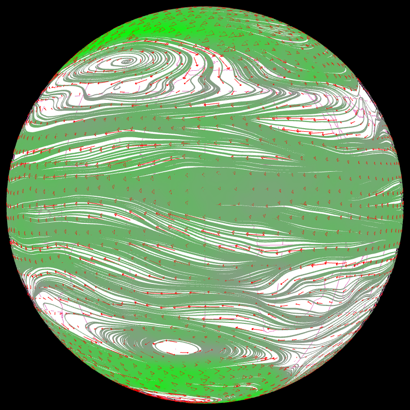

```
    --field[0].path testdata/wind+temp/glob025/P020WIND.U.PHYS.grb 
    testdata/wind+temp/glob025/P020WIND.V.PHYS.grb --field[0].type STREAM 
    --field[0].palette-{ --colors grey green --min 0. --max 40. --values 
    0. 40. }- --field[0].stream.width 1.0 --field[1].type VECTOR 
    --field[1].path testdata/wind+temp/glob025/P020WIND.U.PHYS.grb 
    testdata/wind+temp/glob025/P020WIND.V.PHYS.grb --field[1].vector.color 
    red --field[1].vector.scale 5 --field[1].scale 1.01 --grid.on 
    --landscape.on --landscape.path landscape/white.bmp --field[0].scale 
    1.01 --grid.color pink --coast.on --coast.lines.color pink 
```
## Streamlines on EURAT01 (surface)                                  -- stream_eurat01
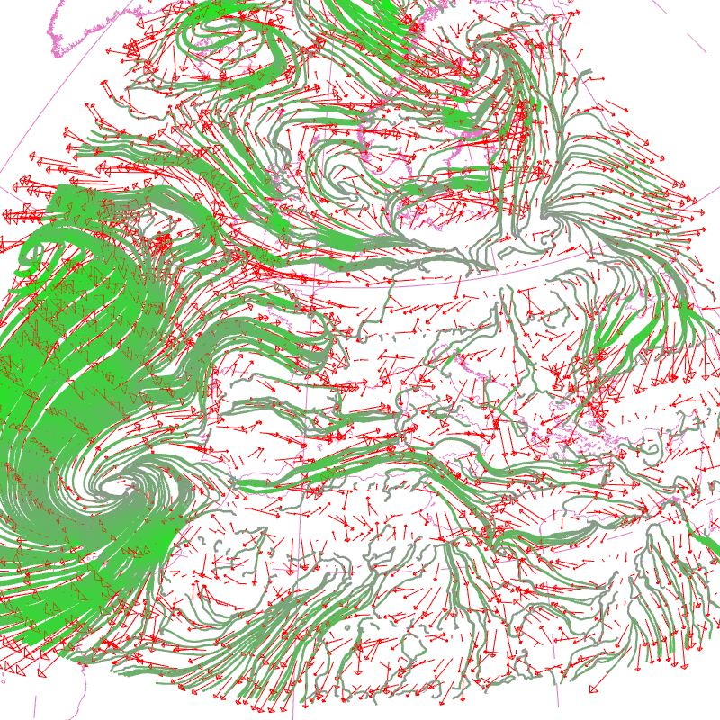

```
    --field[0].path testdata/wind+temp/eurat01/H020WIND.U.PHYS.grb 
    testdata/wind+temp/eurat01/H020WIND.V.PHYS.grb --field[0].type STREAM 
    --field[0].palette-{ --colors grey green --min 0. --max 40. --values 
    0. 40. }- --field[0].stream.width 1.0 --field[1].type VECTOR 
    --field[1].path testdata/wind+temp/eurat01/H020WIND.U.PHYS.grb 
    testdata/wind+temp/eurat01/H020WIND.V.PHYS.grb --field[1].vector.color 
    red --field[1].vector.scale 5 --field[1].scale 1.01 --grid.on 
    --landscape.on --landscape.path landscape/white.bmp --field[0].scale 
    1.01 --grid.color pink --coast.on --coast.lines.color pink --view.lat 
    45 --view.lon 5 --view.fov 10 
```
## Streamlines on AROME 2.5km (surface)                              -- stream_lambert
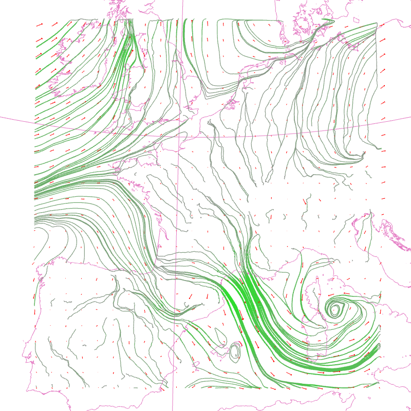

```
    --field[0].path testdata/aro2.5/S090WIND.U.PHYS.grb 
    testdata/aro2.5/S090WIND.V.PHYS.grb --field[0].type STREAM 
    --field[0].palette-{ --colors grey green --min 0. --max 40. --values 
    0. 40. }- --field[0].stream.width 0.0 --field[0].stream.density 0.5 
    --field[0].stream.width 0.5 --field[1].type VECTOR --field[1].path 
    testdata/aro2.5/S090WIND.U.PHYS.grb 
    testdata/aro2.5/S090WIND.V.PHYS.grb --field[1].vector.color red 
    --field[1].vector.scale 1 --field[1].scale 1.01 --grid.on 
    --landscape.on --landscape.path landscape/white.bmp --field[0].scale 
    1.01 --grid.color pink --coast.on --coast.lines.color pink --view.lon 
    2 --view.lat 46.7 --view.fov 4 
```
## Gaussian grid wireframe                                           -- gauss_wireframe
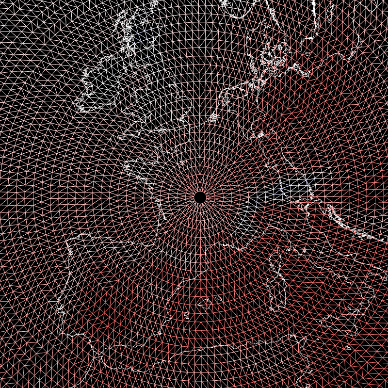

```
    --field[0]-{ --path testdata/wind+temp/t0149c2.2/S105TEMPERATURE.grb 
    --scalar.wireframe.on }- --coast.on --view.lon 2 --view.lat 46.7 
    --view.fov 5 
```
## Scalar field displayed using points                               -- points_scalar
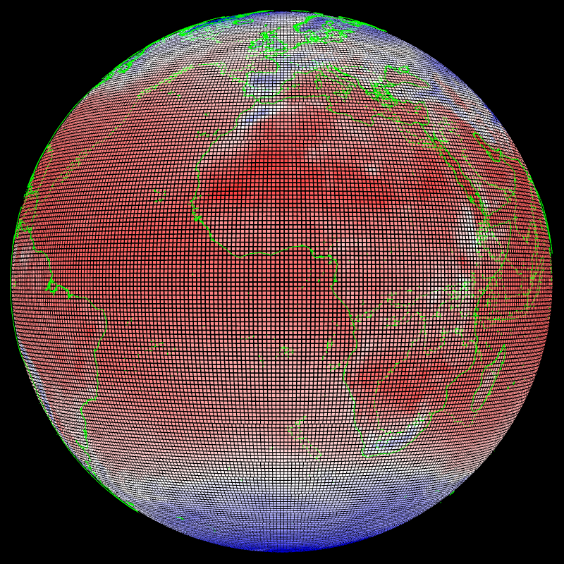

```
    --field[0]-{ --path testdata/wind+temp/t0224/S105TEMPERATURE.grb 
    --scalar.points-{ --on --size.value 0.5 --size.variable.on 
    --size.factor.off }- }- --coast.on --coast.lines.color green 
```
## Scalar field with points (stretched/rotated grid)                 -- points_scalar_rot
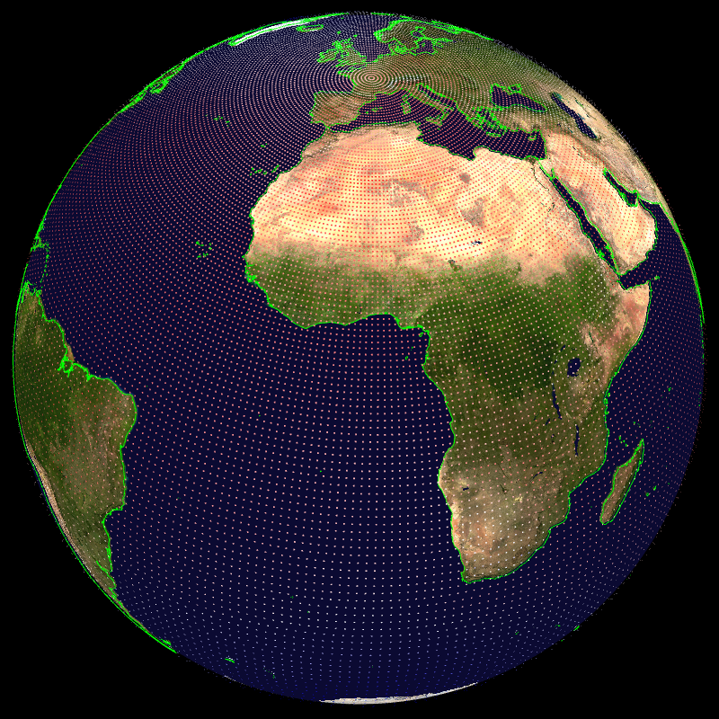

```
    --field[0]-{ --scale 1.01 --path 
    testdata/wind+temp/t0149c2.2/S105TEMPERATURE.grb --scalar.points-{ 
    --on --size.value 0.2 --size.variable.on --size.factor.on }- }- 
    --coast.on --coast.lines.color green --landscape.on 
```
## Scalar field on octahedral grid                                   -- gauss_octahedral
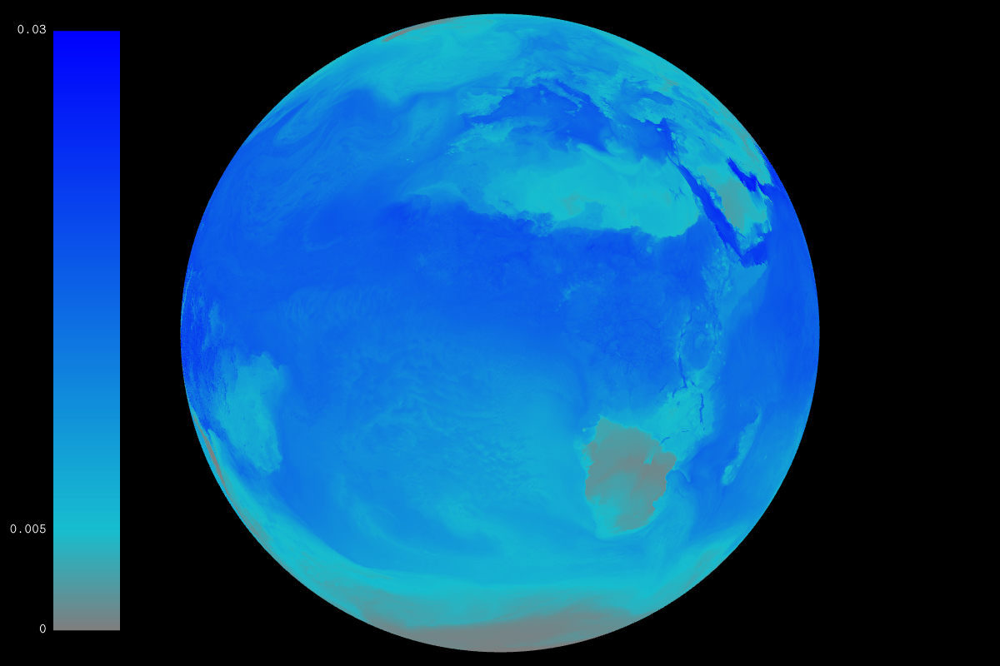

```
    --field[0].path ./testdata/ecmwf/ecmf_0_1_0_ml_137_q.grib2 
    --field[0].palette.colors gray cyan blue --field[0].palette.values 0 
    0.005 0.03 --colorbar.on --window.width 1200 
```
## Landscape with orography (T479)                                   -- land_orography
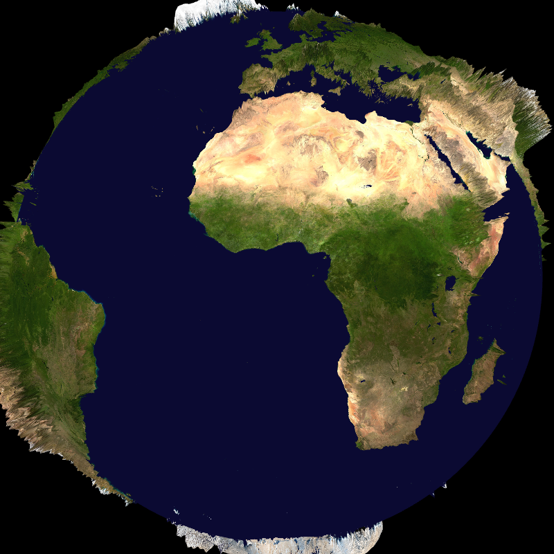

```
    --landscape.on --landscape.geometry_path ./testdata/t479/Z.grb 
    --landscape.geometry.height.on --landscape.geometry.height.scale 0.2 
    --landscape.geometry.height.path ./testdata/t479/Z.grb 
    --landscape.flat.off 
```
## Spherical harmonic (T1198)                                        -- harmonic
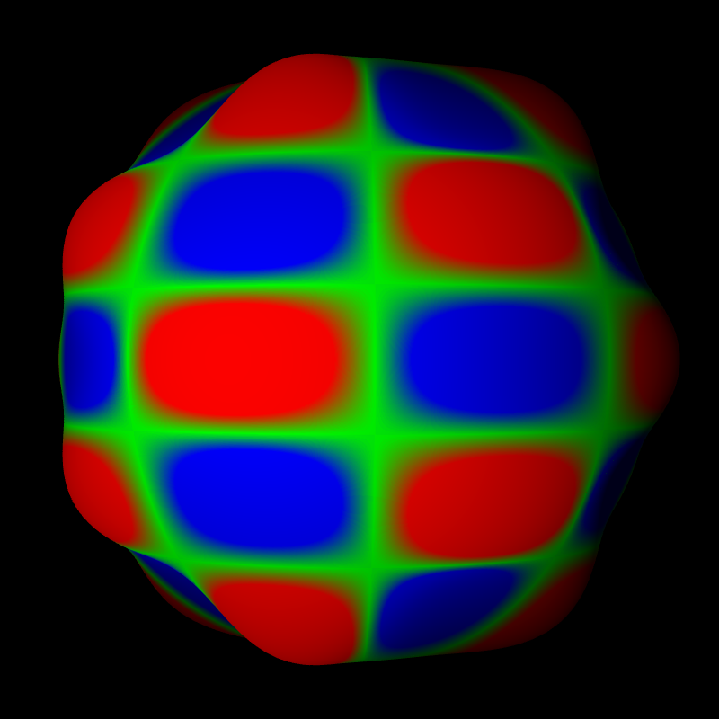

```
    --field[0].path testdata/harmonics/SPEC.+0008.+0004.grb 
    --field[0].palette-{ --colors blue green red --values -1 0. 1 }- 
    --field[0].geometry.height.on --field[0].geometry.height.scale 0.2 
    --view.fov 25 --view.lon 20 --scene.light.on 
```
## Spherical harmonic (T1198C2.2)                                    -- harmonic_stretch
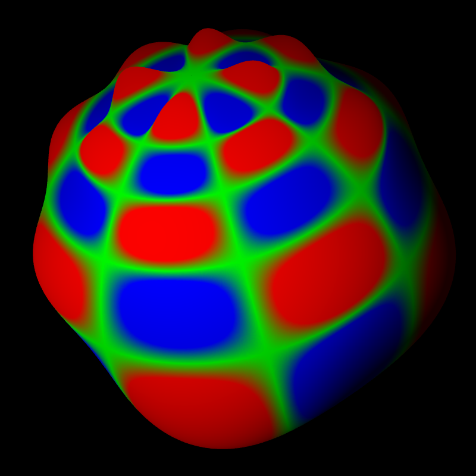

```
    --field[0].path testdata/harmonics/SPEC.+0008.+0004_stretched.grb 
    --field[0].palette-{ --colors blue green red --values -1 0. 1 }- 
    --field[0].geometry.height.on --field[0].geometry.height.scale 0.2 
    --view.fov 25 --view.lon 20 --scene.light.on 
```
## Orography with height                                             -- orography_height
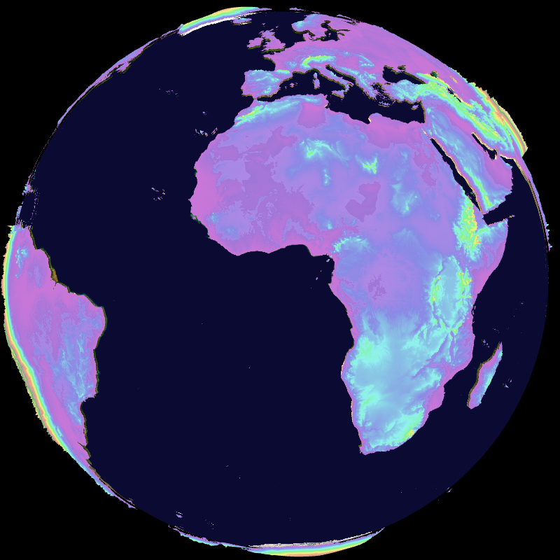

```
    --field[0].path ./testdata/t1798/Z.grb --field[0].palette.name topo 
    --field[0].scale 1.005 --landscape.on --field[0].geometry.height.on 
```
## Height = vector norm value                                        -- height_vector
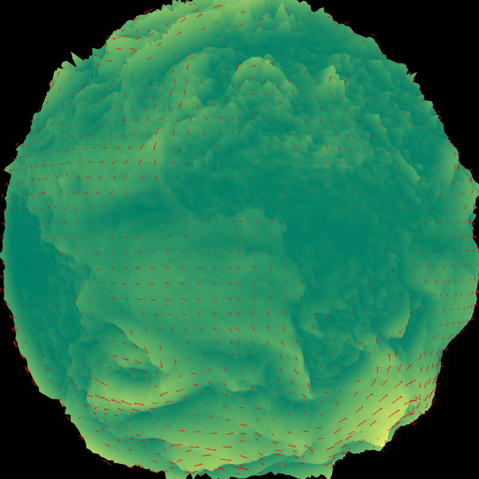

```
    --field[0].type VECTOR --field[0].path 
    testdata/wind+temp/t0224/S105WIND.U.PHYS.grb 
    testdata/wind+temp/t0224/S105WIND.V.PHYS.grb 
    --field[0].geometry.height.on --field[0].geometry.height.scale 0.2 
    --field[0].vector.color red --field[0].palette.name summer 
```
## Height = scalar norm value                                        -- height_scalar
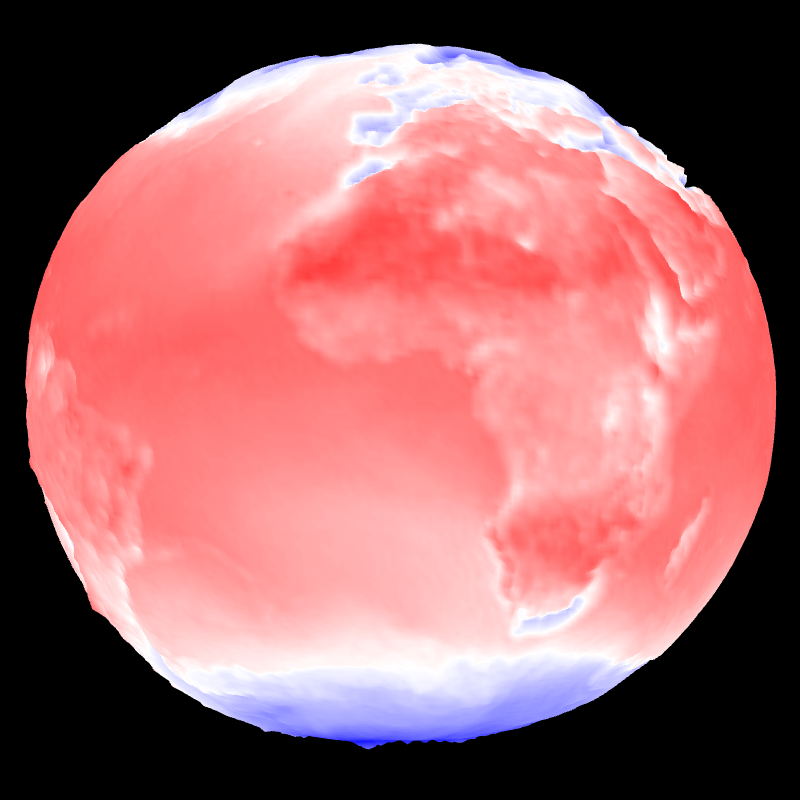

```
    --field[0].path testdata/wind+temp/t0224/S105TEMPERATURE.grb 
    --field[0].geometry.height.on --field[0].geometry.height.scale 0.2 
    --view.fov 24 
```
## Orography (raster & contour) with height                          -- contour_height
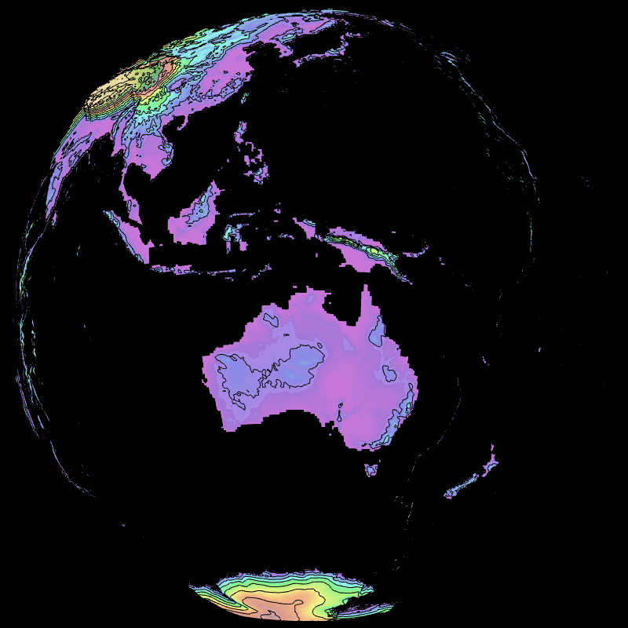

```
    --field[0].path testdata/t479/Z.grb --field[0].scale 1.005 
    --field[0].type CONTOUR --field[1].geometry.height.on 
    --field[0].palette.colors black --field[1].path testdata/t479/Z.grb 
    --field[0].geometry.height.on --view.lat -16 --view.lon 134 
```
## Grid labels                                                       -- grid_labels
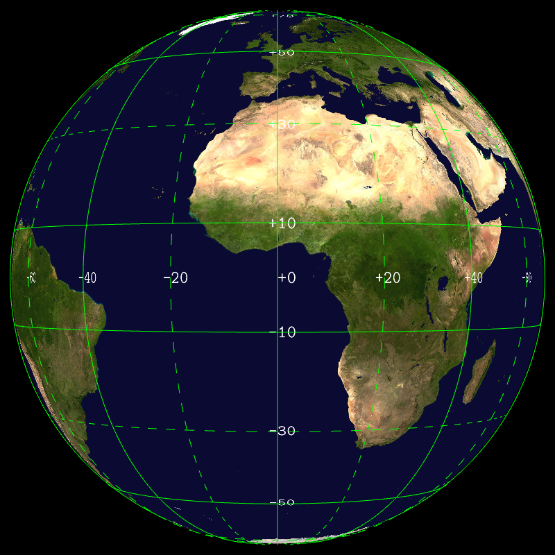

```
    --grid.on --grid.labels.on --landscape.on 
```
## Display low & high                                                -- hilo
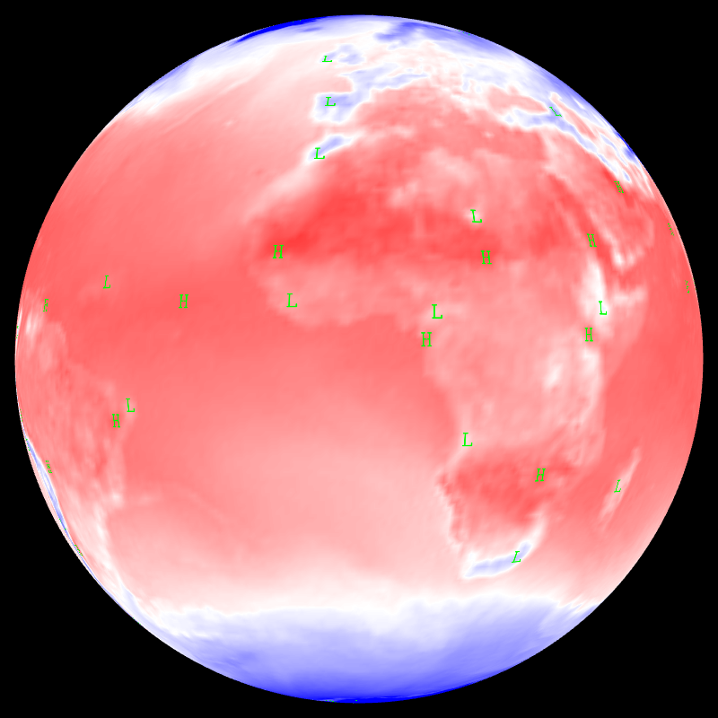

```
    --field[0].path testdata/wind+temp/t0224/S105TEMPERATURE.grb 
    --field[0].hilo.on --field[0].hilo.font.color.foreground green 
```
## Contour shading                                                   -- contour5
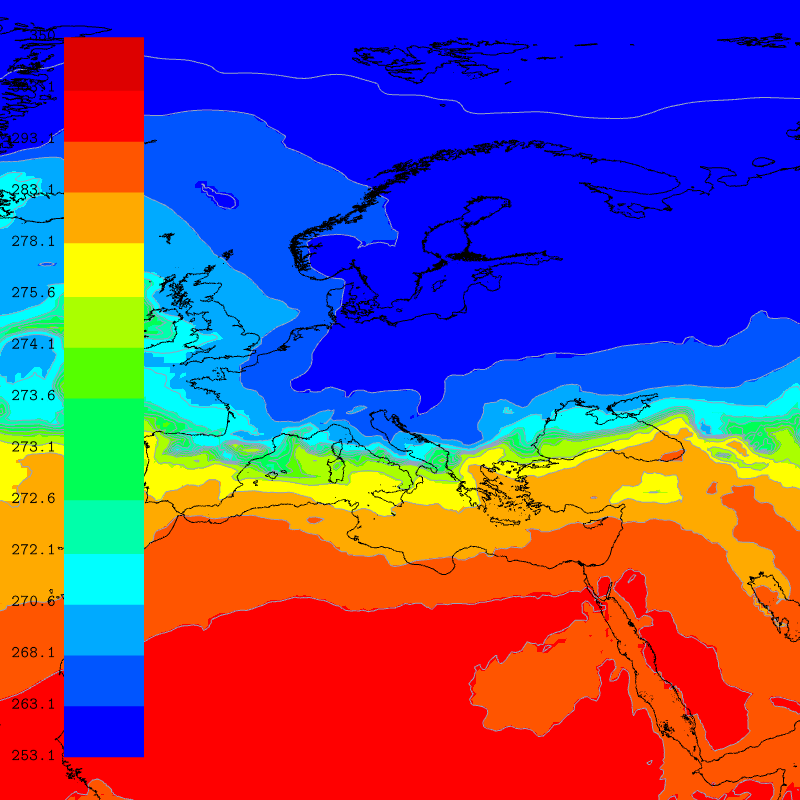

```
    --field[0].path testdata/t850.grb --field[0].palette-{ --colors 
    #0000ff #0055ff #00aaff #00ffff #00ffaa #00ff55 #00ff55 #55ff00 
    #aaff00 #ffff00 #ffaa00 #ff5500 #ff0000 #dd0000 --values 253.15 263.15 
    268.15 270.65 272.15 272.65 273.15 273.65 274.15 275.65 278.15 283.15 
    293.15 303.15 350 }- --coast.on --coast.lines.color black 
    --view.projection LATLON --view.lat 46.7 --view.lon 15 --view.fov 4 
    --field[1].path testdata/t850.grb --field[1].type contour 
    --field[1].palette.colors #95a3c0 --colorbar.on 
    --colorbar.font.color.foreground black --field[1].contour.levels 
    253.15 263.15 268.15 270.65 272.15 272.65 273.15 273.65 274.15 275.65 
    278.15 283.15 293.15 303.15 --field[0].palette.linear.on 
```
## Wind & vorticity                                                  -- wind4
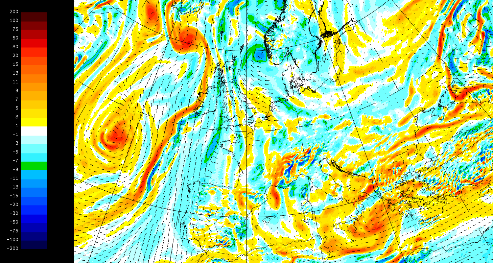

```
    --field[0].path testdata/wind4/vorticity.grib 
    --field[0].palette.colors #00004cff #00007fff #0000b2ff #0000e5ff 
    #0026ffff #004cffff #0072ffff #0099ffff #00bfffff #00d800ff #33f2ffff 
    #72ffffff #bfffffff #ffffffff #ffff00ff #ffe500ff #ffcc00ff #ffb200ff 
    #ff9900ff #ff7f00ff #ff6600ff #ff4c00ff #ff2600ff #e50000ff #b20000ff 
    #7f0000ff #4c0000ff --field[0].palette.values -0.002 -0.001 -0.00075 
    -0.0005 -0.0003 -0.0002 -0.00015 -0.00013 -0.00011 -9e-05 -7e-05 
    -5e-05 -3e-05 -1e-05 1e-05 3e-05 5e-05 7e-05 9e-05 0.00011 0.00013 
    0.00015 0.0002 0.0003 0.0005 0.00075 0.001 0.002 
    --field[0].palette.linear.on --field[0].palette.scale 100000 
    --field[1].scale 1.001 --field[1].path 
    testdata/wind4/wind.grib%shortName="u" 
    testdata/wind4/wind.grib%shortName="v" --field[1].type vector 
    --field[1].vector.hide_norm.on --field[1].vector.color black 
    --colorbar.on --coast.on --coast.lines.color black --coast.on 
    --coast.lines.color black --grid.on --grid.color black --view.lat 50 
    --view.fov 3 --view.projection POLAR_NORTH --view.clip.xmin 0.15 
    --window.width 1500 --grid.resolution 18 
```
## Display sphere partitionning (t1198)                              -- myproc
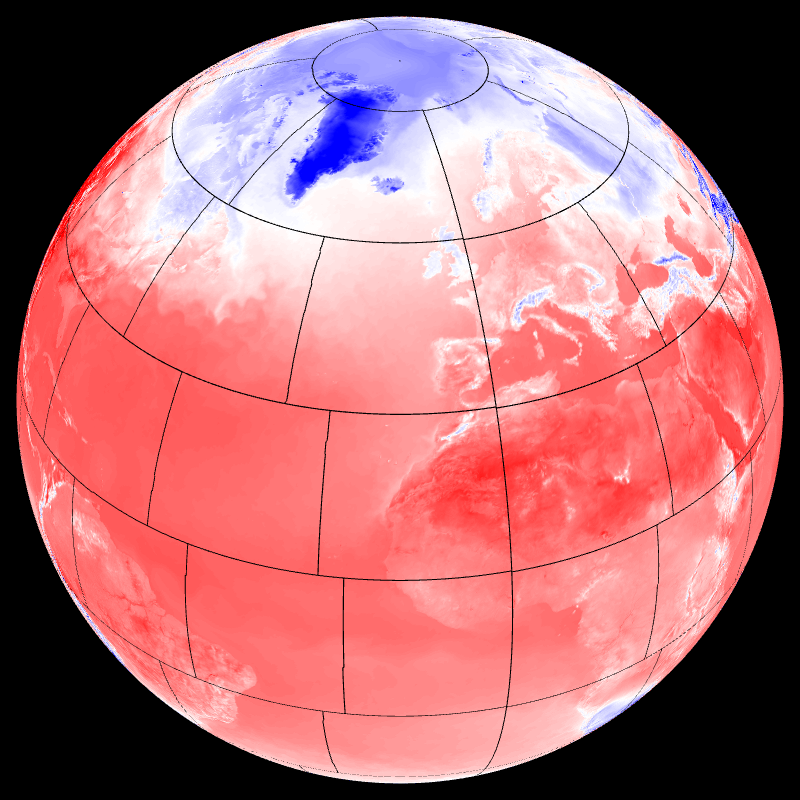

```
    --field[0].scalar.discrete.on --field[0].path 
    testdata/discrete/MYPROC.grb --field[0].palette.colors green 
    --field[0].scalar.discrete.missing_color black 
    --field[0].palette.colors #00000000 --field[1].path 
    testdata/discrete/SURFTEMPERATURE.grb --field[1]-{ --palette.max 
    313.15 --palette.min 253.15 --palette.name cold_hot_temp }- --view.lat 
    36 --view.lon -15 
```
## Display sphere partitionning (t1192c2.2)                          -- myproc22
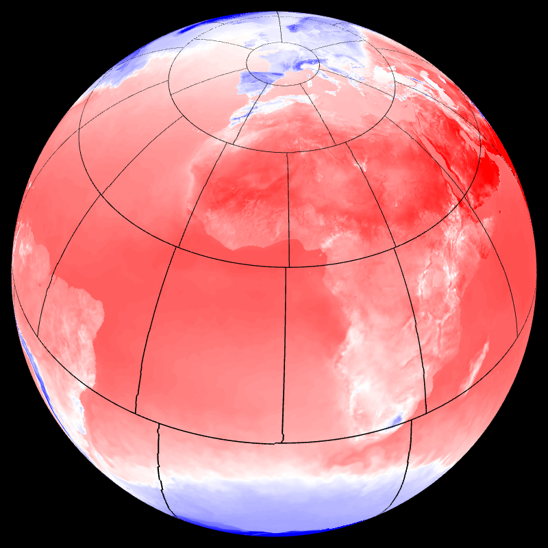

```
    --field[0].scalar.discrete.on --field[0].path 
    testdata/discrete_stretched/MYPROC.grb --field[0].palette.colors green 
    --field[0].scalar.discrete.missing_color black 
    --field[0].palette.colors #00000000 --field[1].path 
    testdata/discrete_stretched/SURFTEMPERATURE.grb --field[1]-{ 
    --palette.max 313.15 --palette.min 253.15 --palette.name cold_hot_temp 
    }- 
```
## SST on lat/lon grid                                               -- sst
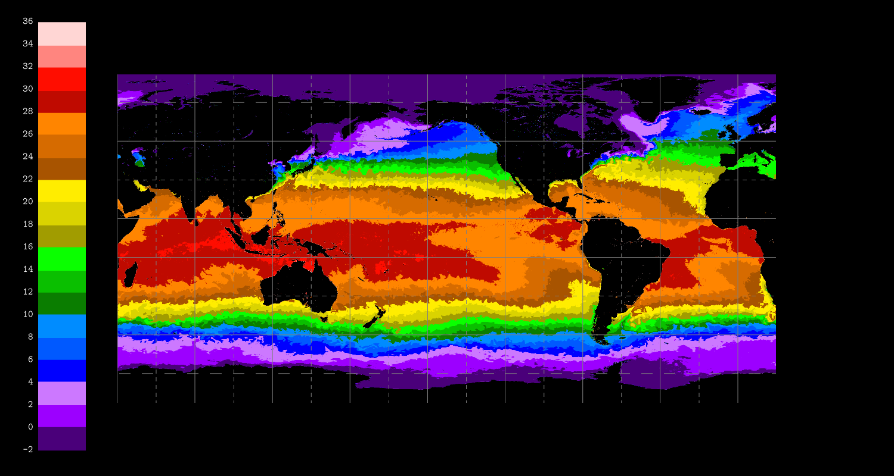

```
    --field[0].scale 1.001 --field[0].path testdata/sst.grib 
    --field[0].palette-{ --values 271.15 273.15 275.15 277.15 279.15 
    281.15 283.15 285.15 287.15 289.15 291.15 293.15 295.15 297.15 299.15 
    301.15 303.15 305.15 307.15 309.15 --colors #4a007aff #9c00ffff 
    #cc78ffff #0000ffff #0059ffff #008cffff #0a7d00ff #0abf00ff #0aff00ff 
    #a19c00ff #dad300ff #ffed00ff #a85400ff #d66b00ff #ff8500ff #bf0a00ff 
    #ff0d00ff #ff857fff #ffd6d4ff --offset -273.15 }- --colorbar.on 
    --grid.on --landscape.on --landscape.path landscape/black.png 
    --view.lon -150 --view.projection LATLON --window.width 1500 
    --view.fov 13 --grid.color gray 
```
## 2m temperature                                                    -- contour9
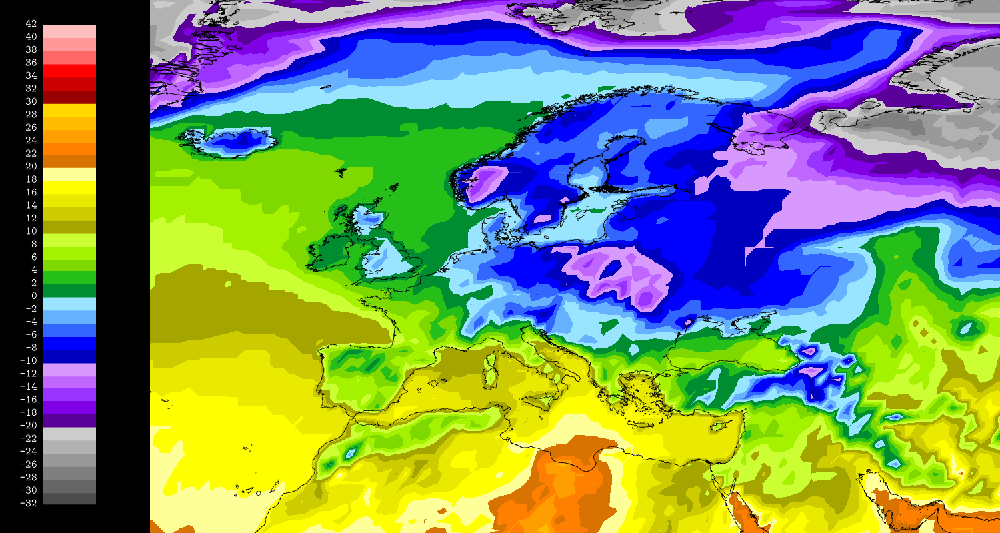

```
    --field[0]-{ --path testdata/2m_temperature.grib --palette.values 
    241.15 243.15 245.15 247.15 249.15 251.15 253.15 255.15 257.15 259.15 
    261.15 263.15 265.15 267.15 269.15 271.15 273.15 275.15 277.15 279.15 
    281.15 283.15 285.15 287.15 289.15 291.15 293.15 295.15 297.15 299.15 
    301.15 303.15 305.15 307.15 309.15 311.15 313.15 315.15 
    --palette.colors #4c4c4cff #666666ff #7f7f7fff #999999ff #b2b2b2ff 
    #ccccccff #590099ff #7f00e5ff #9933ffff #bf66ffff #d899ffff #0000bfff 
    #0000ffff #3366ffff #66b2ffff #99e5ffff #008c30ff #26bf19ff #7fd800ff 
    #a5f200ff #ccff33ff #a5a500ff #cccc00ff #eaea00ff #ffff00ff #ffff99ff 
    #d87200ff #ff7f00ff #ff9e00ff #ffbc00ff #ffd800ff #990000ff #cc0000ff 
    #ff0000ff #ff6666ff #ff9999ff #ffbfbfff --palette.offset -273.15 
    --palette.linear.on }- --colorbar.on --coast.on --coast.lines.color 
    black --view.projection LATLON --window.width 1500 --view.lon 10 
    --view.lat 52 --view.fov 3 --view.clip.xmin 0.15 
```
## Display land surface                                              -- land
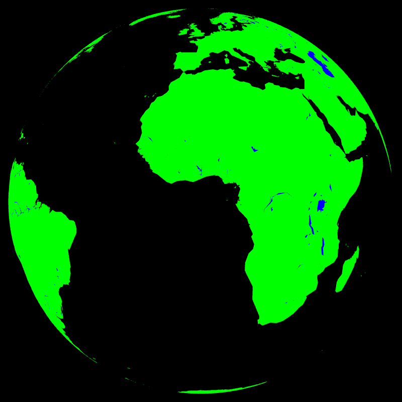

```
    --land.on 
```
## Display land surface (high resolution)                            -- land_high
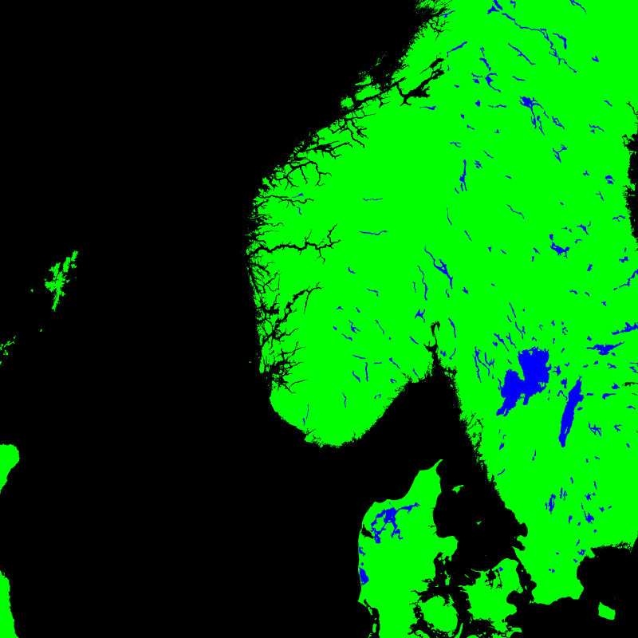

```
    --land.on --land.layers[0].path coastlines/shp/GSHHS_h_L1.shp 
    --land.layers[1].path coastlines/shp/GSHHS_h_L2.shp 
    --land.layers[2].path coastlines/shp/GSHHS_h_L3.shp 
    --land.layers[3].path coastlines/shp/GSHHS_h_L5.shp --view.lon 7 
    --view.lat 60 --view.fov 2 
```
## MPI view                                                          -- mpiview


```
    --field[0].path testdata/discrete/SURFTEMPERATURE.grb 
    --field[0].mpiview.on --field[0].mpiview.path 
    testdata/discrete/MYPROC.grb --field[0].mpiview.scale 0.2 --view.lon 
    31 --view.lat 41 
```
## Lat/lon streamlines                                               -- latlonstream
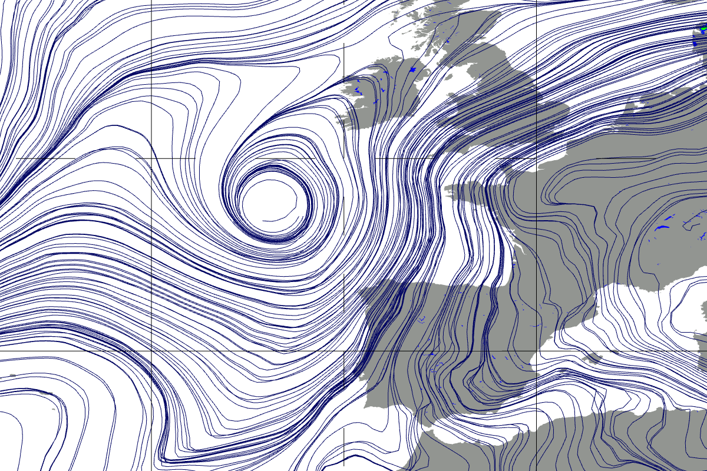

```
    --field[0].path testdata/advection_850.grib%shortName="u" 
    testdata/advection_850.grib%shortName="v" --field[0].type STREAM 
    --field[0].palette.colors darkblue --land.on --land.layers[0].path 
    coastlines/shp/GSHHS_i_L1.shp --land.layers[1].path 
    coastlines/shp/GSHHS_i_L2.shp --land.layers[2].path 
    coastlines/shp/GSHHS_i_L3.shp --land.layers[3].path 
    coastlines/shp/GSHHS_i_L5.shp --land.layers[0].color grey --grid.on 
    --grid.resolution 18 --grid.color black --landscape.on 
    --landscape.path landscape/white.bmp --landscape.scale 0.99 --view.lon 
    -9.5 --view.lat 46 --view.fov 1.3 --view.projection LATLON 
    --window.width 1200 
```
## Wind on global lat/lon grid                                       -- windlatlon
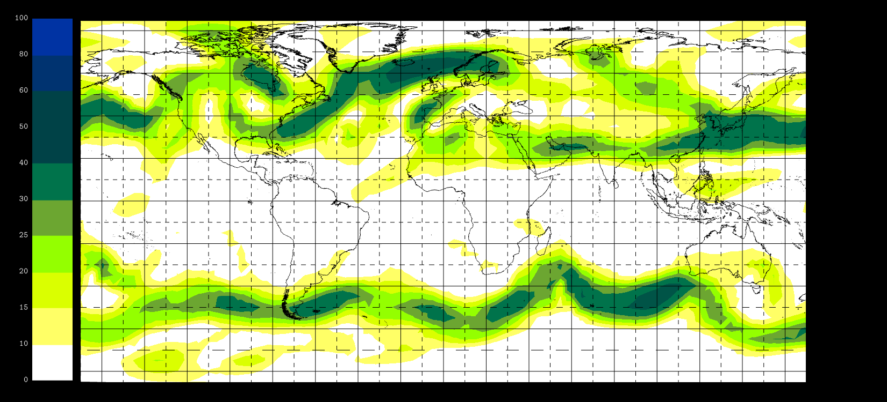

```
    --field[0].path testdata/data_uv.grib%shortName="u" 
    testdata/data_uv.grib%shortName="v" --field[0].type vector 
    --field[0].vector.hide_arrow.on --field[0].palette.values 0 10 15 20 
    25 30 40 50 60 80 100 --colorbar.on --field[0].palette.linear.on 
    --field[0].palette-{ --min 0 --max 100 }- --field[0].palette.colors 
    #ffffffff #ffff66ff #daff00ff #94ff00ff #6ca631ff #00734bff #005447ff 
    #004247ff #003370ff #0033a3ff --coast.on --coast.lines.color black 
    --grid.on --grid.color black --grid.resolution 18 --view.fov 10 
    --view.projection LATLON --window.width 1650 --window.height 750 
```
## Z500, T850                                                        -- z500t850


```
    --coast.lines.color black --coast.on --colorbar.font.color.foreground 
    black --colorbar.on --field[0].palette.colors #ffffffff #0000ffff 
    #0071ffff #00e3ffff #00ffaaff #00ff39ff #39ff00ff #aaff00ff #ffe300ff 
    #ff7100ff #ff0000ff #ffffffff --field[0].palette.offset -273.15 
    --field[0].palette.values 262.15 263.15 265.15 267.15 269.15 271.15 
    273.15 275.15 277.15 279.15 281.15 283.15 284.15 --field[0].path 
    testdata/t850.grb --field[1].contour.levels 47000 47500 48000 48500 
    49000 49500 50000 50500 51000 51500 52000 52500 53000 53500 54000 
    54500 55000 55500 56000 56500 57000 57500 --field[1].contour.widths 0 
    0 0 0 0 0 0 0 0 0 0 0 1 0 0 0 1 0 0 0 0 0 0 
    --field[1].hilo.font.color.foreground black --field[1].hilo.font.scale 
    0.02 --field[1].hilo.on --field[1].palette.colors black 
    --field[1].path testdata/z500.grb --field[1].type CONTOUR --grid.color 
    black --grid.labels.font.color.background white 
    --grid.labels.font.color.foreground black --grid.labels.font.scale 
    0.02 --grid.labels.on --grid.on --grid.resolution 18 --view.fov 5 
    --view.lat 49 --view.lon 2 --view.projection POLAR_NORTH 
    --window.width 1200 
```
