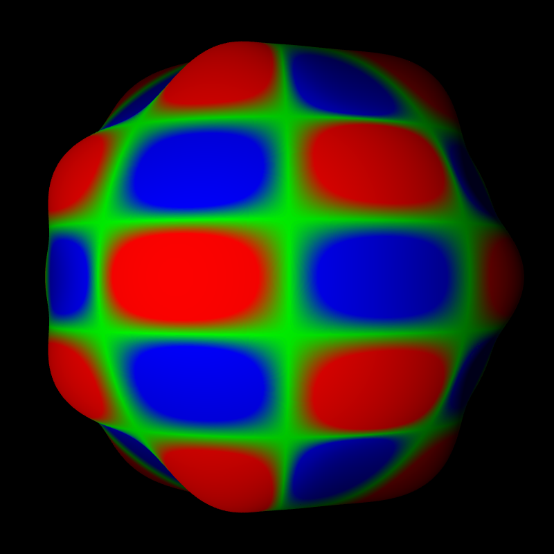
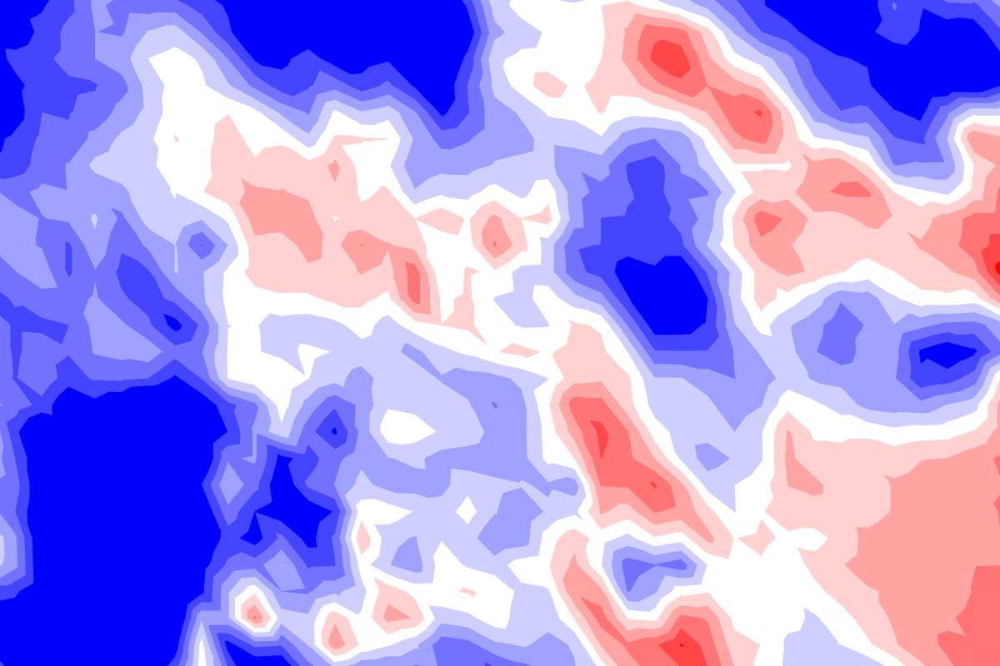

Display GRIB2 fields with OpenGL. Raster, contour, vector, colorbar, mapscale, coastlines, borders. Lat/lon, lambert, gaussian grid.
GLFW backend for interactive display, EGL backend for batch processing without X11 display.
  # CLOUD
[>>](CLOUD.md)
## Clouds, 3 layers, t1198c2.2                                       -- t1198_3l


```
    --landscape.on --landscape.grid.path share/data/t1198c2.2/Z.grb 
    --field[0].path share/data/t1198c2.2/SURFNEBUL.BASSE.grb 
    --field[1].path share/data/t1198c2.2/SURFNEBUL.MOYENN.grb 
    --field[2].path share/data/t1198c2.2/SURFNEBUL.HAUTE.grb 
    --field[0].scale 1.03 --field[1].scale 1.04 --field[2].scale 1.05 
    --field[0].palette.name cloud --field[1].palette.name cloud 
    --field[2].palette.name cloud 
```
# LAMBERT
[>>](LAMBERT.md)
## AROME, Lambert geometry                                           -- aro


```
    --field[0].path share/data/aro2.5/SURFIND.TERREMER.grb 
    --field[0].palette.name cold_hot --field[0].scale 1.00 --view.lat 46.2 
    --view.lon 2.0 --view.fov 5 --coast.on --grid.on 
```
# STRING
[>>](STRING.md)
## Font background color                                             -- background


```
    --landscape.on --landscape.grid.path share/data/t1198c2.2/Z.grb 
    --field[0].path share/data/t1198c2.2/N.grb --field[0].scale 1.03 
    --scene.date.on --scene.date.font.bitmap.scale 0.03 
    --scene.date.font.color.foreground red 
    --scene.date.font.color.background white 
```
# MISC
[>>](MISC.md)
## Enable debug mode                                                 -- debug


```
    --landscape.on --landscape.grid.path share/data/t1198c2.2/Z.grb 
    --field[0].path share/data/t1198c2.2/N.grb --field[0].scale 1.03 
    --render.debug.on 
```
# PALETTE
[>>](PALETTE.md)
## Select palette automatically                                      -- bw


```
    --landscape.on --landscape.grid.path share/data/t1198c2.2/Z.grb 
    --field[0].path share/data/t1198c2.2/N.grb --field[0].scale 1.03 
```
# CONTOUR
[>>](CONTOUR.md)
## Low-res contour                                                   -- contour1


```
    --render.width 1024 --render.height 1024 --landscape.on 
    --landscape.path landscape/black.bmp --field[0].path 
    share/data/contour/t0049.grb --field[0].scale 1.03 --field[0].type 
    CONTOUR 
```
# DIFF
[>>](DIFF.md)
## Contour in diff mode, global lat/lon geometry                     -- contour_diff


```
    --field[0].diff.on --field[0].type CONTOUR --field[0].path 
    share/data/glob01/lfpw_0_3_1_sfc_0_prmsl+0000.grib2 
    share/data/glob01/lfpw_0_3_1_sfc_0_prmsl+0102.grib2 --field[0].scale 
    1.01 --landscape.on --landscape.color white --field[0].user_pref.off 
```
# SCALAR
[>>](SCALAR.md)
## Surface temperature, global lat/lon field                         -- glob01


```
    --field[0].path share/data/glob01/lfpw_0_0_0_sfc_0_t.grib2 
    --field[0].scale 1.00 --field[0].palette.name cold_hot_temp --coast.on 
    --grid.on 
```
# LANDSCAPE
[>>](LANDSCAPE.md)
## Landscape over Europe only                                        -- landscape_eurat01


```
    --landscape.on --landscape.grid.path 
    share/data/eurat01/lfpw_0_0_0_pl_1000_t.grib2 --coast.on --grid.on 
```
# PROJECTION
[>>](PROJECTION.md)
## Display contour field using Mercator projection                   -- mercator


```
    --field[0].diff.on --field[0].user_pref.off --field[0].type CONTOUR 
    --field[0].path share/data/glob01/lfpw_0_3_1_sfc_0_prmsl+0000.grib2 
    share/data/glob01/lfpw_0_3_1_sfc_0_prmsl+0102.grib2 --field[0].scale 
    1.01 --view.projection MERCATOR --landscape.on 
```
# SHELL
[>>](SHELL.md)
## Test interactive shell                                            -- shell


```
    --landscape.on --landscape.grid.path share/data/t1198c2.2/Z.grb 
    --field[0].path share/data/t1198c2.2/N.grb --field[0].scale 1.03 
    --shell.on 
```
# VECTOR
[>>](VECTOR.md)
## Wind on small AROME domain (raster & vector)                      -- small_aro


```
    --field[0].type VECTOR --field[0].path 
    share/data/aro_small/S041WIND.U.PHYS.grb 
    share/data/aro_small/S041WIND.V.PHYS.grb --field[0].scale 1.00 
    --view.lon 26.64 --view.lat 67.36 --view.fov 0.5 --coast.on --grid.on 
```
# STREAM
[>>](STREAM.md)
## Streamlines on t1198c2.2 (surface)                                -- stream_t1198c22


```
    --field[0].scale 1.01 --field[0].path 
    share/data/wind+temp/t1198c2.2/S105WIND.U.PHYS.grb 
    share/data/wind+temp/t1198c2.2/S105WIND.V.PHYS.grb --field[0].type 
    STREAM --field[0].palette-{ --colors grey green --min 0. --max 40. 
    --values 0. 40. }- --field[0].stream.width 1.0 
    --field[0].stream.density 1.0 --field[1].scale 1.01 --field[1].path 
    share/data/wind+temp/t1198c2.2/S105WIND.U.PHYS.grb 
    share/data/wind+temp/t1198c2.2/S105WIND.V.PHYS.grb --field[1].type 
    VECTOR --field[1].vector.norm.off --field[1].vector.arrow.color red 
    --grid.on --grid.color red --grid.scale 1.02 --coast.lines.scale 1.02 
    --coast.on --coast.lines.color red --landscape.on --landscape.path 
    landscape/white.png 
```
# POINTS
[>>](POINTS.md)
## Gaussian grid wireframe                                           -- gauss_wireframe


```
    --field[0]-{ --path share/data/wind+temp/t0149c2.2/S105TEMPERATURE.grb 
    --scalar.wireframe.on }- --coast.on --view.lon 2 --view.lat 46.7 
    --view.fov 5 
```
# SPECTRAL
[>>](SPECTRAL.md)
## Spherical harmonic (T1198)                                        -- harmonic


```
    --field[0].path share/data/harmonics/SPEC.+0008.+0004.grb 
    --field[0].palette-{ --colors blue green red --values -1 0. 1 }- 
    --field[0].geometry.height.on --field[0].geometry.height.scale 0.2 
    --view.fov 25 --view.lon 20 --scene.light.on 
```
# HEIGHT
[>>](HEIGHT.md)
## Orography with height                                             -- orography_height


```
    --field[0].path ./share/data/t1798/Z.grb --field[0].palette.name topo 
    --field[0].scale 1.005 --landscape.on --field[0].geometry.height.on 
```
# GRID
[>>](GRID.md)
## Grid labels                                                       -- grid_labels


```
    --grid.on --grid.labels.on --landscape.on 
```
# MPI
[>>](MPI.md)
## Display sphere partitionning (t1198)                              -- myproc


```
    --field[0].scalar.discrete.on --field[0].path 
    share/data/discrete/MYPROC.grb --field[0].palette.colors green 
    --field[0].scalar.discrete.missing_color black 
    --field[0].palette.colors #00000000 --field[1].path 
    share/data/discrete/SURFTEMPERATURE.grb --field[1]-{ --palette.max 
    313.15 --palette.min 253.15 --palette.name cold_hot_temp }- --view.lat 
    36 --view.lon -15 
```
# LAND
[>>](LAND.md)
## Display land surface                                              -- land


```
    --land.on 
```
# ISOFILL
[>>](ISOFILL.md)
## Isofill test                                                      -- isofill


```
    --field[0].path share/data/wind+temp/t1798/S105TEMPERATURE.grb 
    --field[0].type ISOFILL --field[0]-{ --palette.min 294 --palette.max 
    296 --user_pref.off --isofill.min 294 --isofill.max 296 --palette.name 
    cold_hot_temp }- --view.lat 2.32 --view.lon 14.12 --view.fov 0.5 
    --render.width 1200 
```
# SATELLITE
[>>](SATELLITE.md)
## SSMI satellite data                                               -- ssmigeopoints


```
    --geopoints.path share/data/geopoints/ssmis_light.nc --geopoints.on 
    --geopoints.points.palette.name cold_hot --landscape.on 
    --geopoints.points.size.value 0.5 --grid.on --grid.color black 
    --coast.on --coast.lines.color black --colorbar.on 
    --geopoints.points.palette.min 200 --geopoints.points.palette.max 240 
    --geopoints.lon col_4 --geopoints.lat col_3 --geopoints.val col_5 
    --render.width 1200 --view.lat -32.736 --view.lon 41.909 
```
