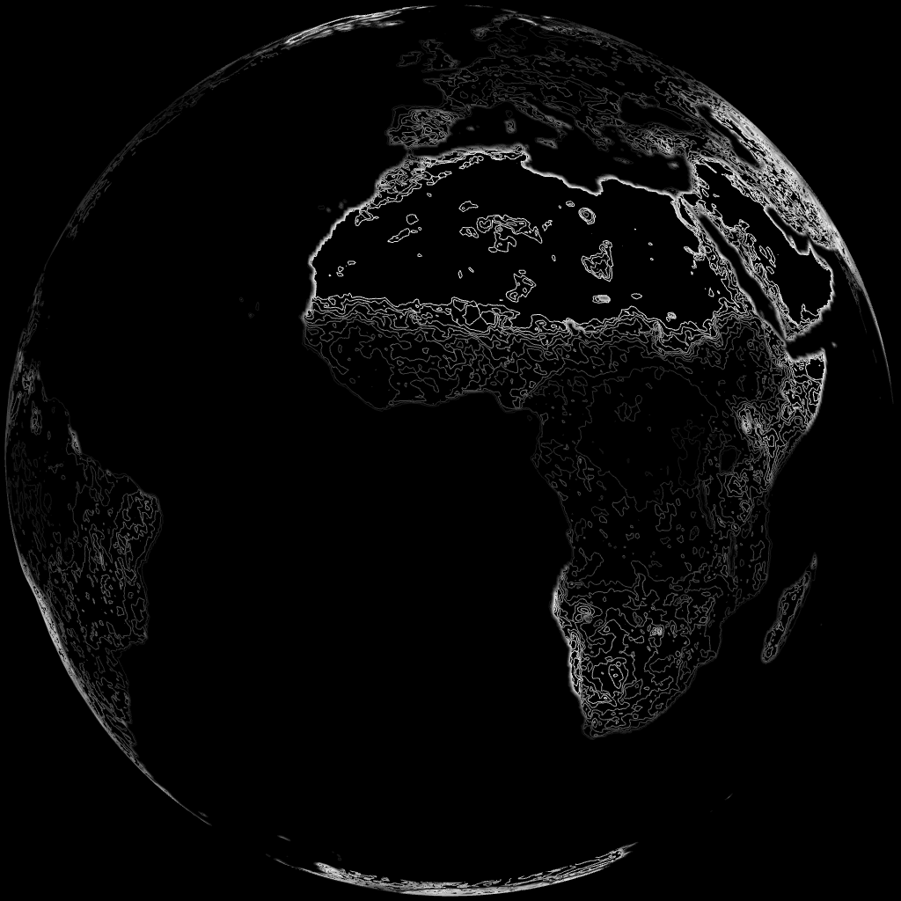
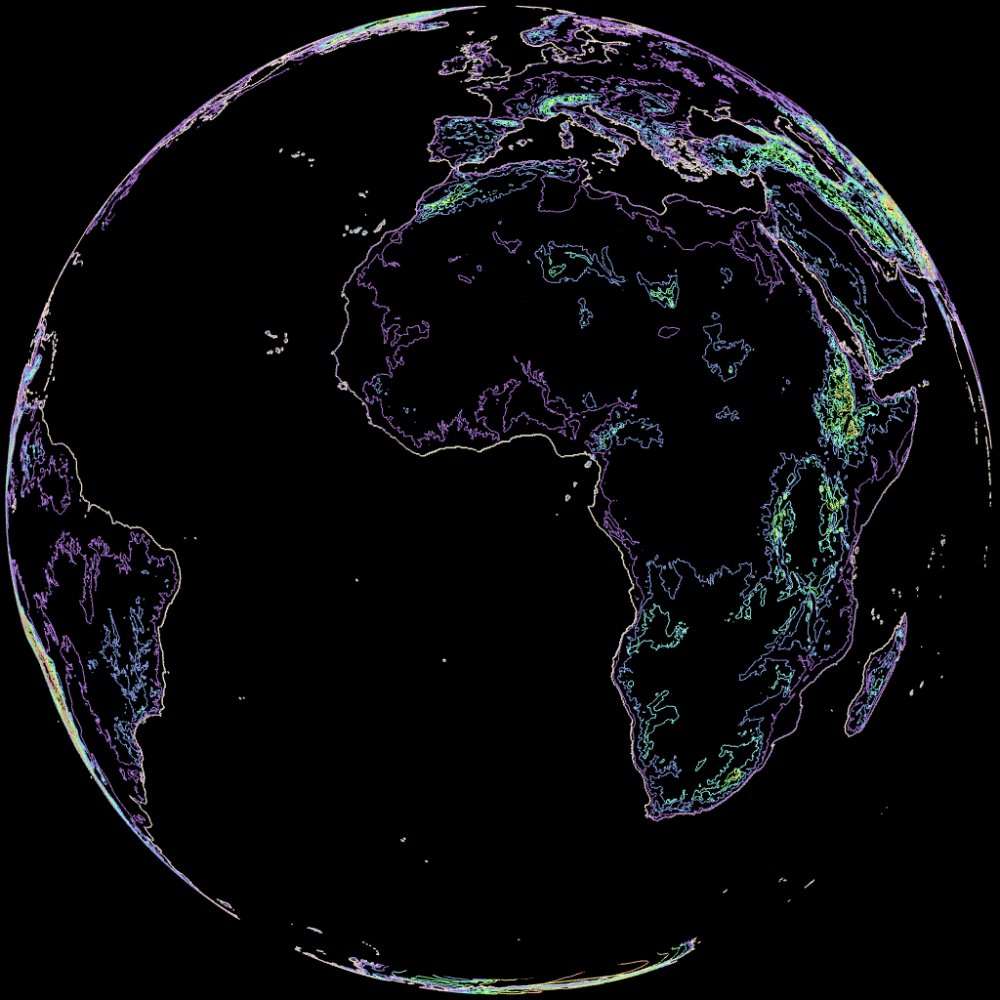
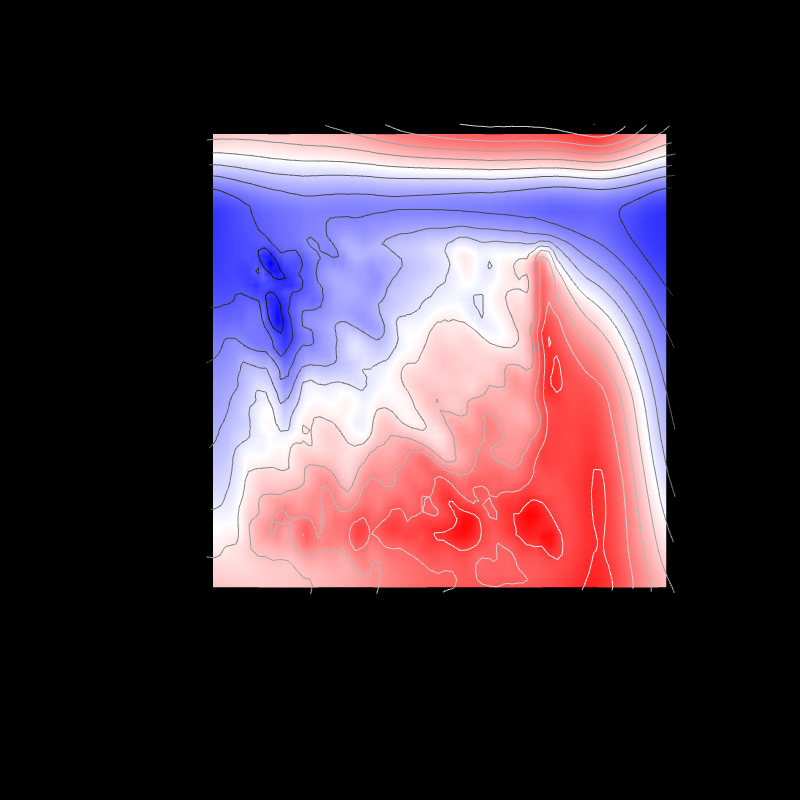
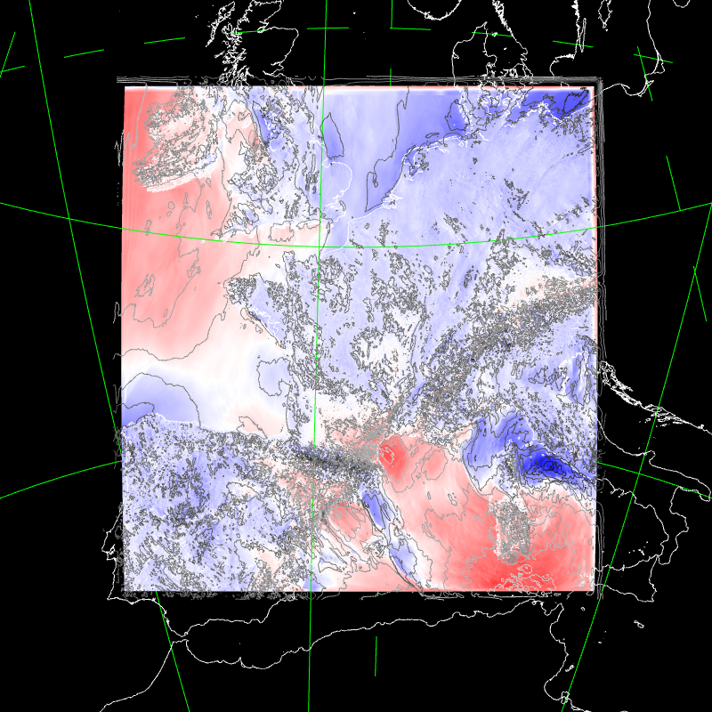
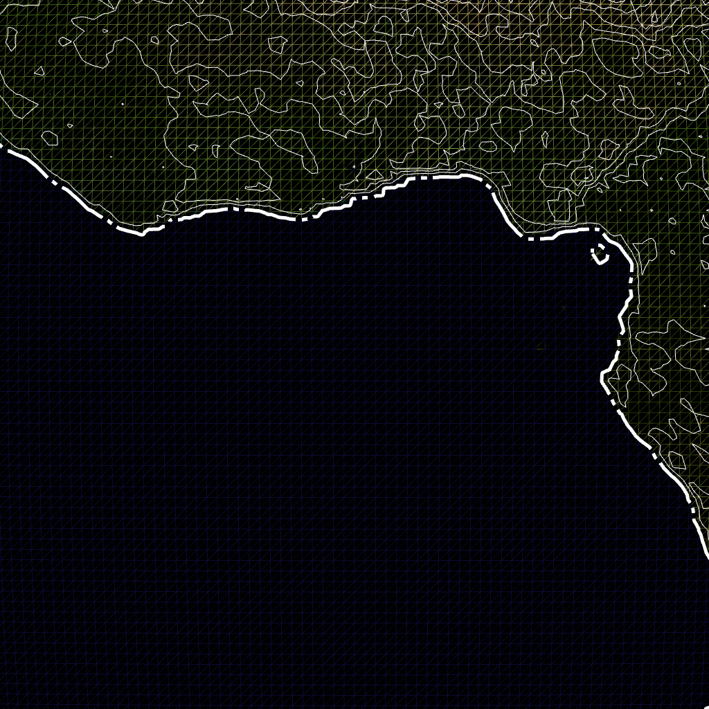
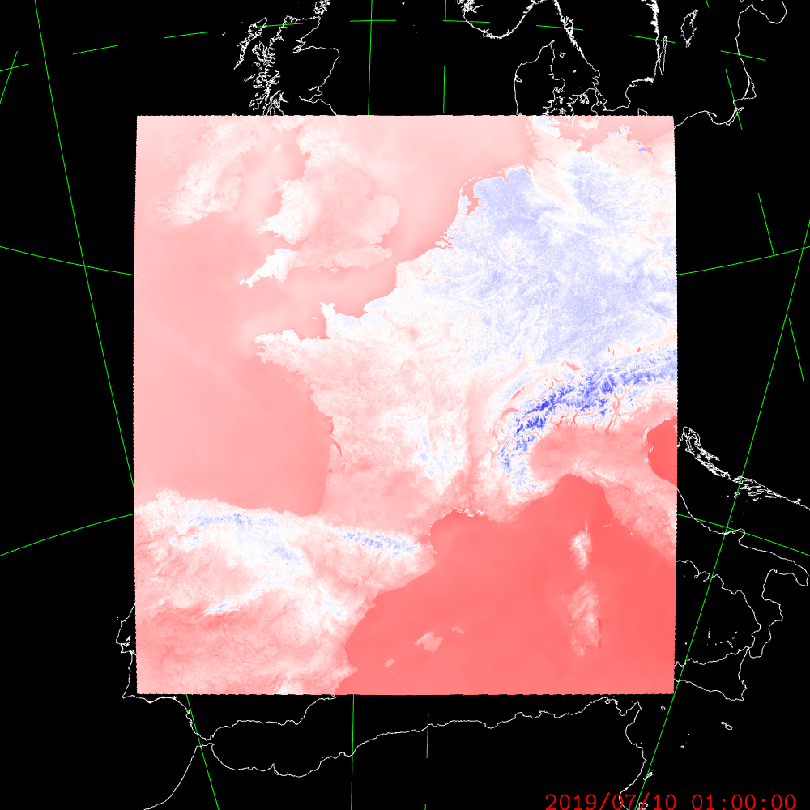
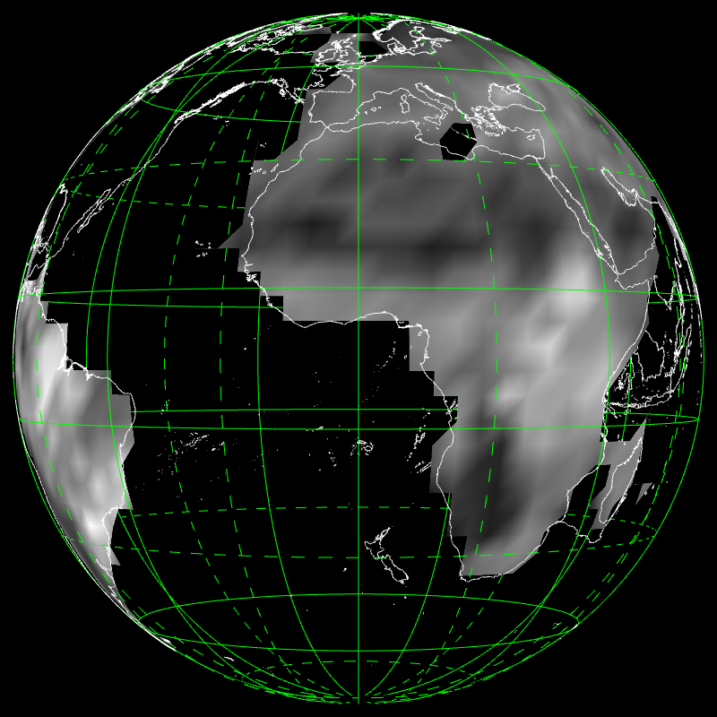
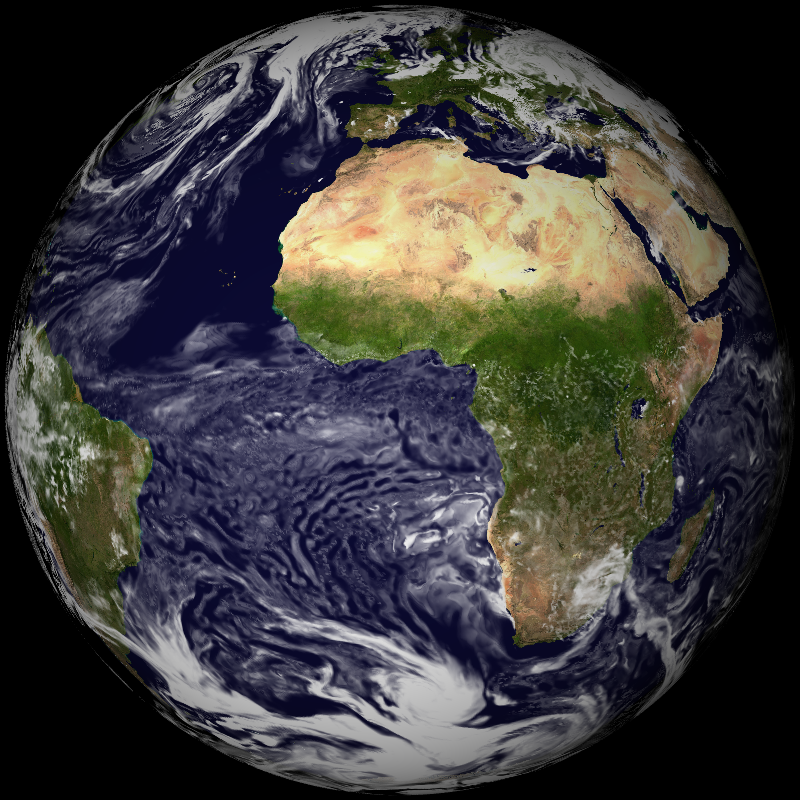
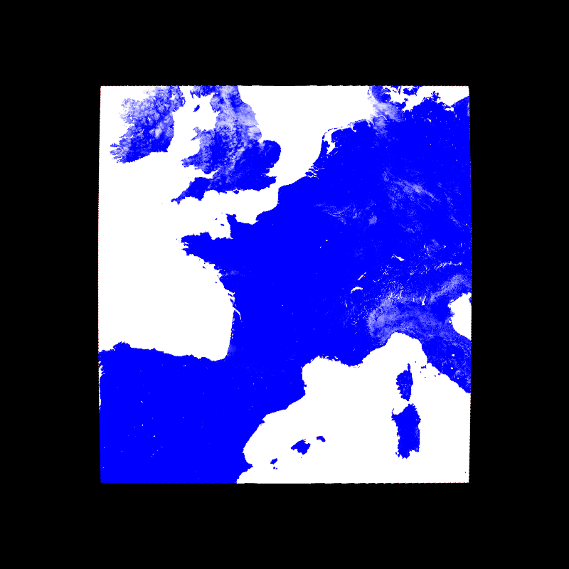
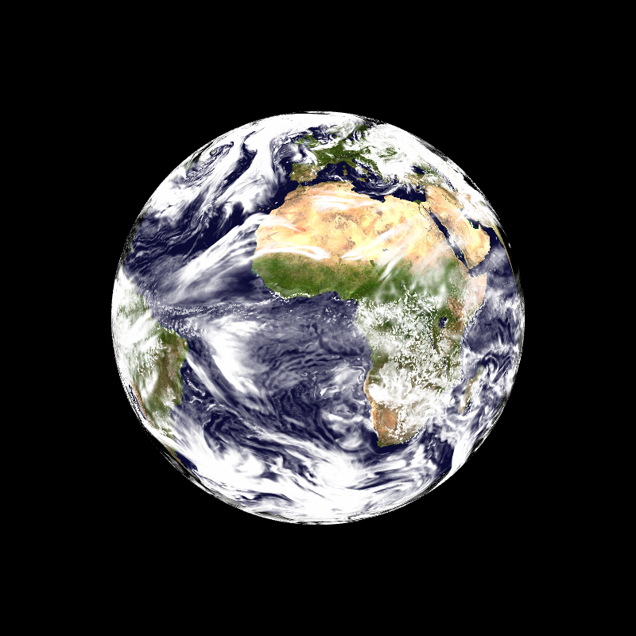

# glgrib
Display GRIB2 fields with OpenGL. Raster, contour, vector, colorbar, mapscale, coastlines, borders. Lat/lon, lambert, gaussian grid.

## Clouds, 3 layers, t1198c2.2                                       -- t1198_3l

## Clouds, 3 layers, t1798c2.2                                       -- t1798_3l

## AROME, Lambert geometry                                           -- aro

## Font background color                                             -- background

## Enable debug mode                                                 -- debug

## Select palette automatically                                      -- bw

## Cities                                                            -- cities

## Colorbar                                                          -- colorbar

## Low-res contour                                                   -- contour1

## Medium-res contour                                                -- contour2

## High-res contour                                                  -- contour3

## Contour & raster, Lambert geometry                                -- contour_aro1

## Contour & raster, Lambert geometry                                -- contour_aro2

## Contour in diff mode, global lat/lon geometry                     -- contour_diff

## Low-res simple contour, limited area lat/lon geometry             -- contour_latlon1

## Low-res simple contour, limited area lat/lon geometry             -- contour_latlon2

## Medium-res contour, limited area lat/lon geometry                 -- contour_latlon3

## Medium-res contour and raster, global geometry                    -- contour_latlon4

## Contour on stretched/rotated gaussian geometry                    -- contour_stretched

## Contour with dashed lines, gaussian geometry                      -- dashed1

## Contour with dashed thick lines, gaussian geometry                -- dashed2

## Contour with dashed thick colored lines, gaussian geometry        -- dashed3

## Display French departements                                       -- departements

## Temperature field on Europe, over global cloud fields             -- eurat01

## Test FA format, display sea fraction                              -- fa

## Surface temperature, global lat/lon field                         -- glob01

## Lambert geometry, French Guyana                                   -- guyane

## Image on top of cloud fields                                      -- image

## Interpolate field over time                                       -- interpolation

## Landscape over Europe only                                        -- landscape_eurat01

## Display mapscale                                                  -- mapscale

## Display contour field using Mercator projection                   -- mercator

## Display field with missing values                                 -- missingvalue

## Display field with keeping field values in RAM                    -- novalue

## Display field in offscreen mode                                   -- offscreen

## Display field with options in file                                -- optionsfile

## Display field with palette gradient color                         -- palette_values_grad

## Display field with discrete palette                               -- palette_values

## Display field difference                                          -- scalar_diff

## Select field from GRIB file                                       -- select_grib

## Test interactive shell                                            -- shell

## Wind on small AROME domain (raster & vector)                      -- small_aro

## Low-res ARPEGE resolution                                         -- small

## 3D strings on the sphere                                          -- strxyz

## Display text                                                      -- text

## Display title (field name)                                        -- title

## Test travelling option                                            -- travelling

## Display vector norm & arrow, Lambert geometry                     -- vector

## Display vector norm, global lat/lon geometry                      -- vector_glob25

## Vector arrow, stretched/rotated gaussian geometry                 -- vector_t1798

## Display landscape in WebMercator projection                       -- webmercator

## Display wind on stretched/rotated gaussian geometry               -- wind_arp

## Wind on global lat/lon geometry                                   -- wind_glob25

## Wind on stretched/rotated gaussian geometry                       -- wind_t1798

