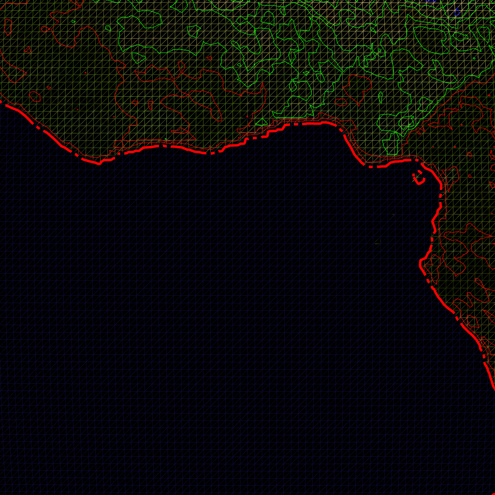
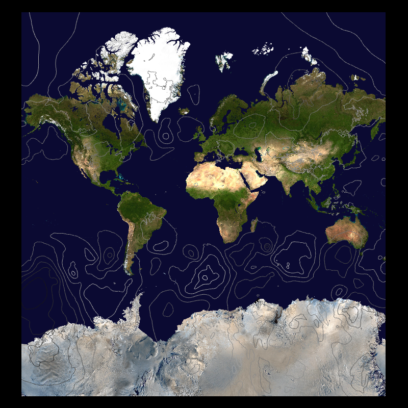
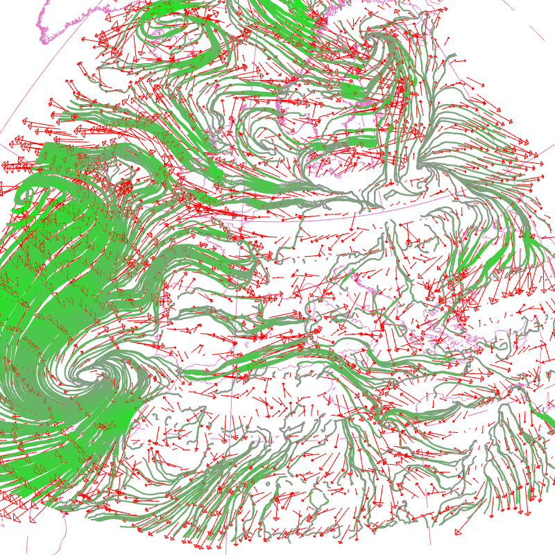
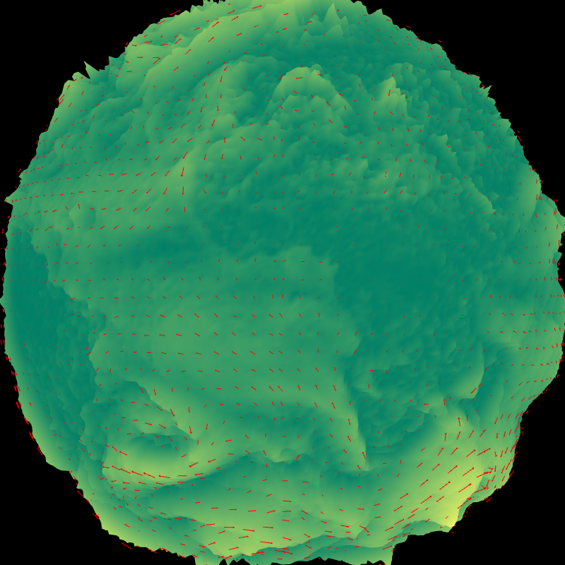
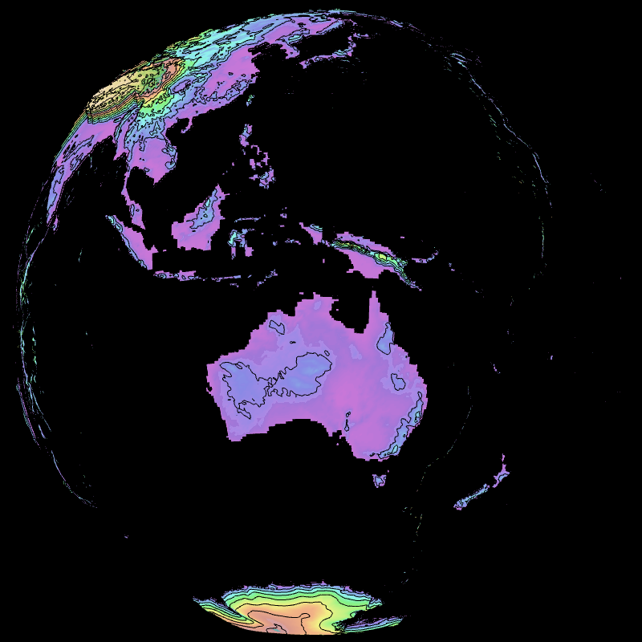

Display GRIB2 fields with OpenGL. Raster, contour, vector, colorbar, mapscale, coastlines, borders. Lat/lon, lambert, gaussian grid.
  ## Clouds, 3 layers, t1198c2.2                                       -- t1198_3l


```
    --landscape.on --landscape.geometry_path testdata/t1198c2.2/Z.grb 
    --field[0].path testdata/t1198c2.2/SURFNEBUL.BASSE.grb --field[1].path 
    testdata/t1198c2.2/SURFNEBUL.MOYENN.grb --field[2].path 
    testdata/t1198c2.2/SURFNEBUL.HAUTE.grb --field[0].scale 1.03 
    --field[1].scale 1.04 --field[2].scale 1.05 --field[0].palette.name 
    cloud --field[1].palette.name cloud --field[2].palette.name cloud 
```
## Clouds, 3 layers, t1798c2.2                                       -- t1798_3l


```
    --landscape.on --landscape.geometry_path testdata/t1798/Z.grb 
    --field[0].path testdata/t1798/SURFNEBUL.BASSE.grb --field[1].path 
    testdata/t1798/SURFNEBUL.MOYENN.grb --field[2].path 
    testdata/t1798/SURFNEBUL.HAUTE.grb --field[0].scale 1.03 
    --field[1].scale 1.04 --field[2].scale 1.05 --field[0].palette.name 
    cloud --field[1].palette.name cloud --field[2].palette.name cloud 
```
## AROME, Lambert geometry                                           -- aro


```
    --field[0].path testdata/aro2.5/SURFIND.TERREMER.grb 
    --field[0].palette.name cold_hot --field[0].scale 1.00 --view.lat 46.2 
    --view.lon 2.0 --view.fov 5 --coast.on --grid.on 
```
## AROME, Lambert geometry, polar stereo                             -- aro_polar


```
    --field[0].path testdata/aro2.5/SURFIND.TERREMER.grb 
    --field[0].palette.name cold_hot --field[0].scale 1.00 --view.lat 46.2 
    --view.lon 2.0 --view.fov 5 --coast.on --grid.on --view.projection 
    POLAR_NORTH --view.lat 70 --view.fov 12 
```
## Font background color                                             -- background


```
    --landscape.on --landscape.geometry_path testdata/t1198c2.2/Z.grb 
    --field[0].path testdata/t1198c2.2/N.grb --field[0].scale 1.03 
    --scene.date.on --scene.date.font.scale 0.03 
    --scene.date.font.color.foreground red 
    --scene.date.font.color.background white 
```
## Enable debug mode                                                 -- debug


```
    --landscape.on --landscape.geometry_path testdata/t1198c2.2/Z.grb 
    --field[0].path testdata/t1198c2.2/N.grb --field[0].scale 1.03 
    --window.debug.on 
```
## Select palette automatically                                      -- bw


```
    --landscape.on --landscape.geometry_path testdata/t1198c2.2/Z.grb 
    --field[0].path testdata/t1198c2.2/N.grb --field[0].scale 1.03 
```
## Cities                                                            -- cities


```
    --landscape.on --cities.on --cities.points.scale 1.01 
    --cities.points.size.value 1 --cities.points.size.variable.on 
    --view.lat 46.7 --view.lon 2 --view.fov 2 --cities.points.size.value 2 
    --cities.labels.on --cities.labels.font.color.foreground red 
    --cities.labels.font.scale 0.04 
```
## Colorbar                                                          -- colorbar


```
    --landscape.on --landscape.geometry_path testdata/t1198c2.2/Z.grb 
    --field[0].path testdata/t1198c2.2/N.grb --field[0].scale 1.03 
    --colorbar.on --colorbar.font.color.foreground green --window.width 
    1000 
```
## Low-res contour                                                   -- contour1


```
    --window.width 1024 --window.height 1024 --landscape.on 
    --landscape.path landscape/black.bmp --field[0].path 
    testdata/contour/t0049.grb --field[0].scale 1.03 --field[0].type 
    CONTOUR 
```
## Medium-res contour                                                -- contour2


```
    --window.width 1024 --window.height 1024 --landscape.on 
    --landscape.path landscape/black.bmp --field[0].path 
    testdata/contour/t0479.grb --field[0].scale 1.03 --field[0].type 
    CONTOUR 
```
## High-res contour                                                  -- contour3


```
    --window.width 1024 --window.height 1024 --landscape.on 
    --landscape.path landscape/black.bmp --field[0].path 
    testdata/contour/t1798.grb --field[0].scale 1.03 --field[0].type 
    CONTOUR 
```
## Contour & raster, Lambert geometry                                -- contour_aro1


```
    --field[0].path testdata/aro_small/S041WIND.U.PHYS.grb 
    --field[0].scale 1.00 --field[0].palette.name cold_hot --field[1].path 
    testdata/aro_small/S041WIND.U.PHYS.grb --field[1].scale 1.03 
    --field[1].type CONTOUR --view.lon 26.64 --view.lat 67.36 --view.fov 
    0.5 --coast.on --grid.on 
```
## Contour & raster, Lambert geometry                                -- contour_aro2


```
    --field[0].path testdata/aro2.5/S090WIND.U.PHYS.grb --field[0].scale 
    1.00 --field[0].palette.name cold_hot --field[1].path 
    testdata/aro2.5/S090WIND.U.PHYS.grb --field[1].scale 1.03 
    --field[1].type CONTOUR --view.lat 46.2 --view.lon 2.0 --view.fov 5 
    --coast.on --grid.on 
```
## Contour in diff mode, global lat/lon geometry                     -- contour_diff


```
    --field[0].diff.on --field[0].type CONTOUR --field[0].path 
    testdata/glob01/lfpw_0_3_1_sfc_0_prmsl+0000.grib2 
    testdata/glob01/lfpw_0_3_1_sfc_0_prmsl+0102.grib2 --field[0].scale 
    1.01 
```
## Low-res simple contour, limited area lat/lon geometry             -- contour_latlon1


```
    --window.width 1024 --window.height 1024 --landscape.on 
    --landscape.path landscape/black.bmp --field[0].path 
    testdata/contour/latlon9x6.grb --field[0].scale 1.03 --field[0].type 
    CONTOUR 
```
## Low-res simple contour, limited area lat/lon geometry             -- contour_latlon2


```
    --window.width 1024 --window.height 1024 --landscape.on 
    --landscape.path landscape/black.bmp --field[0].path 
    testdata/contour/latlon18x13.grb --field[0].scale 1.03 --field[0].type 
    CONTOUR 
```
## Medium-res contour, limited area lat/lon geometry                 -- contour_latlon3


```
    --window.width 1024 --window.height 1024 --landscape.on 
    --landscape.path landscape/black.bmp --field[0].path 
    testdata/eurat01/lfpw_0_0_0_pl_1000_t.grib2 --field[0].scale 1.03 
    --field[0].type CONTOUR 
```
## Medium-res contour and raster, global geometry                    -- contour_latlon4


```
    --window.width 1024 --window.height 1024 --field[0].path 
    testdata/glob025/lfpw_0_0_0_pl_1000_t.grib2 --field[1].path 
    testdata/glob025/lfpw_0_0_0_pl_1000_t.grib2 --field[1].palette.colors 
    black --field[1].type CONTOUR --field[1].scale 1.001 
```
## Contour on stretched/rotated gaussian geometry                    -- contour_stretched


```
    --window.width 1024 --window.height 1024 --field[0].path 
    testdata/t1198c2.2/Z.grb --field[0].scale 1.03 --field[0].type CONTOUR 
```
## Contour with dashed lines, gaussian geometry                      -- dashed1


```
    --landscape.on --landscape.wireframe.on --landscape.geometry_path 
    testdata/contour/t0479.grb --window.width 1024 --window.height 1024 
    --field[0].palette.colors white --field[0].path 
    testdata/contour/t0479.grb --field[0].scale 1.00 --field[0].type 
    CONTOUR --field[0].contour.lengths 100 --field[0].contour.patterns X- 
    --view.fov 5 
```
## Contour with dashed thick lines, gaussian geometry                -- dashed2


```
    --landscape.on --landscape.wireframe.on --landscape.geometry_path 
    testdata/contour/t0479.grb --window.width 1024 --window.height 1024 
    --field[0].palette.colors white --field[0].path 
    testdata/contour/t0479.grb --field[0].scale 1.01 --field[0].type 
    CONTOUR --field[0].contour.lengths 100 --field[0].contour.patterns 
    XXXXXXXXX-X- --view.fov 5 --field[0].contour.widths 5 
```
## Contour with dashed thick colored lines, gaussian geometry        -- dashed3


```
    --landscape.on --landscape.wireframe.on --landscape.geometry_path 
    testdata/contour/t0479.grb --window.width 1024 --window.height 1024 
    --field[0].path testdata/contour/t0479.grb --field[0].scale 1.01 
    --field[0].type CONTOUR --field[0].contour.lengths 100 
    --field[0].contour.patterns XXXXXXXXX-X- --view.fov 5 
    --field[0].contour.widths 5 --field[0].palette.colors red green blue 
```
## Display French departements                                       -- departements


```
    --departements.on --departements.lines.color blue 
    --departements.lines.selector 
    code_insee = 23 or code_insee = 19 or code_insee = 87 --view.lon 2 
    --view.lat 46.7 --view.fov 5 --coast.on 
```
## Temperature field on Europe, over global cloud fields             -- eurat01


```
    --landscape.on --landscape.geometry_path testdata/t1198c2.2/Z.grb 
    --field[0].path testdata/t1198c2.2/N.grb --field[1].path 
    testdata/eurat01/lfpw_0_0_0_pl_1000_t.grib2 --field[0].scale 1.02 
    --field[1].scale 1.03 --field[0].palette.name cloud_auto 
    --field[1].palette.name cold_hot 
```
## Test FA format, display sea fraction                              -- fa


```
    --field[0].path testdata/fa/PGD.t479.fa%SFX.FRAC_SEA --field[0].scale 
    1.03 
```
## Surface temperature, global lat/lon field                         -- glob01


```
    --field[0].path testdata/glob01/lfpw_0_0_0_sfc_0_t.grib2 
    --field[0].scale 1.00 --field[0].palette.name cold_hot_temp --coast.on 
    --grid.on 
```
## Lambert geometry, French Guyana                                   -- guyane


```
    --landscape.on --field[0].path testdata/aro_guyane/SURFTEMPERATURE.grb 
    --field[0].palette.name cold_hot_temp --field[0].scale 1.01 --view.lat 
    5 --view.lon -51 --view.fov 3 --coast.on --grid.on 
```
## Image on top of cloud fields                                      -- image


```
    --landscape.on --landscape.geometry_path testdata/t1198c2.2/Z.grb 
    --field[0].path testdata/t1198c2.2/N.grb --field[0].scale 1.03 
    --scene.image.on --scene.image.path testdata/image/B.bmp 
    --scene.image.x0 0. --scene.image.y0 0. --scene.image.x1 0.1 
    --scene.image.y1 0.1 
```
## Interpolate field over time                                       -- interpolation


```
    --field[0].path testdata/interp/01.grb testdata/interp/36.grb 
    --field[0].scale 1.03 --field[0].palette.name cold_hot_temp --view.lon 
    2 --view.lat 46.7 --view.fov 5 --scene.interpolation.on 
    --scene.interpolation.frames 200 --window.width 1000 --window.height 
    1000 --scene.date.font.scale 0.03 --scene.date.font.color.foreground 
    red --scene.date.on --coast.on --grid.on 
```
## Landscape over Europe only                                        -- landscape_eurat01


```
    --landscape.on --landscape.geometry_path 
    testdata/eurat01/lfpw_0_0_0_pl_1000_t.grib2 --coast.on --grid.on 
```
## Display mapscale                                                  -- mapscale


```
    --landscape.on --mapscale.on 
```
## Display contour field using Mercator projection                   -- mercator


```
    --field[0].diff.on --field[0].type CONTOUR --field[0].path 
    testdata/glob01/lfpw_0_3_1_sfc_0_prmsl+0000.grib2 
    testdata/glob01/lfpw_0_3_1_sfc_0_prmsl+0102.grib2 --field[0].scale 
    1.01 --view.projection MERCATOR --landscape.on 
```
## Display field with missing values                                 -- missingvalue


```
    --field[0].path testdata/t49/SFX.CLAY.grb --coast.on --grid.on 
```
## Display field with keeping field values in RAM                    -- novalue


```
    --landscape.on --landscape.geometry_path testdata/t1798/Z.grb 
    --field[0].path testdata/t1798/SURFNEBUL.BASSE.grb --field[0].scale 
    1.03 --field[0].palette.name cloud_auto --field[0].no_value_pointer.on 
```
## Display field in offscreen mode                                   -- offscreen


```
    --landscape.on --landscape.geometry_path testdata/t1198c2.2/Z.grb 
    --window.offscreen.on --window.offscreen.frames 10 
    --scene.light.rotate.on --scene.light.on --field[0].path 
    testdata/t1198c2.2/SURFNEBUL.BASSE.grb 
    testdata/t1198c2.2/SURFNEBUL.MOYENN.grb 
    testdata/t1198c2.2/SURFNEBUL.HAUTE.grb --field[0].scale 1.03 1.03 1.03 
    --field[0].palette.name cloud_auto cloud_auto cloud_auto 
```
## Display field with options in file                                -- optionsfile


```
    --{testdata/options.list} 
```
## Display field with palette gradient color                         -- palette_values_grad


```
    --landscape.on --landscape.geometry_path testdata/t1198c2.2/Z.grb 
    --field[0].path testdata/t1198c2.2/N.grb --field[0].scale 1.03 
    --field[0].palette-{ --colors #00000000 #008bff #01f8e9 #05cf66 
    #34c00c #b6e904 #ffe600 #ffb500 #ff6900 #ff0f00 #b3003e #570088 
    --values 0 2 6 10 14 18 22 26 30 34 38 42 --min 0 --max 46 }- 
    --colorbar.on --window.width 1200 
```
## Display field with discrete palette                               -- palette_values


```
    --landscape.on --landscape.geometry_path testdata/t1198c2.2/Z.grb 
    --field[0].path testdata/t1198c2.2/N.grb --field[0].scale 1.03 
    --field[0].palette-{ --colors #00000000 #008bff #01f8e9 #05cf66 
    #34c00c #b6e904 #ffe600 #ffb500 #ff6900 #ff0f00 #b3003e #570088 
    --values 0 2 6 10 14 18 22 26 30 34 38 42 46 --min 0 --max 46 }- 
    --colorbar.on --window.width 1200 
```
## Display field difference                                          -- scalar_diff


```
    --field[0].diff.on --field[0].path testdata/interp/01.grb 
    testdata/interp/36.grb --field[0].scale 1.01 --view.lon 2 --view.lat 
    46.7 --view.fov 5 --field[0].palette-{ --name cold_hot --min -10 --max 
    +10 }- 
```
## Select field from GRIB file                                       -- select_grib


```
    --landscape.on --landscape.geometry_path testdata/t1198c2.2/Z.grb 
    --field[0].path testdata/t1198c2.2/N.grb%parameterCategory=6,year=2019 
    --field[0].scale 1.03 
```
## Test interactive shell                                            -- shell


```
    --landscape.on --landscape.geometry_path testdata/t1198c2.2/Z.grb 
    --field[0].path testdata/t1198c2.2/N.grb --field[0].scale 1.03 
    --shell.on 
```
## Wind on small AROME domain (raster & vector)                      -- small_aro


```
    --field[0].type VECTOR --field[0].path 
    testdata/aro_small/S041WIND.U.PHYS.grb 
    testdata/aro_small/S041WIND.V.PHYS.grb --field[0].scale 1.00 
    --view.lon 26.64 --view.lat 67.36 --view.fov 0.5 --coast.on --grid.on 
```
## Low-res ARPEGE resolution                                         -- small


```
    --landscape.on --landscape.geometry_path testdata/t49/Z.grb 
    --field[0].scale 1.01 --field[0].path testdata/t49/SFX.CLAY.grb 
    --coast.on --grid.on 
```
## 3D strings on the sphere                                          -- strxyz


```
    --field[0].path testdata/t1198c2.2/N.grb --field[0].scale 0.99 
    --colorbar.on --colorbar.font.color.foreground green --window.width 
    1000 --view.projection XYZ --scene.test_strxyz.on 
```
## Display text                                                      -- text


```
    --landscape.on --landscape.geometry_path testdata/t1198c2.2/Z.grb 
    --field[0].path testdata/t1198c2.2/N.grb --field[0].scale 1.03 
    --scene.text.on --scene.text.s coucou --scene.text.x 0.0 
    --scene.text.y 1.0 --scene.text.a NW --scene.text.font.scale 0.03 
    --scene.text.font.color.foreground black 
    --scene.text.font.color.background white 
```
## Display title (field name)                                        -- title


```
    --landscape.on --landscape.geometry_path testdata/t1198c2.2/Z.grb 
    --field[0].path testdata/t1198c2.2/N.grb --field[0].scale 1.03 
    --scene.title.on 
```
## Test travelling option                                            -- travelling


```
    --scene.travelling.on --scene.travelling.pos1.lon 0 
    --scene.travelling.pos1.lat 0 --scene.travelling.pos1.fov 30 
    --scene.travelling.pos2.lon 90 --scene.travelling.pos2.lat 45 
    --scene.travelling.pos2.fov 10 --landscape.on 
    --landscape.geometry_path testdata/t1198c2.2/Z.grb --field[0].path 
    testdata/t1198c2.2/N.grb --field[0].scale 1.03 
```
## Display vector norm & arrow, Lambert geometry                     -- vector


```
    --field[0].type VECTOR --field[0].path 
    testdata/aro2.5/S090WIND.U.PHYS.grb 
    testdata/aro2.5/S090WIND.V.PHYS.grb --field[0].scale 1.00 
    --field[0].vector.color green --view.lat 46.2 --view.lon 2.0 
    --view.fov 5 --coast.on --grid.on 
```
## Display vector norm, global lat/lon geometry                      -- vector_glob25


```
    --landscape.on --landscape.geometry_path 
    testdata/arpt1798_wind/lfpw_0_2_2_sfc_20_u.grib2 --field[0].type 
    VECTOR --field[0].path testdata/arpt1798_wind/glob25_+1.grb 
    testdata/arpt1798_wind/glob25_+1.grb --field[0].scale 1.01 --coast.on 
    --grid.on 
```
## Vector arrow, stretched/rotated gaussian geometry                 -- vector_t1798


```
    --landscape.on --landscape.geometry_path testdata/arpt1798_wind/+1.grb 
    --field[0].type VECTOR --field[0].path testdata/arpt1798_wind/+1.grb 
    testdata/arpt1798_wind/+1.grb --field[0].scale 1.01 --coast.on 
    --grid.on 
```
## Display landscape in WebMercator projection                       -- webmercator


```
    --landscape-{ --on --path 
    ./landscape/WebMercator_00006_00021_00028_00037_00035.ORTHOIMAGERY.ORTHOPHOTOS.bmp 
    --projection WEBMERCATOR }- --grid.on 
```
## Display wind on stretched/rotated gaussian geometry               -- wind_arp


```
    --landscape.on --landscape.geometry_path testdata/t31c2.4/Z.grb 
    --field[0].type VECTOR --field[0].path 
    testdata/t31c2.4/S015WIND.U.PHYS.grb 
    testdata/t31c2.4/S015WIND.V.PHYS.grb --field[0].scale 1.01 --coast.on 
    --grid.on 
```
## Wind on global lat/lon geometry                                   -- wind_glob25


```
    --landscape.on --landscape.geometry_path 
    testdata/arpt1798_wind/lfpw_0_2_2_sfc_20_u.grib2 --field[0].type 
    VECTOR --field[0].path 
    testdata/arpt1798_wind/lfpw_0_2_2_sfc_20_u.grib2 
    testdata/arpt1798_wind/lfpw_0_2_3_sfc_20_v.grib2 --field[0].scale 1.01 
    --coast.on --grid.on 
```
## Wind on stretched/rotated gaussian geometry                       -- wind_t1798


```
    --landscape.on --landscape.geometry_path 
    testdata/arpt1798_wind/S105WIND.U.PHYS.grb --field[0].type VECTOR 
    --field[0].path testdata/arpt1798_wind/S105WIND.U.PHYS.grb 
    testdata/arpt1798_wind/S105WIND.V.PHYS.grb --field[0].scale 1.01 
    --coast.on --grid.on 
```
## Streamlines on t1198c2.2 (surface)                                -- stream_t1198c22


```
    --field[0].scale 1.01 --field[0].path 
    testdata/wind+temp/t1198c2.2/S105WIND.U.PHYS.grb 
    testdata/wind+temp/t1198c2.2/S105WIND.V.PHYS.grb --field[0].type 
    STREAM --field[0].palette-{ --colors grey green --min 0. --max 40. 
    --values 0. 40. }- --field[0].stream.width 1.0 
    --field[0].stream.density 1.0 --field[1].scale 1.01 --field[1].path 
    testdata/wind+temp/t1198c2.2/S105WIND.U.PHYS.grb 
    testdata/wind+temp/t1198c2.2/S105WIND.V.PHYS.grb --field[1].type 
    VECTOR --field[1].vector.hide_norm.on --field[1].vector.color red 
    --grid.on --grid.color red --grid.scale 1.02 --coast.lines.scale 1.02 
    --coast.on --coast.lines.color red --landscape.on --landscape.path 
    landscape/white.png 
```
## Streamlines on GLOB025 (high level)                               -- stream_glob025


```
    --field[0].path testdata/wind+temp/glob025/P020WIND.U.PHYS.grb 
    testdata/wind+temp/glob025/P020WIND.V.PHYS.grb --field[0].type STREAM 
    --field[0].palette-{ --colors grey green --min 0. --max 40. --values 
    0. 40. }- --field[0].stream.width 1.0 --field[1].type VECTOR 
    --field[1].path testdata/wind+temp/glob025/P020WIND.U.PHYS.grb 
    testdata/wind+temp/glob025/P020WIND.V.PHYS.grb --field[1].vector.color 
    red --field[1].vector.scale 5 --field[1].scale 1.01 --grid.on 
    --landscape.on --landscape.path landscape/white.bmp --field[0].scale 
    1.01 --grid.color pink --coast.on --coast.lines.color pink 
```
## Streamlines on EURAT01 (surface)                                  -- stream_eurat01


```
    --field[0].path testdata/wind+temp/eurat01/H020WIND.U.PHYS.grb 
    testdata/wind+temp/eurat01/H020WIND.V.PHYS.grb --field[0].type STREAM 
    --field[0].palette-{ --colors grey green --min 0. --max 40. --values 
    0. 40. }- --field[0].stream.width 1.0 --field[1].type VECTOR 
    --field[1].path testdata/wind+temp/eurat01/H020WIND.U.PHYS.grb 
    testdata/wind+temp/eurat01/H020WIND.V.PHYS.grb --field[1].vector.color 
    red --field[1].vector.scale 5 --field[1].scale 1.01 --grid.on 
    --landscape.on --landscape.path landscape/white.bmp --field[0].scale 
    1.01 --grid.color pink --coast.on --coast.lines.color pink --view.lat 
    45 --view.lon 5 --view.fov 10 
```
## Streamlines on AROME 2.5km (surface)                              -- stream_lambert


```
    --field[0].path testdata/aro2.5/S090WIND.U.PHYS.grb 
    testdata/aro2.5/S090WIND.V.PHYS.grb --field[0].type STREAM 
    --field[0].palette-{ --colors grey green --min 0. --max 40. --values 
    0. 40. }- --field[0].stream.width 0.0 --field[0].stream.density 0.5 
    --field[0].stream.width 0.5 --field[1].type VECTOR --field[1].path 
    testdata/aro2.5/S090WIND.U.PHYS.grb 
    testdata/aro2.5/S090WIND.V.PHYS.grb --field[1].vector.color red 
    --field[1].vector.scale 1 --field[1].scale 1.01 --grid.on 
    --landscape.on --landscape.path landscape/white.bmp --field[0].scale 
    1.01 --grid.color pink --coast.on --coast.lines.color pink --view.lon 
    2 --view.lat 46.7 --view.fov 4 
```
## Gaussian grid wireframe                                           -- gauss_wireframe


```
    --field[0]-{ --path testdata/wind+temp/t0149c2.2/S105TEMPERATURE.grb 
    --scalar.wireframe.on }- --coast.on --view.lon 2 --view.lat 46.7 
    --view.fov 5 
```
## Scalar field displayed using points                               -- points_scalar


```
    --field[0]-{ --path testdata/wind+temp/t0224/S105TEMPERATURE.grb 
    --scalar.points-{ --on --size.value 0.5 --size.variable.on 
    --size.factor.off }- }- --coast.on --coast.lines.color green 
```
## Scalar field with points (stretched/rotated grid)                 -- points_scalar_rot


```
    --field[0]-{ --scale 1.01 --path 
    testdata/wind+temp/t0149c2.2/S105TEMPERATURE.grb --scalar.points-{ 
    --on --size.value 0.2 --size.variable.on --size.factor.on }- }- 
    --coast.on --coast.lines.color green --landscape.on 
```
## Scalar field on octahedral grid                                   -- gauss_octahedral


```
    --field[0].path ./testdata/ecmwf/ecmf_0_1_0_ml_137_q.grib2 
    --field[0].palette.colors gray cyan blue --field[0].palette.values 0 
    0.005 0.03 --colorbar.on --window.width 1200 
```
## Landscape with orography (T479)                                   -- land_orography


```
    --landscape.on --landscape.geometry_path ./testdata/t479/Z.grb 
    --landscape.geometry.height.on --landscape.geometry.height.scale 0.2 
    --landscape.geometry.height.path ./testdata/t479/Z.grb 
    --landscape.flat.off 
```
## Spherical harmonic (T1198)                                        -- harmonic


```
    --field[0].path testdata/harmonics/SPEC.+0008.+0004.grb 
    --field[0].palette-{ --colors blue green red --values -1 0. 1 }- 
    --field[0].geometry.height.on --field[0].geometry.height.scale 0.2 
    --view.fov 25 --view.lon 20 --scene.light.on 
```
## Orography with height                                             -- orography_height


```
    --field[0].path ./testdata/t1798/Z.grb --field[0].palette.name topo 
    --field[0].scale 1.005 --landscape.on --field[0].geometry.height.on 
```
## Height = vector norm value                                        -- height_vector


```
    --field[0].type VECTOR --field[0].path 
    testdata/wind+temp/t0224/S105WIND.U.PHYS.grb 
    testdata/wind+temp/t0224/S105WIND.V.PHYS.grb 
    --field[0].geometry.height.on --field[0].geometry.height.scale 0.2 
    --field[0].vector.color red --field[0].palette.name summer 
```
## Height = scalar norm value                                        -- height_scalar


```
    --field[0].path testdata/wind+temp/t0224/S105TEMPERATURE.grb 
    --field[0].geometry.height.on --field[0].geometry.height.scale 0.2 
    --view.fov 24 
```
## Orography (raster & contour) with height                          -- contour_height


```
    --field[0].path testdata/t479/Z.grb --field[0].scale 1.005 
    --field[0].type CONTOUR --field[1].geometry.height.on 
    --field[0].palette.colors black --field[1].path testdata/t479/Z.grb 
    --field[0].geometry.height.on --view.lat -16 --view.lon 134 
```
