Display GRIB2 fields with OpenGL. Raster, contour, vector, colorbar, mapscale, coastlines, borders. Lat/lon, lambert, gaussian grid.
  ## Clouds, 3 layers, t1198c2.2                                       -- t1198_3l
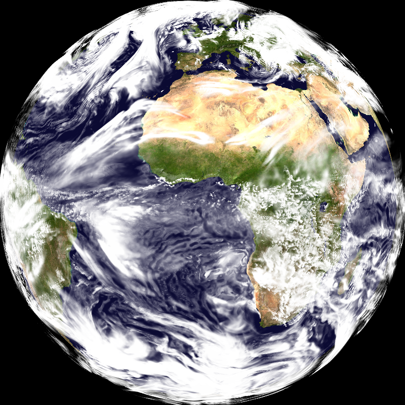

```
    --landscape.on --landscape.geometry_path share/data/t1198c2.2/Z.grb 
    --field[0].path share/data/t1198c2.2/SURFNEBUL.BASSE.grb 
    --field[1].path share/data/t1198c2.2/SURFNEBUL.MOYENN.grb 
    --field[2].path share/data/t1198c2.2/SURFNEBUL.HAUTE.grb 
    --field[0].scale 1.03 --field[1].scale 1.04 --field[2].scale 1.05 
    --field[0].palette.name cloud --field[1].palette.name cloud 
    --field[2].palette.name cloud 
```
## Clouds, 3 layers, t1798c2.2                                       -- t1798_3l
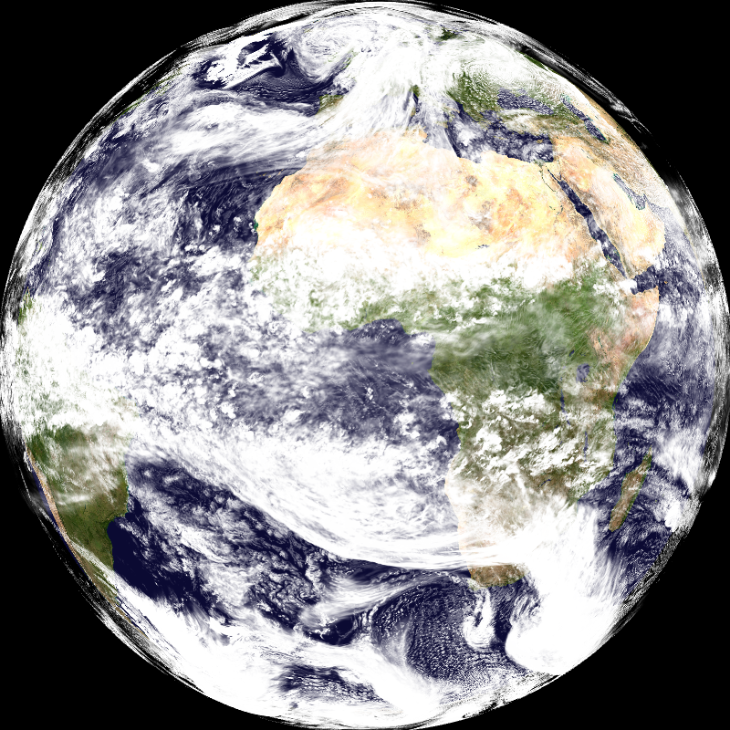

```
    --landscape.on --landscape.geometry_path share/data/t1798/Z.grb 
    --field[0].path share/data/t1798/SURFNEBUL.BASSE.grb --field[1].path 
    share/data/t1798/SURFNEBUL.MOYENN.grb --field[2].path 
    share/data/t1798/SURFNEBUL.HAUTE.grb --field[0].scale 1.03 
    --field[1].scale 1.04 --field[2].scale 1.05 --field[0].palette.name 
    cloud --field[1].palette.name cloud --field[2].palette.name cloud 
```
## AROME, Lambert geometry                                           -- aro


```
    --field[0].path share/data/aro2.5/SURFIND.TERREMER.grb 
    --field[0].palette.name cold_hot --field[0].scale 1.00 --view.lat 46.2 
    --view.lon 2.0 --view.fov 5 --coast.on --grid.on 
```
## AROME, Lambert geometry, polar stereo                             -- aro_polar
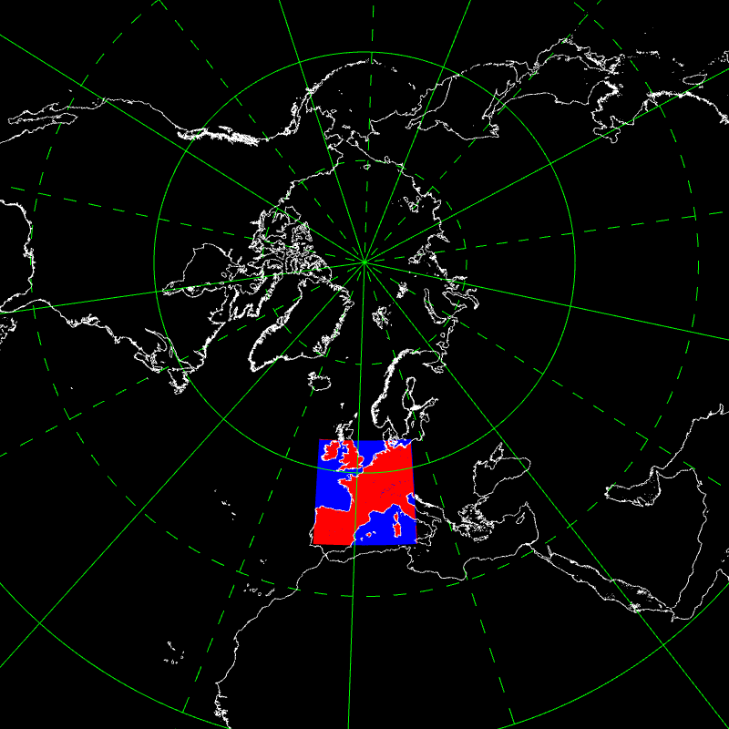

```
    --field[0].path share/data/aro2.5/SURFIND.TERREMER.grb 
    --field[0].palette.name cold_hot --field[0].scale 1.00 --view.lat 46.2 
    --view.lon 2.0 --view.fov 5 --coast.on --grid.on --view.projection 
    POLAR_NORTH --view.lat 70 --view.fov 12 
```
## Font background color                                             -- background
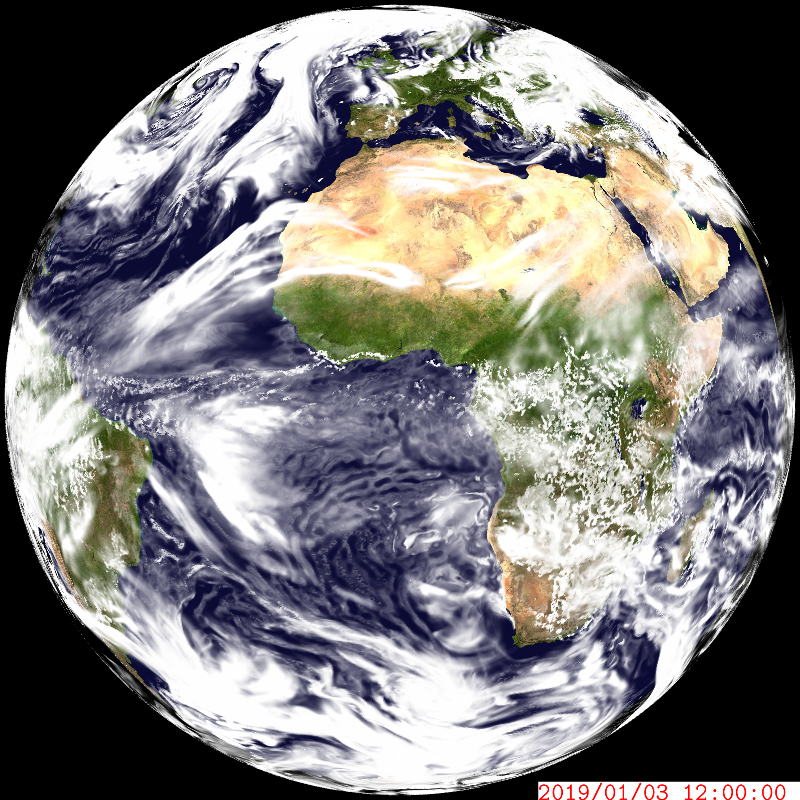

```
    --landscape.on --landscape.geometry_path share/data/t1198c2.2/Z.grb 
    --field[0].path share/data/t1198c2.2/N.grb --field[0].scale 1.03 
    --scene.date.on --scene.date.font.scale 0.03 
    --scene.date.font.color.foreground red 
    --scene.date.font.color.background white 
```
## Enable debug mode                                                 -- debug


```
    --landscape.on --landscape.geometry_path share/data/t1198c2.2/Z.grb 
    --field[0].path share/data/t1198c2.2/N.grb --field[0].scale 1.03 
    --window.debug.on 
```
## Select palette automatically                                      -- bw
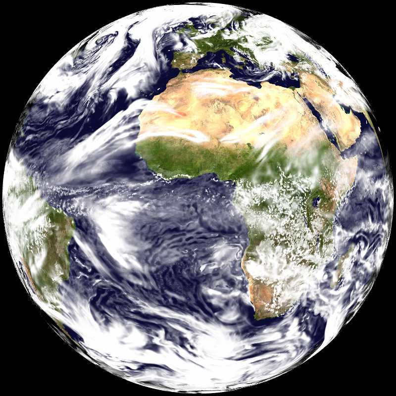

```
    --landscape.on --landscape.geometry_path share/data/t1198c2.2/Z.grb 
    --field[0].path share/data/t1198c2.2/N.grb --field[0].scale 1.03 
```
## Cities                                                            -- cities


```
    --landscape.on --cities.on --cities.points.scale 1.01 
    --cities.points.size.value 1 --cities.points.size.variable.on 
    --view.lat 46.7 --view.lon 2 --view.fov 2 --cities.points.size.value 2 
    --cities.labels.on --cities.labels.font.color.foreground red 
    --cities.labels.font.scale 0.04 
```
## Colorbar                                                          -- colorbar


```
    --landscape.on --landscape.geometry_path share/data/t1198c2.2/Z.grb 
    --field[0].path share/data/t1198c2.2/N.grb --field[0].scale 1.03 
    --colorbar.on --colorbar.font.color.foreground green --window.width 
    1000 
```
## Low-res contour                                                   -- contour1


```
    --window.width 1024 --window.height 1024 --landscape.on 
    --landscape.path landscape/black.bmp --field[0].path 
    share/data/contour/t0049.grb --field[0].scale 1.03 --field[0].type 
    CONTOUR 
```
## Medium-res contour                                                -- contour2


```
    --window.width 1024 --window.height 1024 --landscape.on 
    --landscape.path landscape/black.bmp --field[0].path 
    share/data/contour/t0479.grb --field[0].scale 1.03 --field[0].type 
    CONTOUR 
```
## High-res contour                                                  -- contour3


```
    --window.width 1024 --window.height 1024 --landscape.on 
    --landscape.path landscape/black.bmp --field[0].path 
    share/data/contour/t1798.grb --field[0].scale 1.03 --field[0].type 
    CONTOUR 
```
## Contour & raster, Lambert geometry                                -- contour_aro1


```
    --field[0].path share/data/aro_small/S041WIND.U.PHYS.grb 
    --field[0].scale 1.00 --field[0].palette.name cold_hot --field[1].path 
    share/data/aro_small/S041WIND.U.PHYS.grb --field[1].scale 1.03 
    --field[1].type CONTOUR --view.lon 26.64 --view.lat 67.36 --view.fov 
    0.5 --coast.on --grid.on 
```
## Contour & raster, Lambert geometry                                -- contour_aro2


```
    --field[0].path share/data/aro2.5/S090WIND.U.PHYS.grb --field[0].scale 
    1.00 --field[0].palette.name cold_hot --field[1].path 
    share/data/aro2.5/S090WIND.U.PHYS.grb --field[1].scale 1.03 
    --field[1].type CONTOUR --view.lat 46.2 --view.lon 2.0 --view.fov 5 
    --coast.on --grid.on 
```
## Contour in diff mode, global lat/lon geometry                     -- contour_diff


```
    --field[0].diff.on --field[0].type CONTOUR --field[0].path 
    share/data/glob01/lfpw_0_3_1_sfc_0_prmsl+0000.grib2 
    share/data/glob01/lfpw_0_3_1_sfc_0_prmsl+0102.grib2 --field[0].scale 
    1.01 
```
## Low-res simple contour, limited area lat/lon geometry             -- contour_latlon1
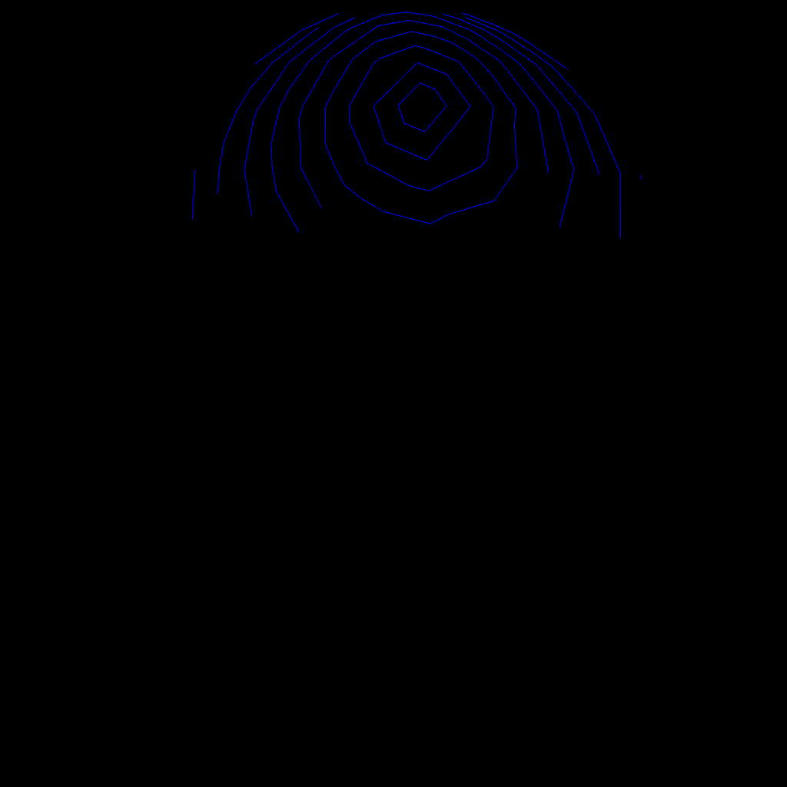

```
    --window.width 1024 --window.height 1024 --landscape.on 
    --landscape.path landscape/black.bmp --field[0].path 
    share/data/contour/latlon9x6.grb --field[0].scale 1.03 --field[0].type 
    CONTOUR 
```
## Low-res simple contour, limited area lat/lon geometry             -- contour_latlon2
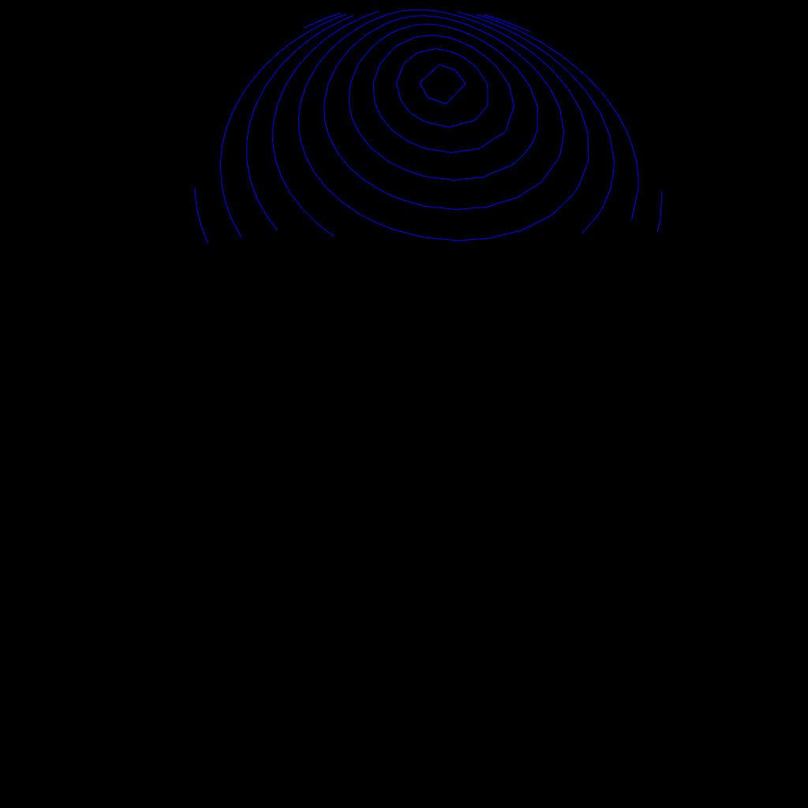

```
    --window.width 1024 --window.height 1024 --landscape.on 
    --landscape.path landscape/black.bmp --field[0].path 
    share/data/contour/latlon18x13.grb --field[0].scale 1.03 
    --field[0].type CONTOUR 
```
## Medium-res contour, limited area lat/lon geometry                 -- contour_latlon3


```
    --window.width 1024 --window.height 1024 --landscape.on 
    --landscape.path landscape/black.bmp --field[0].path 
    share/data/eurat01/lfpw_0_0_0_pl_1000_t.grib2 --field[0].scale 1.03 
    --field[0].type CONTOUR 
```
## Medium-res contour and raster, global geometry                    -- contour_latlon4


```
    --window.width 1024 --window.height 1024 --field[0].path 
    share/data/glob025/lfpw_0_0_0_pl_1000_t.grib2 --field[1].path 
    share/data/glob025/lfpw_0_0_0_pl_1000_t.grib2 
    --field[1].palette.colors black --field[1].type CONTOUR 
    --field[1].scale 1.001 
```
## Contour on stretched/rotated gaussian geometry                    -- contour_stretched


```
    --window.width 1024 --window.height 1024 --field[0].path 
    share/data/t1198c2.2/Z.grb --field[0].scale 1.03 --field[0].type 
    CONTOUR 
```
## Contour with dashed lines, gaussian geometry                      -- dashed1


```
    --landscape.on --landscape.wireframe.on --landscape.geometry_path 
    share/data/contour/t0479.grb --window.width 1024 --window.height 1024 
    --field[0].palette.colors white --field[0].path 
    share/data/contour/t0479.grb --field[0].scale 1.00 --field[0].type 
    CONTOUR --field[0].contour.lengths 100 --field[0].contour.patterns X- 
    --view.fov 5 
```
## Contour with dashed thick lines, gaussian geometry                -- dashed2


```
    --landscape.on --landscape.wireframe.on --landscape.geometry_path 
    share/data/contour/t0479.grb --window.width 1024 --window.height 1024 
    --field[0].palette.colors white --field[0].path 
    share/data/contour/t0479.grb --field[0].scale 1.01 --field[0].type 
    CONTOUR --field[0].contour.lengths 100 --field[0].contour.patterns 
    XXXXXXXXX-X- --view.fov 5 --field[0].contour.widths 5 
```
## Contour with dashed thick colored lines, gaussian geometry        -- dashed3


```
    --landscape.on --landscape.wireframe.on --landscape.geometry_path 
    share/data/contour/t0479.grb --window.width 1024 --window.height 1024 
    --field[0].path share/data/contour/t0479.grb --field[0].scale 1.01 
    --field[0].type CONTOUR --field[0].contour.lengths 100 
    --field[0].contour.patterns XXXXXXXXX-X- --view.fov 5 
    --field[0].contour.widths 5 --field[0].palette.colors red green blue 
```
## Display French departements                                       -- departements
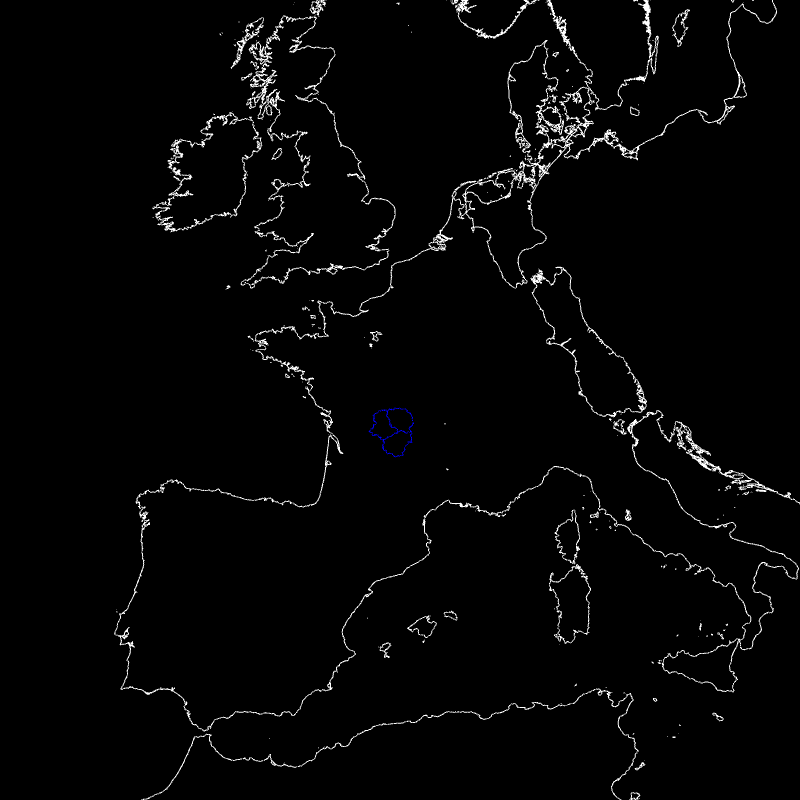

```
    --departements.on --departements.lines.color blue 
    --departements.lines.selector 
    code_insee = 23 or code_insee = 19 or code_insee = 87 --view.lon 2 
    --view.lat 46.7 --view.fov 5 --coast.on 
```
## Temperature field on Europe, over global cloud fields             -- eurat01


```
    --landscape.on --landscape.geometry_path share/data/t1198c2.2/Z.grb 
    --field[0].path share/data/t1198c2.2/N.grb --field[1].path 
    share/data/eurat01/lfpw_0_0_0_pl_1000_t.grib2 --field[0].scale 1.02 
    --field[1].scale 1.03 --field[0].palette.name cloud_auto 
    --field[1].palette.name cold_hot 
```
## Test FA format, display sea fraction                              -- fa


```
    --field[0].path share/data/fa/PGD.t479.fa%SFX.FRAC_SEA 
    --field[0].scale 1.03 
```
## Surface temperature, global lat/lon field                         -- glob01


```
    --field[0].path share/data/glob01/lfpw_0_0_0_sfc_0_t.grib2 
    --field[0].scale 1.00 --field[0].palette.name cold_hot_temp --coast.on 
    --grid.on 
```
## Lambert geometry, French Guyana                                   -- guyane
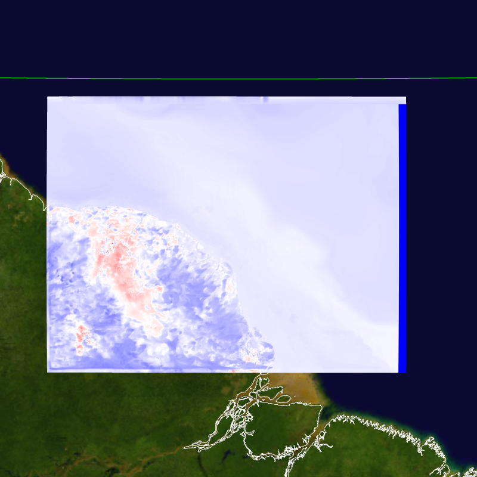

```
    --landscape.on --field[0].user_pref.off --field[0].path 
    share/data/aro_guyane/SURFTEMPERATURE.grb --field[0].palette.name 
    cold_hot_temp --field[0].scale 1.01 --view.lat 5 --view.lon -51 
    --view.fov 3 --coast.on --grid.on 
```
## Image on top of cloud fields                                      -- image
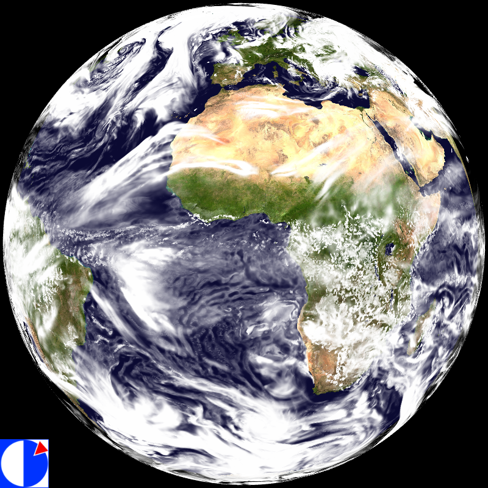

```
    --landscape.on --landscape.geometry_path share/data/t1198c2.2/Z.grb 
    --field[0].path share/data/t1198c2.2/N.grb --field[0].scale 1.03 
    --scene.image.on --scene.image.path share/data/image/B.bmp 
    --scene.image.x0 0. --scene.image.y0 0. --scene.image.x1 0.1 
    --scene.image.y1 0.1 
```
## Interpolate field over time                                       -- interpolation


```
    --field[0].path share/data/interp/01.grb share/data/interp/36.grb 
    --field[0].scale 1.03 --field[0].palette.name cold_hot_temp --view.lon 
    2 --view.lat 46.7 --view.fov 5 --scene.interpolation.on 
    --scene.interpolation.frames 200 --window.width 1000 --window.height 
    1000 --scene.date.font.scale 0.03 --scene.date.font.color.foreground 
    red --scene.date.on --coast.on --grid.on 
```
## Landscape over Europe only                                        -- landscape_eurat01


```
    --landscape.on --landscape.geometry_path 
    share/data/eurat01/lfpw_0_0_0_pl_1000_t.grib2 --coast.on --grid.on 
```
## Display mapscale                                                  -- mapscale


```
    --landscape.on --mapscale.on 
```
## Display contour field using Mercator projection                   -- mercator


```
    --field[0].diff.on --field[0].type CONTOUR --field[0].path 
    share/data/glob01/lfpw_0_3_1_sfc_0_prmsl+0000.grib2 
    share/data/glob01/lfpw_0_3_1_sfc_0_prmsl+0102.grib2 --field[0].scale 
    1.01 --view.projection MERCATOR --landscape.on 
```
## Display field with missing values                                 -- missingvalue


```
    --field[0].path share/data/t49/SFX.CLAY.grb --coast.on --grid.on 
    --field[0].user_pref.off 
```
## Display field with keeping field values in RAM                    -- novalue


```
    --landscape.on --landscape.geometry_path share/data/t1798/Z.grb 
    --field[0].path share/data/t1798/SURFNEBUL.BASSE.grb --field[0].scale 
    1.03 --field[0].palette.name cloud_auto --field[0].no_value_pointer.on 
```
## Display field in offscreen mode                                   -- offscreen


```
    --landscape.on --landscape.geometry_path share/data/t1198c2.2/Z.grb 
    --window.offscreen.on --window.offscreen.frames 36 
    --scene.light.rotate.on --scene.light.on --field[0].path 
    share/data/t1198c2.2/SURFNEBUL.BASSE.grb 
    share/data/t1198c2.2/SURFNEBUL.MOYENN.grb 
    share/data/t1198c2.2/SURFNEBUL.HAUTE.grb --field[0].scale 1.03 1.03 
    1.03 --field[0].palette.name cloud_auto cloud_auto cloud_auto 
    --scene.light.rotate.rate 10 
```
## Display field with options in file                                -- optionsfile


```
    --{share/data/options.list} 
```
## Display field with palette gradient color                         -- palette_values_grad


```
    --landscape.on --landscape.geometry_path share/data/t1198c2.2/Z.grb 
    --field[0].path share/data/t1198c2.2/N.grb --field[0].scale 1.03 
    --field[0].palette-{ --colors #00000000 #008bff #01f8e9 #05cf66 
    #34c00c #b6e904 #ffe600 #ffb500 #ff6900 #ff0f00 #b3003e #570088 
    --values 0 2 6 10 14 18 22 26 30 34 38 42 --min 0 --max 46 }- 
    --colorbar.on --window.width 1200 
```
## Display field with discrete palette                               -- palette_values
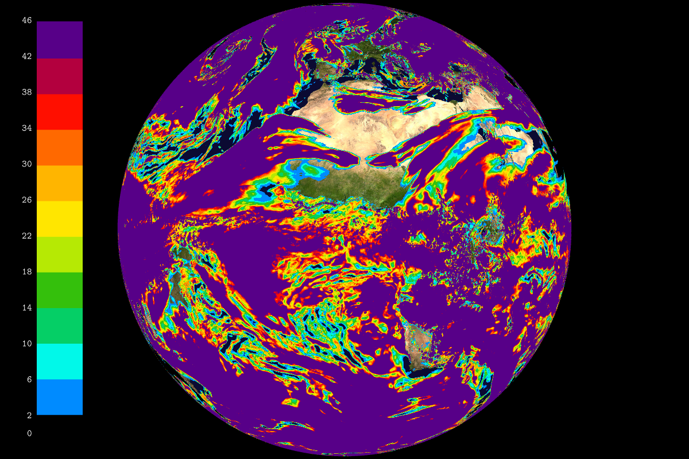

```
    --landscape.on --landscape.geometry_path share/data/t1198c2.2/Z.grb 
    --field[0].path share/data/t1198c2.2/N.grb --field[0].scale 1.03 
    --field[0].palette-{ --colors #00000000 #008bff #01f8e9 #05cf66 
    #34c00c #b6e904 #ffe600 #ffb500 #ff6900 #ff0f00 #b3003e #570088 
    --values 0 2 6 10 14 18 22 26 30 34 38 42 46 --min 0 --max 46 }- 
    --colorbar.on --window.width 1200 
```
## Display field difference                                          -- scalar_diff


```
    --field[0].diff.on --field[0].path share/data/interp/01.grb 
    share/data/interp/36.grb --field[0].scale 1.01 --view.lon 2 --view.lat 
    46.7 --view.fov 5 --field[0].palette-{ --name cold_hot --min -10 --max 
    +10 }- 
```
## Select field from GRIB file                                       -- select_grib


```
    --landscape.on --landscape.geometry_path share/data/t1198c2.2/Z.grb 
    --field[0].path 
    share/data/t1198c2.2/N.grb%parameterCategory=6,year=2019 
    --field[0].scale 1.03 
```
## Test interactive shell                                            -- shell


```
    --landscape.on --landscape.geometry_path share/data/t1198c2.2/Z.grb 
    --field[0].path share/data/t1198c2.2/N.grb --field[0].scale 1.03 
    --shell.on 
```
## Wind on small AROME domain (raster & vector)                      -- small_aro
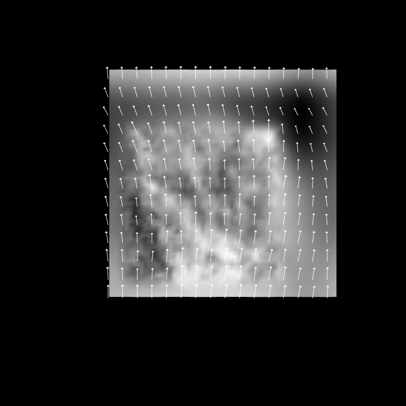

```
    --field[0].type VECTOR --field[0].path 
    share/data/aro_small/S041WIND.U.PHYS.grb 
    share/data/aro_small/S041WIND.V.PHYS.grb --field[0].scale 1.00 
    --view.lon 26.64 --view.lat 67.36 --view.fov 0.5 --coast.on --grid.on 
```
## Low-res ARPEGE resolution                                         -- small
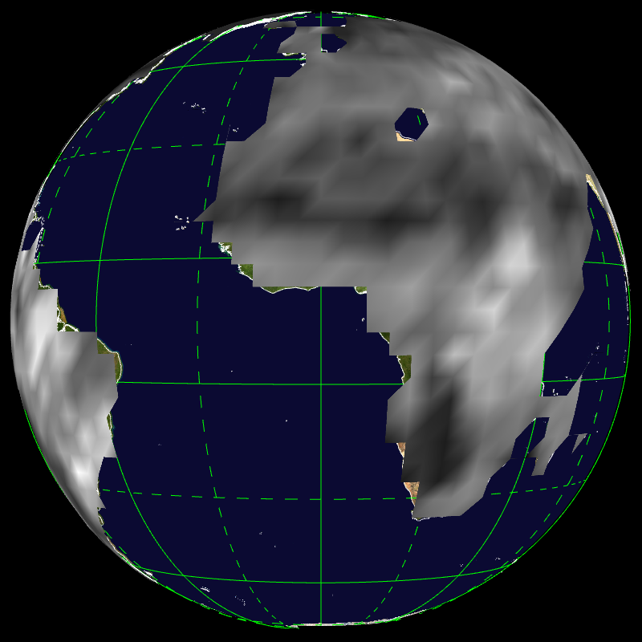

```
    --landscape.on --landscape.geometry_path share/data/t49/Z.grb 
    --field[0].scale 1.01 --field[0].path share/data/t49/SFX.CLAY.grb 
    --coast.on --grid.on --field[0].user_pref.off 
```
## Display text                                                      -- text
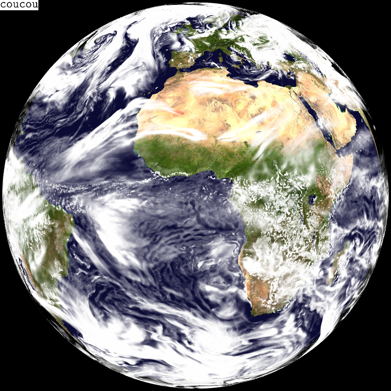

```
    --landscape.on --landscape.geometry_path share/data/t1198c2.2/Z.grb 
    --field[0].path share/data/t1198c2.2/N.grb --field[0].scale 1.03 
    --scene.text.on --scene.text.s coucou --scene.text.x 0.0 
    --scene.text.y 1.0 --scene.text.a NW --scene.text.font.scale 0.03 
    --scene.text.font.color.foreground black 
    --scene.text.font.color.background white 
```
## Display title (field name)                                        -- title
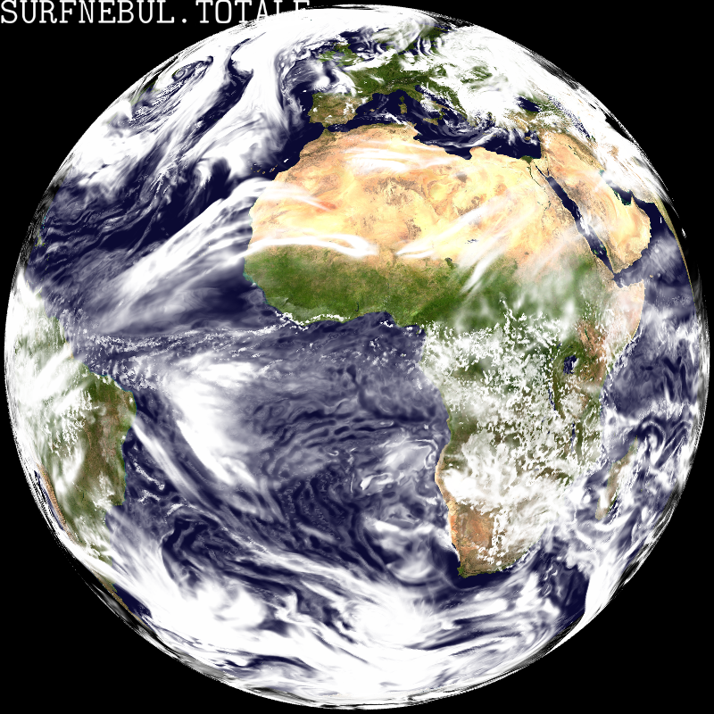

```
    --landscape.on --landscape.geometry_path share/data/t1198c2.2/Z.grb 
    --field[0].path share/data/t1198c2.2/N.grb --field[0].scale 1.03 
    --scene.title.on 
```
## Test travelling option                                            -- travelling


```
    --scene.travelling.on --scene.travelling.pos1.lon 0 
    --scene.travelling.pos1.lat 0 --scene.travelling.pos1.fov 30 
    --scene.travelling.pos2.lon 90 --scene.travelling.pos2.lat 45 
    --scene.travelling.pos2.fov 10 --landscape.on 
    --landscape.geometry_path share/data/t1198c2.2/Z.grb --field[0].path 
    share/data/t1198c2.2/N.grb --field[0].scale 1.03 
```
## Display vector norm & arrow, Lambert geometry                     -- vector


```
    --field[0].type VECTOR --field[0].path 
    share/data/aro2.5/S090WIND.U.PHYS.grb 
    share/data/aro2.5/S090WIND.V.PHYS.grb --field[0].scale 1.00 
    --field[0].vector.arrow.color green --view.lat 46.2 --view.lon 2.0 
    --view.fov 5 --coast.on --grid.on 
```
## Display vector norm, global lat/lon geometry                      -- vector_glob25
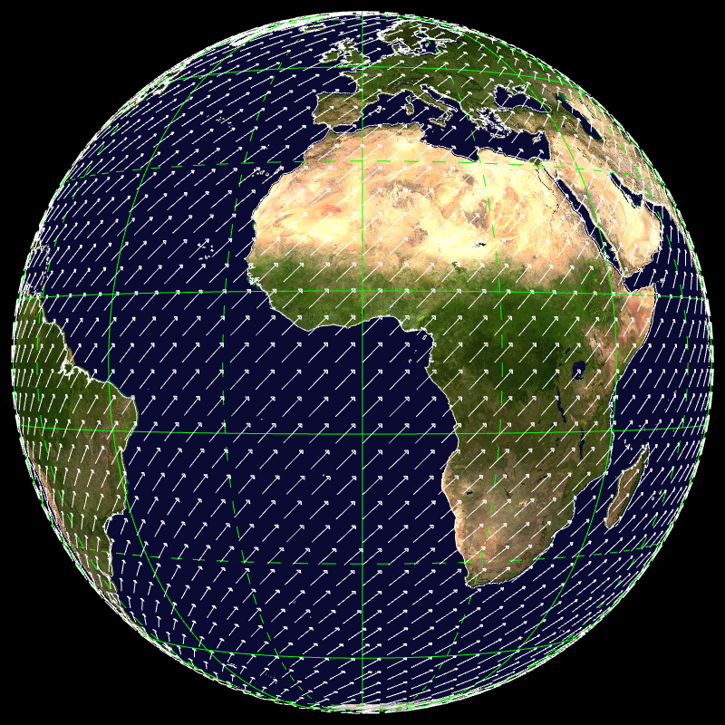

```
    --landscape.on --landscape.geometry_path 
    share/data/arpt1798_wind/lfpw_0_2_2_sfc_20_u.grib2 --field[0].type 
    VECTOR --field[0].path share/data/arpt1798_wind/glob25_+1.grb 
    share/data/arpt1798_wind/glob25_+1.grb --field[0].scale 1.01 
    --coast.on --grid.on 
```
## Vector arrow, stretched/rotated gaussian geometry                 -- vector_t1798


```
    --landscape.on --landscape.geometry_path 
    share/data/arpt1798_wind/+1.grb --field[0].type VECTOR --field[0].path 
    share/data/arpt1798_wind/+1.grb share/data/arpt1798_wind/+1.grb 
    --field[0].scale 1.01 --coast.on --grid.on 
```
## Display landscape in WebMercator projection                       -- webmercator
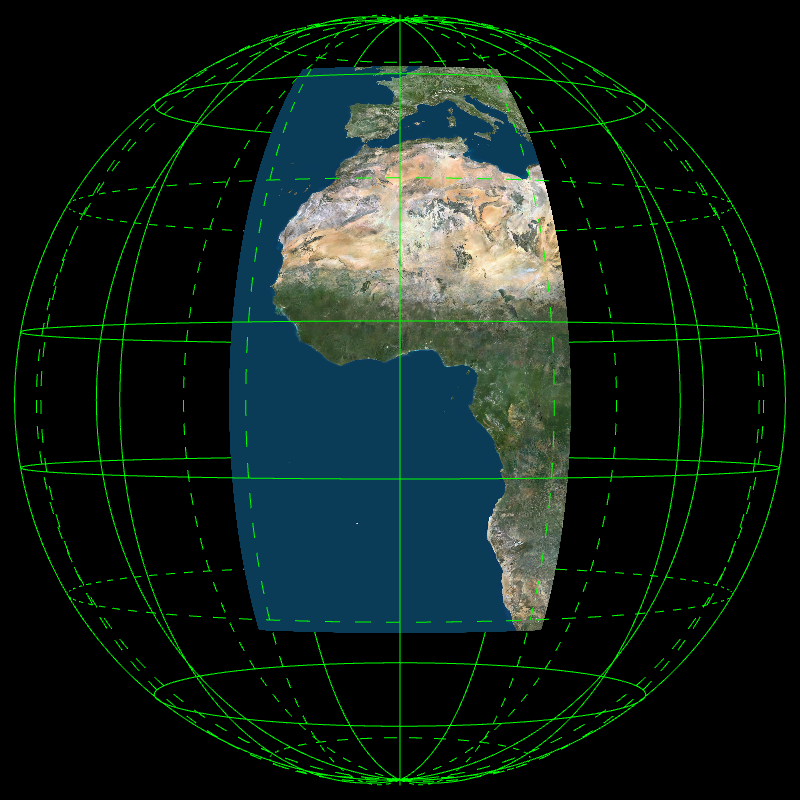

```
    --landscape-{ --on --path 
    ./landscape/WebMercator_00006_00021_00028_00037_00035.ORTHOIMAGERY.ORTHOPHOTOS.bmp 
    --projection WEBMERCATOR }- --grid.on 
```
## Display wind on stretched/rotated gaussian geometry               -- wind_arp
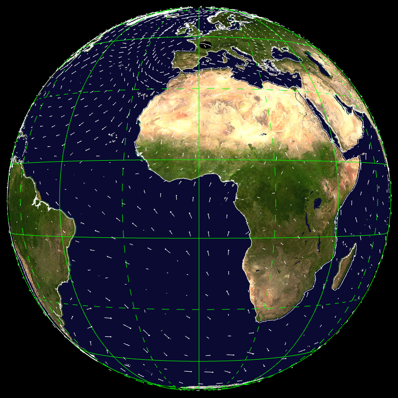

```
    --landscape.on --landscape.geometry_path share/data/t31c2.4/Z.grb 
    --field[0].type VECTOR --field[0].path 
    share/data/t31c2.4/S015WIND.U.PHYS.grb 
    share/data/t31c2.4/S015WIND.V.PHYS.grb --field[0].scale 1.01 
    --coast.on --grid.on 
```
## Wind on global lat/lon geometry                                   -- wind_glob25
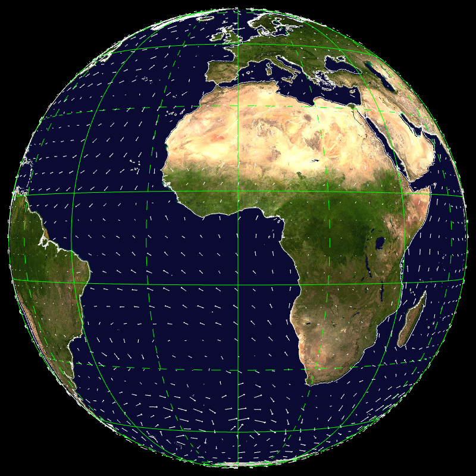

```
    --landscape.on --landscape.geometry_path 
    share/data/arpt1798_wind/lfpw_0_2_2_sfc_20_u.grib2 --field[0].type 
    VECTOR --field[0].path 
    share/data/arpt1798_wind/lfpw_0_2_2_sfc_20_u.grib2 
    share/data/arpt1798_wind/lfpw_0_2_3_sfc_20_v.grib2 --field[0].scale 
    1.01 --coast.on --grid.on 
```
## Wind on stretched/rotated gaussian geometry                       -- wind_t1798


```
    --landscape.on --landscape.geometry_path 
    share/data/arpt1798_wind/S105WIND.U.PHYS.grb --field[0].type VECTOR 
    --field[0].path share/data/arpt1798_wind/S105WIND.U.PHYS.grb 
    share/data/arpt1798_wind/S105WIND.V.PHYS.grb --field[0].scale 1.01 
    --coast.on --grid.on 
```
## Streamlines on t1198c2.2 (surface)                                -- stream_t1198c22
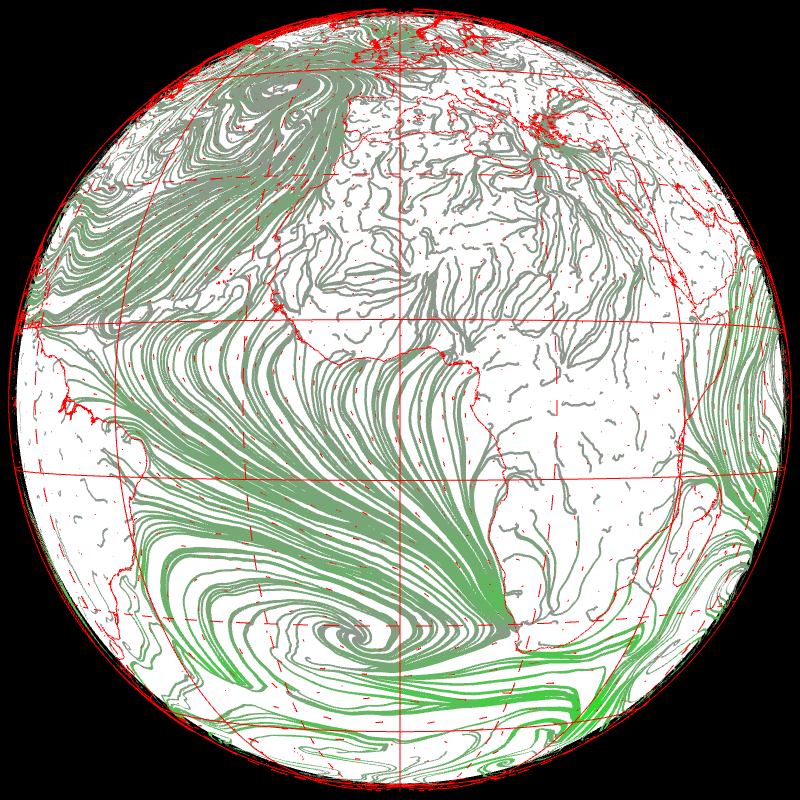

```
    --field[0].scale 1.01 --field[0].path 
    share/data/wind+temp/t1198c2.2/S105WIND.U.PHYS.grb 
    share/data/wind+temp/t1198c2.2/S105WIND.V.PHYS.grb --field[0].type 
    STREAM --field[0].palette-{ --colors grey green --min 0. --max 40. 
    --values 0. 40. }- --field[0].stream.width 1.0 
    --field[0].stream.density 1.0 --field[1].scale 1.01 --field[1].path 
    share/data/wind+temp/t1198c2.2/S105WIND.U.PHYS.grb 
    share/data/wind+temp/t1198c2.2/S105WIND.V.PHYS.grb --field[1].type 
    VECTOR --field[1].vector.norm.off --field[1].vector.arrow.color red 
    --grid.on --grid.color red --grid.scale 1.02 --coast.lines.scale 1.02 
    --coast.on --coast.lines.color red --landscape.on --landscape.path 
    landscape/white.png 
```
## Streamlines on GLOB025 (high level)                               -- stream_glob025
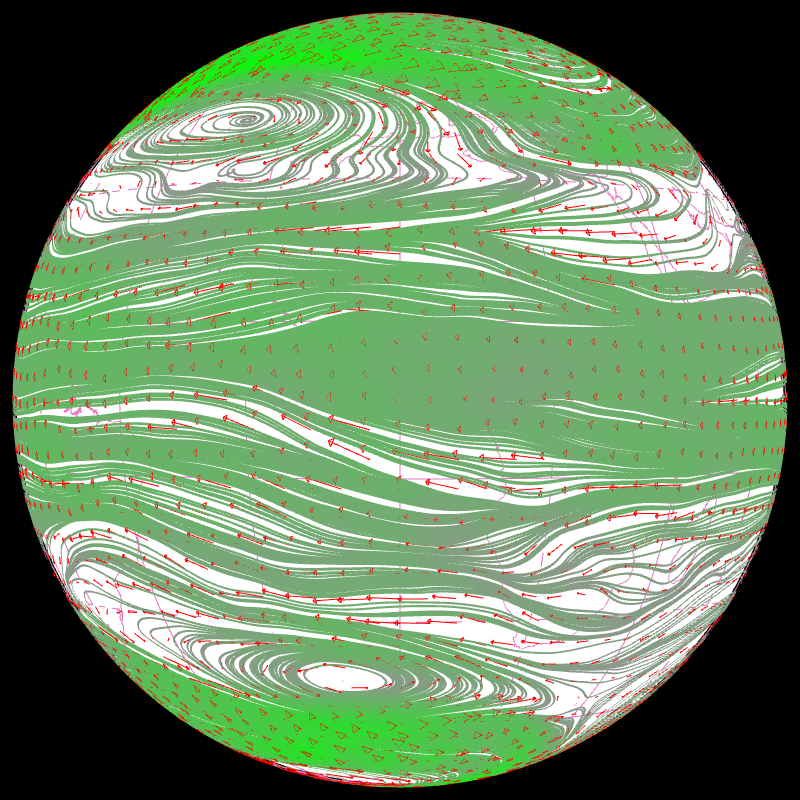

```
    --field[0].path share/data/wind+temp/glob025/P020WIND.U.PHYS.grb 
    share/data/wind+temp/glob025/P020WIND.V.PHYS.grb --field[0].type 
    STREAM --field[0].palette-{ --colors grey green --min 0. --max 40. 
    --values 0. 40. }- --field[0].stream.width 1.0 --field[1].type VECTOR 
    --field[1].path share/data/wind+temp/glob025/P020WIND.U.PHYS.grb 
    share/data/wind+temp/glob025/P020WIND.V.PHYS.grb 
    --field[1].vector.arrow.color red --field[1].vector.scale 5 
    --field[1].scale 1.01 --grid.on --landscape.on --landscape.path 
    landscape/white.bmp --field[0].scale 1.01 --grid.color pink --coast.on 
    --coast.lines.color pink 
```
## Streamlines on EURAT01 (surface)                                  -- stream_eurat01


```
    --field[0].path share/data/wind+temp/eurat01/H020WIND.U.PHYS.grb 
    share/data/wind+temp/eurat01/H020WIND.V.PHYS.grb --field[0].type 
    STREAM --field[0].palette-{ --colors grey green --min 0. --max 40. 
    --values 0. 40. }- --field[0].stream.width 1.0 --field[1].type VECTOR 
    --field[1].path share/data/wind+temp/eurat01/H020WIND.U.PHYS.grb 
    share/data/wind+temp/eurat01/H020WIND.V.PHYS.grb 
    --field[1].vector.arrow.color red --field[1].vector.scale 5 
    --field[1].scale 1.01 --grid.on --landscape.on --landscape.path 
    landscape/white.bmp --field[0].scale 1.01 --grid.color pink --coast.on 
    --coast.lines.color pink --view.lat 45 --view.lon 5 --view.fov 10 
```
## Streamlines on AROME 2.5km (surface)                              -- stream_lambert


```
    --field[0].path share/data/aro2.5/S090WIND.U.PHYS.grb 
    share/data/aro2.5/S090WIND.V.PHYS.grb --field[0].type STREAM 
    --field[0].palette-{ --colors grey green --min 0. --max 40. --values 
    0. 40. }- --field[0].stream.width 0.0 --field[0].stream.density 0.5 
    --field[0].stream.width 0.5 --field[1].type VECTOR --field[1].path 
    share/data/aro2.5/S090WIND.U.PHYS.grb 
    share/data/aro2.5/S090WIND.V.PHYS.grb --field[1].vector.arrow.color 
    red --field[1].vector.scale 1 --field[1].scale 1.01 --grid.on 
    --landscape.on --landscape.path landscape/white.bmp --field[0].scale 
    1.01 --grid.color pink --coast.on --coast.lines.color pink --view.lon 
    2 --view.lat 46.7 --view.fov 4 
```
## Gaussian grid wireframe                                           -- gauss_wireframe


```
    --field[0]-{ --path share/data/wind+temp/t0149c2.2/S105TEMPERATURE.grb 
    --scalar.wireframe.on }- --coast.on --view.lon 2 --view.lat 46.7 
    --view.fov 5 
```
## Scalar field displayed using points                               -- points_scalar
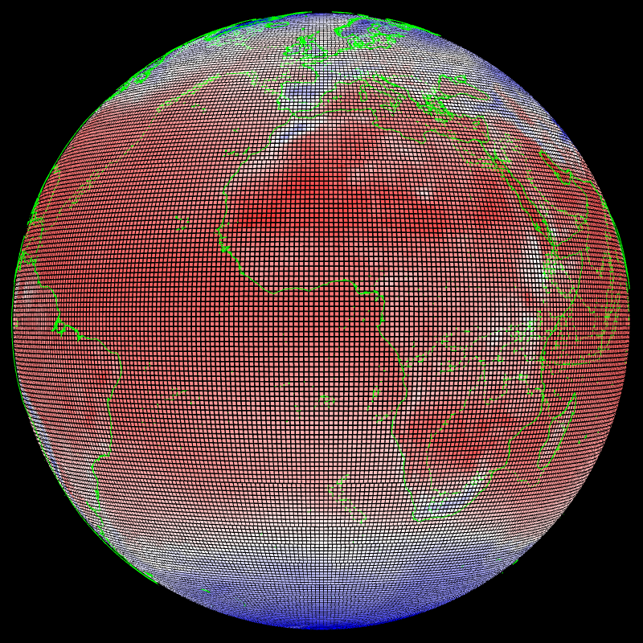

```
    --field[0]-{ --path share/data/wind+temp/t0224/S105TEMPERATURE.grb 
    --scalar.points-{ --on --size.value 0.5 --size.variable.on 
    --size.factor.off }- }- --coast.on --coast.lines.color green 
```
## Scalar field with points (stretched/rotated grid)                 -- points_scalar_rot
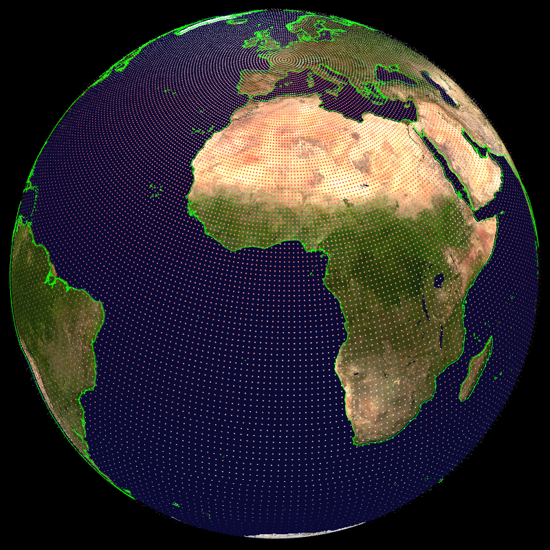

```
    --field[0]-{ --scale 1.01 --path 
    share/data/wind+temp/t0149c2.2/S105TEMPERATURE.grb --scalar.points-{ 
    --on --size.value 0.2 --size.variable.on --size.factor.on }- }- 
    --coast.on --coast.lines.color green --landscape.on 
```
## Scalar field on octahedral grid                                   -- gauss_octahedral


```
    --field[0].path ./share/data/ecmwf/ecmf_0_1_0_ml_137_q.grib2 
    --field[0].palette.colors gray cyan blue --field[0].palette.values 0 
    0.005 0.03 --colorbar.on --window.width 1200 
```
## Landscape with orography (T479)                                   -- land_orography


```
    --landscape.on --landscape.geometry_path ./share/data/t479/Z.grb 
    --landscape.geometry.height.on --landscape.geometry.height.scale 0.2 
    --landscape.geometry.height.path ./share/data/t479/Z.grb 
    --landscape.flat.off 
```
## Spherical harmonic (T1198)                                        -- harmonic


```
    --field[0].path share/data/harmonics/SPEC.+0008.+0004.grb 
    --field[0].palette-{ --colors blue green red --values -1 0. 1 }- 
    --field[0].geometry.height.on --field[0].geometry.height.scale 0.2 
    --view.fov 25 --view.lon 20 --scene.light.on 
```
## Spherical harmonic (T1198C2.2)                                    -- harmonic_stretch


```
    --field[0].path share/data/harmonics/SPEC.+0008.+0004_stretched.grb 
    --field[0].palette-{ --colors blue green red --values -1 0. 1 }- 
    --field[0].geometry.height.on --field[0].geometry.height.scale 0.2 
    --view.fov 25 --view.lon 20 --scene.light.on 
```
## Orography with height                                             -- orography_height


```
    --field[0].path ./share/data/t1798/Z.grb --field[0].palette.name topo 
    --field[0].scale 1.005 --landscape.on --field[0].geometry.height.on 
```
## Height = vector norm value                                        -- height_vector


```
    --field[0].type VECTOR --field[0].path 
    share/data/wind+temp/t0224/S105WIND.U.PHYS.grb 
    share/data/wind+temp/t0224/S105WIND.V.PHYS.grb 
    --field[0].geometry.height.on --field[0].geometry.height.scale 0.2 
    --field[0].vector.arrow.color red --field[0].palette.name summer 
```
## Height = scalar norm value                                        -- height_scalar


```
    --field[0].path share/data/wind+temp/t0224/S105TEMPERATURE.grb 
    --field[0].geometry.height.on --field[0].geometry.height.scale 0.2 
    --view.fov 24 
```
## Orography (raster & contour) with height                          -- contour_height


```
    --field[0].path share/data/t479/Z.grb --field[0].scale 1.005 
    --field[0].type CONTOUR --field[1].geometry.height.on 
    --field[0].palette.colors black --field[1].path share/data/t479/Z.grb 
    --field[0].geometry.height.on --view.lat -16 --view.lon 134 
```
## Grid labels                                                       -- grid_labels


```
    --grid.on --grid.labels.on --landscape.on 
```
## Display low & high                                                -- hilo


```
    --field[0].path share/data/wind+temp/t0224/S105TEMPERATURE.grb 
    --field[0].hilo.on --field[0].hilo.font.color.foreground green 
```
## Contour shading                                                   -- contour5
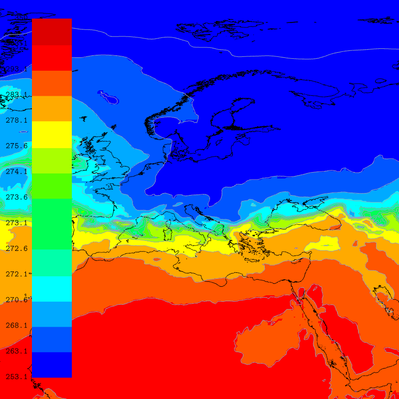

```
    --field[0].path share/data/t850.grb --field[0].palette-{ --colors 
    #0000ff #0055ff #00aaff #00ffff #00ffaa #00ff55 #00ff55 #55ff00 
    #aaff00 #ffff00 #ffaa00 #ff5500 #ff0000 #dd0000 --values 253.15 263.15 
    268.15 270.65 272.15 272.65 273.15 273.65 274.15 275.65 278.15 283.15 
    293.15 303.15 350 }- --coast.on --coast.lines.color black 
    --view.projection LATLON --view.lat 46.7 --view.lon 15 --view.fov 4 
    --field[1].path share/data/t850.grb --field[1].type contour 
    --field[1].palette.colors #95a3c0 --colorbar.on 
    --colorbar.font.color.foreground black --field[1].contour.levels 
    253.15 263.15 268.15 270.65 272.15 272.65 273.15 273.65 274.15 275.65 
    278.15 283.15 293.15 303.15 --field[0].palette.linear.on 
```
## Wind & vorticity                                                  -- wind4
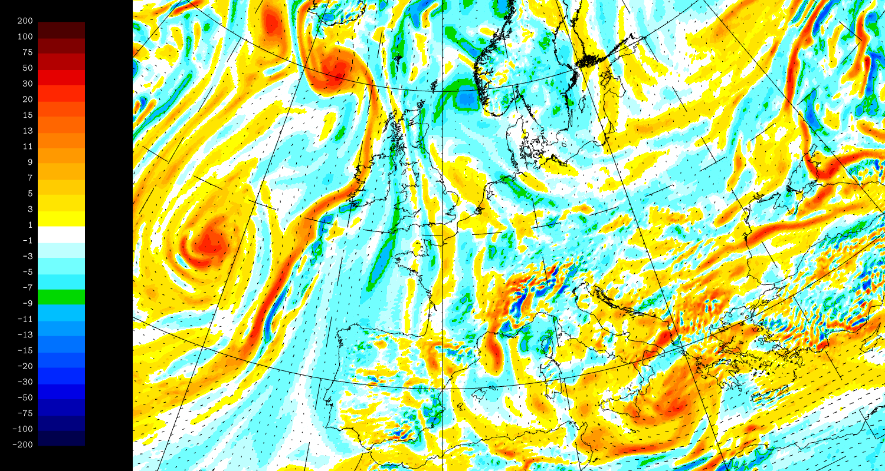

```
    --field[0].path share/data/wind4/vorticity.grib 
    --field[0].palette.colors #00004cff #00007fff #0000b2ff #0000e5ff 
    #0026ffff #004cffff #0072ffff #0099ffff #00bfffff #00d800ff #33f2ffff 
    #72ffffff #bfffffff #ffffffff #ffff00ff #ffe500ff #ffcc00ff #ffb200ff 
    #ff9900ff #ff7f00ff #ff6600ff #ff4c00ff #ff2600ff #e50000ff #b20000ff 
    #7f0000ff #4c0000ff --field[0].palette.values -0.002 -0.001 -0.00075 
    -0.0005 -0.0003 -0.0002 -0.00015 -0.00013 -0.00011 -9e-05 -7e-05 
    -5e-05 -3e-05 -1e-05 1e-05 3e-05 5e-05 7e-05 9e-05 0.00011 0.00013 
    0.00015 0.0002 0.0003 0.0005 0.00075 0.001 0.002 
    --field[0].palette.linear.on --field[0].palette.scale 100000 
    --field[1].scale 1.001 --field[1].path 
    share/data/wind4/wind.grib%shortName="u" 
    share/data/wind4/wind.grib%shortName="v" --field[1].type vector 
    --field[1].vector.norm.off --field[1].vector.arrow.color black 
    --colorbar.on --coast.on --coast.lines.color black --coast.on 
    --coast.lines.color black --grid.on --grid.color black --view.lat 50 
    --view.fov 3 --view.projection POLAR_NORTH --view.clip.xmin 0.15 
    --window.width 1500 --grid.resolution 18 
```
## Display sphere partitionning (t1198)                              -- myproc
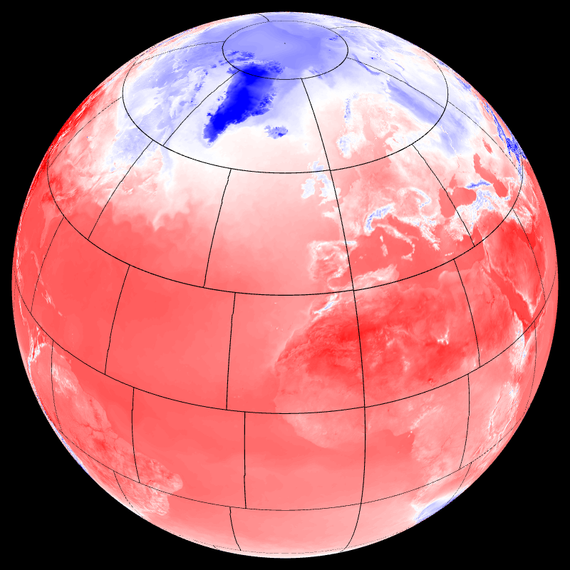

```
    --field[0].scalar.discrete.on --field[0].path 
    share/data/discrete/MYPROC.grb --field[0].palette.colors green 
    --field[0].scalar.discrete.missing_color black 
    --field[0].palette.colors #00000000 --field[1].path 
    share/data/discrete/SURFTEMPERATURE.grb --field[1]-{ --palette.max 
    313.15 --palette.min 253.15 --palette.name cold_hot_temp }- --view.lat 
    36 --view.lon -15 
```
## Display sphere partitionning (t1192c2.2)                          -- myproc22
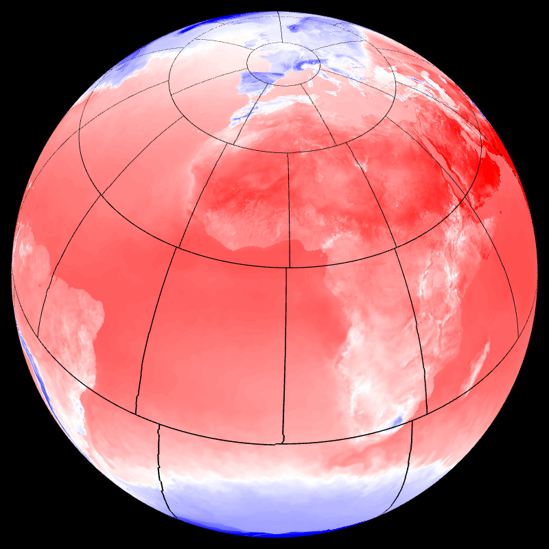

```
    --field[0].scalar.discrete.on --field[0].path 
    share/data/discrete_stretched/MYPROC.grb --field[0].palette.colors 
    green --field[0].scalar.discrete.missing_color black 
    --field[0].palette.colors #00000000 --field[1].path 
    share/data/discrete_stretched/SURFTEMPERATURE.grb --field[1]-{ 
    --palette.max 313.15 --palette.min 253.15 --palette.name cold_hot_temp 
    }- 
```
## SST on lat/lon grid                                               -- sst
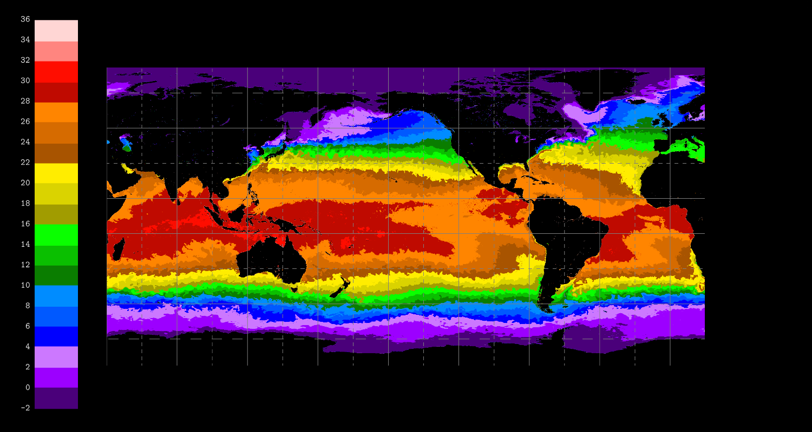

```
    --field[0].scale 1.001 --field[0].path share/data/sst.grib 
    --field[0].palette-{ --values 271.15 273.15 275.15 277.15 279.15 
    281.15 283.15 285.15 287.15 289.15 291.15 293.15 295.15 297.15 299.15 
    301.15 303.15 305.15 307.15 309.15 --colors #4a007aff #9c00ffff 
    #cc78ffff #0000ffff #0059ffff #008cffff #0a7d00ff #0abf00ff #0aff00ff 
    #a19c00ff #dad300ff #ffed00ff #a85400ff #d66b00ff #ff8500ff #bf0a00ff 
    #ff0d00ff #ff857fff #ffd6d4ff --offset -273.15 }- --colorbar.on 
    --grid.on --landscape.on --landscape.path landscape/black.png 
    --view.lon -150 --view.projection LATLON --window.width 1500 
    --view.fov 13 --grid.color gray 
```
## 2m temperature                                                    -- contour9
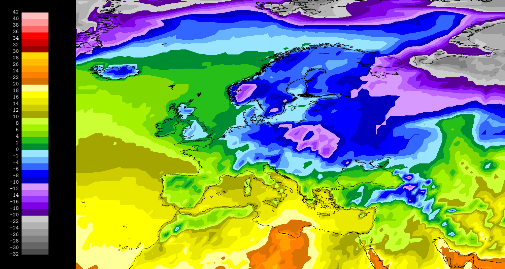

```
    --field[0]-{ --path share/data/2m_temperature.grib --palette.values 
    241.15 243.15 245.15 247.15 249.15 251.15 253.15 255.15 257.15 259.15 
    261.15 263.15 265.15 267.15 269.15 271.15 273.15 275.15 277.15 279.15 
    281.15 283.15 285.15 287.15 289.15 291.15 293.15 295.15 297.15 299.15 
    301.15 303.15 305.15 307.15 309.15 311.15 313.15 315.15 
    --palette.colors #4c4c4cff #666666ff #7f7f7fff #999999ff #b2b2b2ff 
    #ccccccff #590099ff #7f00e5ff #9933ffff #bf66ffff #d899ffff #0000bfff 
    #0000ffff #3366ffff #66b2ffff #99e5ffff #008c30ff #26bf19ff #7fd800ff 
    #a5f200ff #ccff33ff #a5a500ff #cccc00ff #eaea00ff #ffff00ff #ffff99ff 
    #d87200ff #ff7f00ff #ff9e00ff #ffbc00ff #ffd800ff #990000ff #cc0000ff 
    #ff0000ff #ff6666ff #ff9999ff #ffbfbfff --palette.offset -273.15 
    --palette.linear.on }- --colorbar.on --coast.on --coast.lines.color 
    black --view.projection LATLON --window.width 1500 --view.lon 10 
    --view.lat 52 --view.fov 3 --view.clip.xmin 0.15 
```
## Display land surface                                              -- land


```
    --land.on 
```
## Display land surface (high resolution)                            -- land_high


```
    --land.on --land.layers[0].path coastlines/shp/GSHHS_h_L1.shp 
    --land.layers[1].path coastlines/shp/GSHHS_h_L2.shp 
    --land.layers[2].path coastlines/shp/GSHHS_h_L3.shp 
    --land.layers[3].path coastlines/shp/GSHHS_h_L5.shp --view.lon 7 
    --view.lat 60 --view.fov 2 
```
## MPI view                                                          -- mpiview


```
    --field[0].path share/data/discrete/SURFTEMPERATURE.grb 
    --field[0].mpiview.on --field[0].mpiview.path 
    share/data/discrete/MYPROC.grb --field[0].mpiview.scale 0.2 --view.lon 
    31 --view.lat 41 
```
## Lat/lon streamlines                                               -- latlonstream
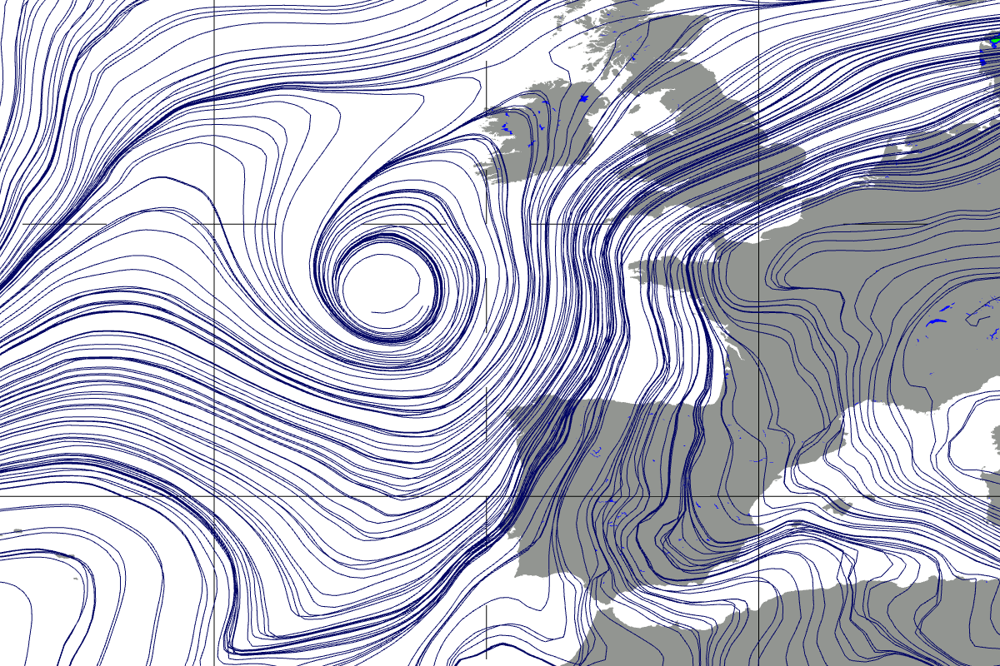

```
    --field[0].path share/data/advection_850.grib%shortName="u" 
    share/data/advection_850.grib%shortName="v" --field[0].type STREAM 
    --field[0].palette.colors darkblue --land.on --land.layers[0].path 
    coastlines/shp/GSHHS_i_L1.shp --land.layers[1].path 
    coastlines/shp/GSHHS_i_L2.shp --land.layers[2].path 
    coastlines/shp/GSHHS_i_L3.shp --land.layers[3].path 
    coastlines/shp/GSHHS_i_L5.shp --land.layers[0].color grey --grid.on 
    --grid.resolution 18 --grid.color black --landscape.on 
    --landscape.path landscape/white.bmp --landscape.scale 0.99 --view.lon 
    -9.5 --view.lat 46 --view.fov 1.3 --view.projection LATLON 
    --window.width 1200 
```
## Wind on global lat/lon grid                                       -- windlatlon
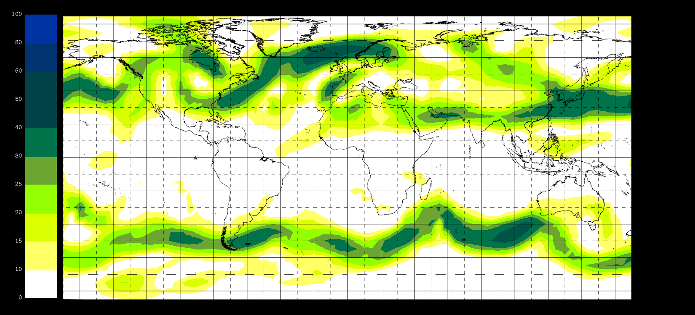

```
    --field[0].path share/data/data_uv.grib%shortName="u" 
    share/data/data_uv.grib%shortName="v" --field[0].type vector 
    --field[0].vector.arrow.off --field[0].palette.values 0 10 15 20 25 30 
    40 50 60 80 100 --colorbar.on --field[0].palette.linear.on 
    --field[0].palette-{ --min 0 --max 100 }- --field[0].palette.colors 
    #ffffffff #ffff66ff #daff00ff #94ff00ff #6ca631ff #00734bff #005447ff 
    #004247ff #003370ff #0033a3ff --coast.on --coast.lines.color black 
    --grid.on --grid.color black --grid.resolution 18 --view.fov 10 
    --view.projection LATLON --window.width 1650 --window.height 750 
```
## Z500, T850                                                        -- z500t850


```
    --coast.lines.color black --coast.on --colorbar.font.color.foreground 
    black --colorbar.on --field[0].palette.colors #ffffffff #0000ffff 
    #0071ffff #00e3ffff #00ffaaff #00ff39ff #39ff00ff #aaff00ff #ffe300ff 
    #ff7100ff #ff0000ff #ffffffff --field[0].palette.offset -273.15 
    --field[0].palette.values 262.15 263.15 265.15 267.15 269.15 271.15 
    273.15 275.15 277.15 279.15 281.15 283.15 284.15 --field[0].path 
    share/data/t850.grb --field[1].contour.levels 47000 47500 48000 48500 
    49000 49500 50000 50500 51000 51500 52000 52500 53000 53500 54000 
    54500 55000 55500 56000 56500 57000 57500 --field[1].contour.widths 0 
    0 0 0 0 0 0 0 0 0 0 0 1 0 0 0 1 0 0 0 0 0 0 
    --field[1].hilo.font.color.foreground black --field[1].hilo.font.scale 
    0.02 --field[1].hilo.on --field[1].palette.colors black 
    --field[1].path share/data/z500.grb --field[1].type CONTOUR 
    --grid.color black --grid.labels.font.color.background white 
    --grid.labels.font.color.foreground black --grid.labels.font.scale 
    0.02 --grid.labels.on --grid.on --grid.resolution 18 --view.fov 5 
    --view.lat 49 --view.lon 2 --view.projection POLAR_NORTH 
    --window.width 1200 
```
## Joachim storm                                                     -- joachim


```
    --field[0].scale 1.0005 --field[0].path 
    share/data/joachim_surf.grib%stepRange="18-24",shortName="10fg6" 
    --field[0].palette.values 0 20 20.6 21.2 21.8 22.4 23 23.6 24.2 24.8 
    25.4 26 27.5 29 30.5 32 33.5 35 36.5 38 --field[0].palette.colors 
    #00000000 #88a8d6ff #819cd2ff #7a8fceff #7382caff #6c74c6ff #6666c2ff 
    #6760bdff #6959b8ff #6b53b4ff #6e4fadff #9045b8ff #bf3bc2ff #cc319dff 
    #d62869ff #e11e28ff #eb4e14ff #f5960aff #ffea01ff 
    --field[0].palette.linear.on --colorbar.on --field[1].path 
    share/data/joachim_surf.grib%stepRange=24,shortName="10u" 
    share/data/joachim_surf.grib%stepRange=24,shortName="10v" 
    --field[1].scale 1.001 --field[1].type vector 
    --field[1].vector.norm.off --field[1].vector.arrow.color black 
    --field[1].vector.density 20 --field[2].path 
    share/data/joachim_surf.grib%stepRange=24,shortName="msl" 
    --field[2].scale 1.001 --field[2].type contour 
    --field[2].palette.colors black --field[2].contour.levels 97000 97500 
    98000 98500 99000 99500 100000 100500 101000 101500 102000 
    --field[2].contour.widths 3 3 3 3 1 1 1 1 1 1 3 --window.width 1200 
    --grid.on --grid.color black --grid.resolution 18 --coast.on 
    --coast.lines.color black --coast.lines.path 
    coastlines/gshhg/GSHHS_bin/gshhs_i.b --border.on --border.lines.path 
    coastlines/gshhg/WDBII_bin/wdb_borders_i.b --view.clip.xmin 0.15 
    --view.projection POLAR_NORTH --land.on --land.layers[0].color 
    #7c879cff --land.layers[0].path coastlines/shp/GSHHS_i_L1.shp 
    --land.layers[1].path coastlines/shp/GSHHS_i_L2.shp 
    --land.layers[2].path coastlines/shp/GSHHS_i_L3.shp 
    --land.layers[3].path coastlines/shp/GSHHS_i_L5.shp --landscape.on 
    --landscape.path  --landscape.color white --landscape.scale 0.999 
    --view.lon 4 --view.lat 51 --view.fov 3 
```
## Isofill test                                                      -- isofill


```
    --field[0].path share/data/wind+temp/t1798/S105TEMPERATURE.grb 
    --field[0].type ISOFILL --field[0]-{ --palette.min 294 --palette.max 
    296 --user_pref.off --isofill.min 294 --isofill.max 296 --palette.name 
    cold_hot_temp }- --view.lat 2.32 --view.lon 14.12 --view.fov 0.5 
    --window.width 1200 
```
## Isofill test wireframe                                            -- isofillwire


```
    --field[0].path share/data/wind+temp/t1798/S105TEMPERATURE.grb 
    --field[0].type ISOFILL --field[0]-{ --scalar.wireframe.on 
    --palette.min 294 --palette.max 296 --user_pref.off --isofill.min 294 
    --isofill.max 296 --palette.name cold_hot_temp }- --view.lat 2.32 
    --view.lon 14.12 --view.fov 0.5 --window.width 1200 
```
## Isofill temperature                                               -- isofilltemp
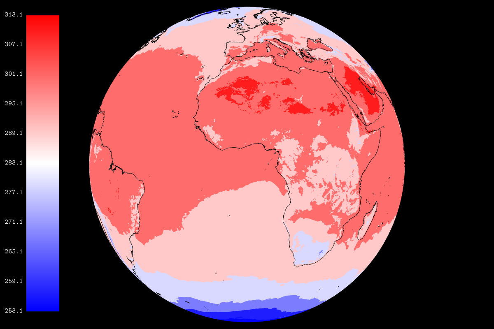

```
    --field[0].path share/data/wind+temp/t1798/S105TEMPERATURE.grb 
    --field[0].type ISOFILL --field[0]-{ --palette.name cold_hot_temp }- 
    --colorbar.on --window.width 1200 --coast.on --coast.lines.color black 
```
## Isofill Lambert                                                   -- isofilllambert


```
    --landscape.on --field[0].type ISOFILL --field[0].user_pref.off 
    --field[0].path share/data/aro_guyane/SURFTEMPERATURE.grb 
    --field[0].palette.name cold_hot_temp --field[0].scale 1.01 --view.lat 
    5 --view.lon -52 --view.fov 2 --coast.on --grid.on --colorbar.on 
    --window.width 1200 --coast.lines.scale 1.02 --coast.lines.color black 
```
## Isofill latlon                                                    -- isofilllatlon


```
    --landscape.on --field[0].type ISOFILL --field[0].path 
    share/data/eurat01/lfpw_0_0_0_pl_1000_t.grib2 --field[0].scale 1.01 
    --view.lat 46.7 --view.lon 2 --view.fov 10 --coast.on --grid.on 
    --colorbar.on --window.width 1200 --coast.lines.scale 1.02 
    --coast.lines.color black 
```
## Old ARPEGE                                                        -- oldarpege
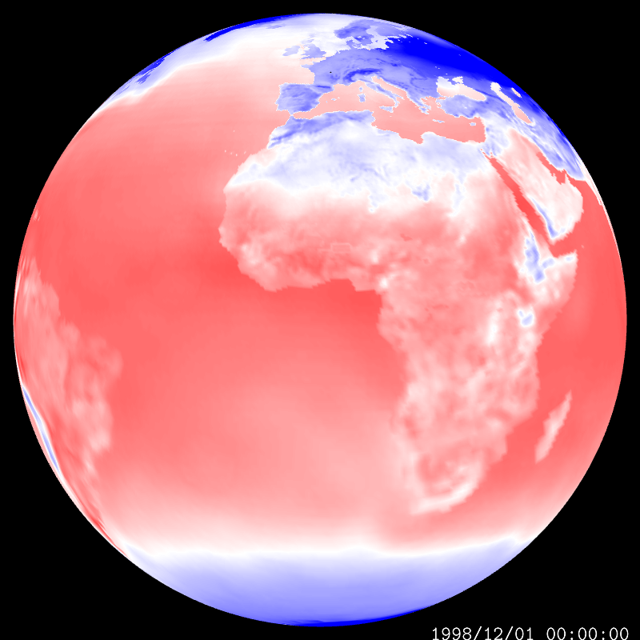

```
    --field[0].path share/data/arpege.123.fa%SURFTEMPERATURE 
    --scene.date.on --scene.date.font.scale 0.03 
```
## Contour with labels (dummy field)                                 -- contourlabels
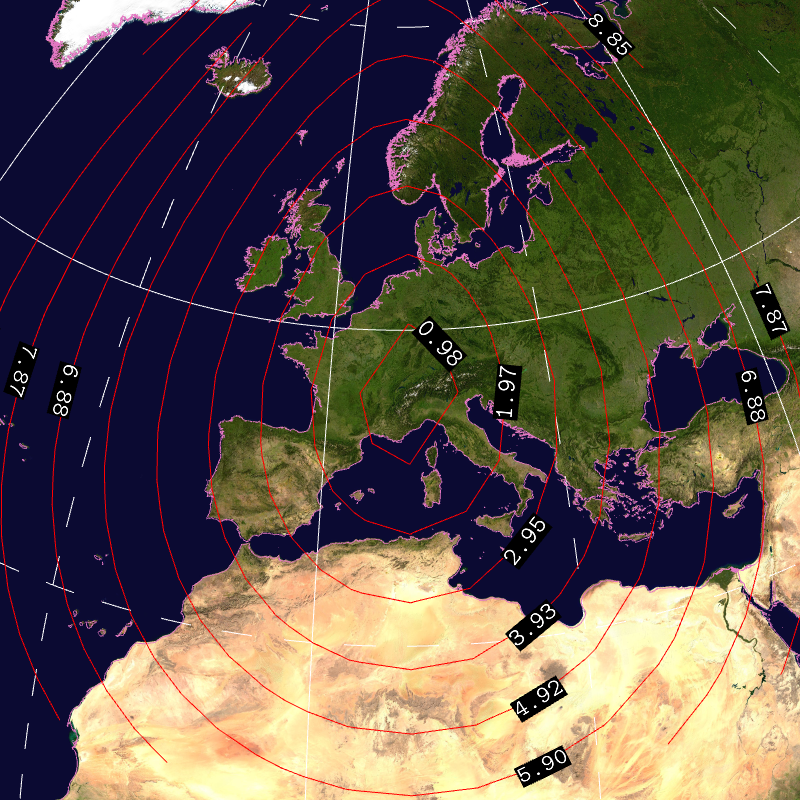

```
    --landscape.on --field[0].path share/data/contour/latlon18x13.grb 
    --field[0].scale 1.03 --field[0].type CONTOUR --view.lat 45.65 
    --view.lon 6.39 --field[0].contour.labels.on --grid.on --view.fov 10 
    --grid.color white --field[0].palette.colors red 
    --field[0].contour.labels-{ --font.color.foreground white 
    --font.color.background black }- --coast.on --coast.lines.color pink 
```
## Contour with labels                                               -- contourlabels2


```
    --landscape.on --field[0].path share/data/z500.grb --field[0].scale 
    1.01 --field[0].type CONTOUR --view.lat 56 --view.lon 20 
    --field[0].contour.labels.on --grid.on --grid.color black 
    --field[0].palette.colors red --field[0].contour.levels 48000 48500 
    49000 49500 50000 50500 51000 51500 52000 52500 53000 53500 54000 
    54500 55000 55500 56000 56500 57000 57500 --field[0].contour.labels-{ 
    --font.color.foreground white --font.color.background black 
    --font.scale 0.04 --format %.0f }- --coast.on --coast.lines.color pink 
```
## AROME 1.3km                                                       -- arome13


```
    --field[0].path share/data/aro1.3/CLSVENT.ZONAL.grb 
    share/data/aro1.3/CLSVENT.MERIDIEN.grb --field[0].type VECTOR --view-{ 
    --lon 2 --lat 46.2 --fov 3 }- --field[0].palette.colors black green 
    --field[0].palette.values 0. 20. --field[0].vector.arrow.color red 
    --coast.lines.color cyan --coast.on 
```
## Polynesie                                                         -- polynesie


```
    --field[0].path share/data/polynesie/SURFTEMPERATURE.grb --view.lat 
    -17.63 --view.lon -149.5 --view.fov 0.2 --coast.lines.color green 
    --coast.on --field[0].scalar.points.on --colorbar.on --window.width 
    1200 --colorbar.font.color.background black 
```
## Wind Australia                                                    -- windaustralia
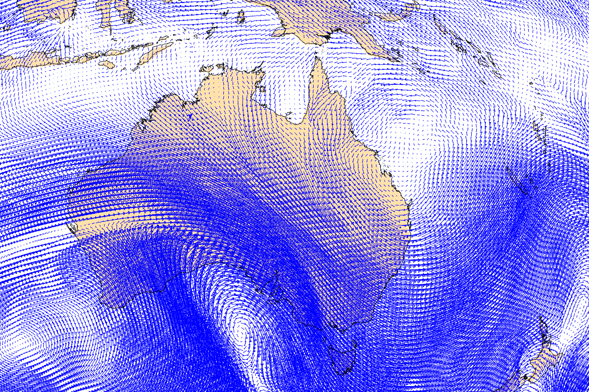

```
    --field[0].path share/data/uv200.grib%paramId=131 
    share/data/uv200.grib%paramId=132 --field[0].type VECTOR --coast.on 
    --view.lat -25 --view.lon 140 --view.fov 8 --field[0].vector.norm.off 
    --land.on --field[0].vector.arrow.color blue --landscape.on 
    --landscape.color white --landscape.scale 0.999 --coast.on 
    --coast.lines.color black --coast.lines.path 
    coastlines/gshhg/GSHHS_bin/gshhs_i.b --field[0].vector.density 100 
    --field[0].vector.scale 10 --window.width 1200 --field[0].scale 1.001 
```
## Wind Australia                                                    -- windaustralia2
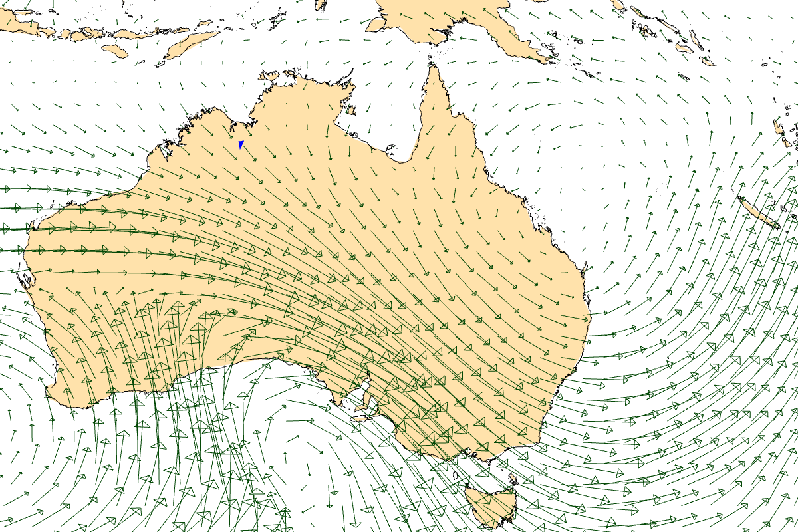

```
    --field[0].path share/data/uv200.grib%paramId=131 
    share/data/uv200.grib%paramId=132 --field[0].type VECTOR --coast.on 
    --view.lat -25 --view.lon 140 --view.fov 2 --field[0].vector.norm.off 
    --land.on --field[0].vector.arrow.color darkgreen --landscape.on 
    --landscape.color white --landscape.scale 0.999 --coast.on 
    --coast.lines.color black --coast.lines.path 
    coastlines/gshhg/GSHHS_bin/gshhs_i.b --field[0].vector.scale 5 
    --window.width 1200 --field[0].scale 1.001 --view.projection LATLON 
    --field[0].vector.density 10 
```
## Wind Australia                                                    -- windaustralia3


```
    --field[0].path share/data/uv200.grib%paramId=131 
    share/data/uv200.grib%paramId=132 --field[0].type VECTOR --coast.on 
    --view.lat -37 --view.lon 140 --view.fov 3 --field[0].vector.norm.off 
    --land.on --landscape.on --landscape.color #333333 --landscape.scale 
    0.999 --coast.on --coast.lines.color black --coast.lines.path 
    coastlines/gshhg/GSHHS_bin/gshhs_i.b --field[0].vector.scale 1 
    --window.width 1200 --field[0].scale 1.001 --view.projection LATLON 
    --field[0].vector.density 10 --field[0].palette.colors #1cb8a6 #19c25c 
    #24cb15 #80d511 #e0d50d #ea7209 #f50408 #ff007f 
    --field[0].palette.values 20 30 40 50 60 70 80 90 100 
    --field[0].vector.arrow.color #00000000 
    --field[0].vector.arrow.fixed.on --field[0].vector.arrow.min 10 
    --land.layers[0].color black --coast.on --coast.lines.color #555555 
    --colorbar.on --field[0].vector.density 20 --field[0].vector.scale 2 
```
## Precipitations Europe                                             -- precipeurope
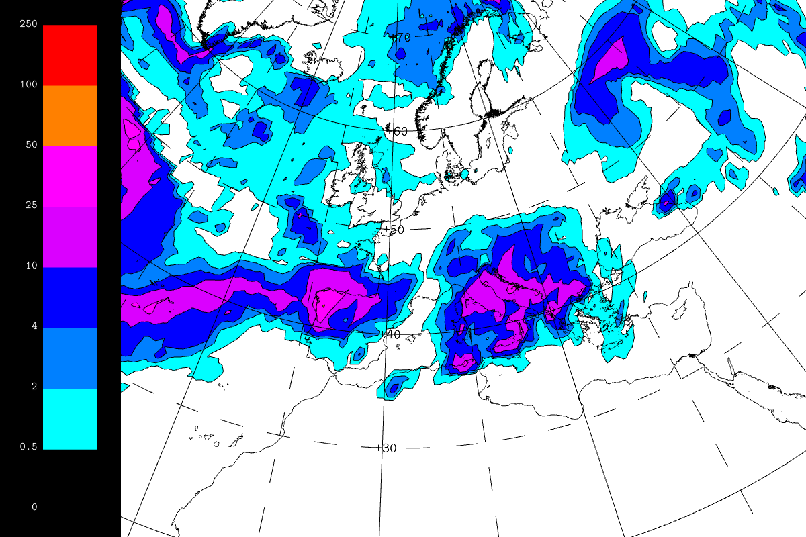

```
    --field[0].path share/data/total_precipitation.grib --coast.on 
    --coast.lines.color black --landscape.color white --landscape.scale 
    0.999 --landscape.on --field[0].palette.colors #00000000 #00ffff 
    #0080ff #0000ff #da00ff #ff00ff #ff8000 #ff0000 
    --field[0].palette.values 0. 0.0005 0.002 0.004 0.010 0.025 0.050 
    0.100 0.250 --colorbar.on --field[0].palette.linear.on --field[0].type 
    ISOFILL --window.width 1200 --field[0].isofill.levels 0. 0.0005 0.002 
    0.004 0.010 0.025 0.050 0.100 0.250 --field[1].type CONTOUR 
    --field[1].path share/data/total_precipitation.grib --field[1].scale 
    1.001 --field[1].contour.levels 0. 0.0005 0.002 0.004 0.010 0.025 
    0.050 0.100 0.250 --field[1].palette.colors black 
    --colorbar.font.color.foreground white --view.lon 2 --view.lat 46.2 
    --view.fov 5 --view.projection POLAR_NORTH --grid.on --grid.color 
    black --grid.labels.on --grid.labels.font.color.foreground black 
    --grid.labels.font.scale 0.03 --grid.resolution 18 
    --field[0].palette.scale 1000 --colorbar.font.color.background black 
    --view.clip.xmin 0.15 
```
## Precipitations Europe (precise, with fixed palette)               -- precipfixed


```
    --field[0].path share/data/total_precipitation.grib 
    --field[0].palette.colors #00000000 #bbffff #00ffff #0080ff #0000ff 
    #da00ff #ff00ff #ff8000 #ff0000 --field[0].palette.values 0. 0.0001 
    0.0005 0.002 0.004 0.010 0.025 0.050 0.100 0.250 
    --field[0].palette.linear.on --field[0].type ISOFILL 
    --field[0].palette.fixed.on --field[0].isofill.levels 0. 0.0001 0.0005 
    0.002 0.004 0.010 0.025 0.050 0.100 0.250 --coast.on 
    --coast.lines.color black --landscape.color white --landscape.scale 
    0.999 --landscape.on --window.width 1200 --grid.labels.on 
    --grid.labels.font.color.foreground black --grid.labels.font.scale 
    0.03 --grid.resolution 18 --field[0].palette.scale 1000 --view.lon 2 
    --view.lat 46.2 --view.fov 5 --view.projection POLAR_NORTH --grid.on 
    --grid.color black --colorbar.on --colorbar.font.color.background 
    black --view.clip.xmin 0.15 --colorbar.font.color.foreground white 
    --field[1].type CONTOUR --field[1].path 
    share/data/total_precipitation.grib --field[1].scale 1.001 
    --field[1].contour.levels 0. 0.0001 0.0005 0.002 0.004 0.010 0.025 
    0.050 0.100 0.250 --field[1].palette.colors black 
```
## Z500                                                              -- z500europe
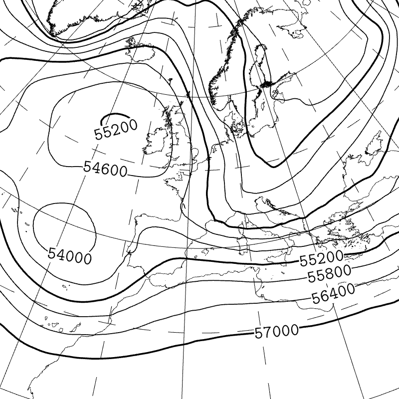

```
    --field[0]-{ --contour.labels.format %5.0f --contour.widths 1 2 1 1 2 
    1 1 2 1 1 2 --path share/data/z500.grb --type CONTOUR --palette.colors 
    black --contour.labels.on --contour.labels.font.color.foreground black 
    --contour.labels.font.color.background white --contour.levels 51000 
    51600 52200 52800 53400 54000 54600 55200 55800 56400 57000 }- 
    --landscape.on --landscape.scale 0.999 --landscape.color white 
    --coast.on --coast.lines.color black --view.lat 46.2 --view.lon 2 
    --view.fov 5 --grid.on --grid.color black --grid.resolution 18 
    --view.projection POLAR_NORTH 
```
## Temperature, contour, colors                                      -- tempcontour


```
    --field[0].scale 1.001 --field[0].path share/data/t850.grib 
    --field[0].palette.colors #0000ff #003cff #0078ff #00b4ff #00f0ff 
    #00ffd2 #00ff96 #00ff5a #00ff1e #1eff00 #5aff00 #96ff00 #d2ff00 
    #fff000 #ffb400 #ff7800 #ff3c00 #ff0000 --field[0].palette.values 
    259.15 261.15 263.15 265.15 267.15 269.15 271.15 273.15 275.15 277.15 
    279.15 281.15 283.15 285.15 287.15 289.15 291.15 --colorbar.on 
    --window.width 1200 --field[0].type CONTOUR --field[0].contour.levels 
    259.15 261.15 263.15 265.15 267.15 269.15 271.15 273.15 275.15 277.15 
    279.15 281.15 283.15 285.15 287.15 289.15 --landscape.on 
    --landscape.color black --landscape.scale 0.999 --land.on --view.lon 2 
    --view.lat 46.2 --view.fov 4 --field[0].contour.widths 3 3 3 3 3 3 3 3 
    3 3 3 3 3 3 3 3 --land.layers[0].path coastlines/shp/GSHHS_h_L1.shp 
    --land.layers[0].color #404040 --view.clip.xmin 0.15 --grid.color grey 
    --grid.resolution 18 --grid.on 
```
## Wind Australia                                                    -- windaustralia4
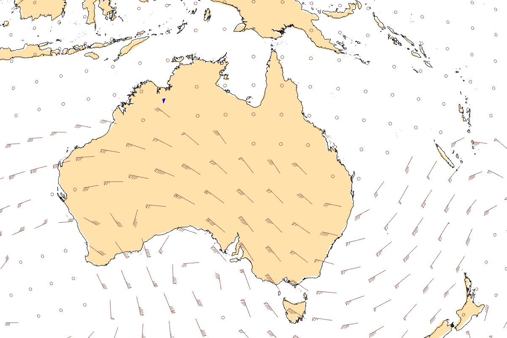

```
    --field[0].path share/data/uv200.grib%paramId=131 
    share/data/uv200.grib%paramId=132 --field[0].type VECTOR --coast.on 
    --view.lat -25 --view.lon 140 --view.fov 8 --field[0].vector.norm.off 
    --land.on --landscape.on --landscape.color white --landscape.scale 
    0.999 --coast.on --coast.lines.color black --coast.lines.path 
    coastlines/gshhg/GSHHS_bin/gshhs_i.b --field[0].vector.density 20 
    --field[0].vector.scale 0.5 --window.width 1200 --field[0].scale 1.001 
    --field[0].vector.arrow.off --field[0].vector.barb.on 
    --field[0].vector.barb.color brown --field[0].vector.barb.circle.level 
    15 
```
## Wind + geopotential                                               -- windgeop
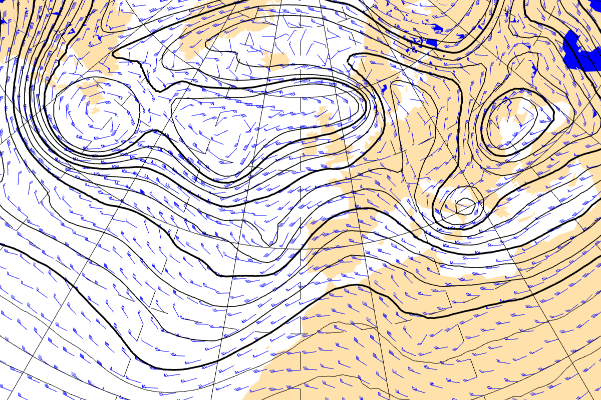

```
    --field[0].palette.colors black --field[0].contour.widths 1 2 1 1 2 1 
    1 2 1 1 2 --field[0].contour.levels 89000 89500 90000 90500 91000 
    91500 92000 92500 93000 93500 94000 94500 95000 95500 96000 96500 
    97000 97500 98000 98500 99000 99500 --field[0].path 
    share/data/ghtuv.grib%shortName="z" --field[0].type CONTOUR --land.on 
    --landscape.on --landscape.color white --landscape.scale 0.999 
    --field[1]-{ --type vector --path share/data/ghtuv.grib%shortName="u" 
    share/data/ghtuv.grib%shortName="v" --vector-{ --norm.off --arrow.off 
    --barb.on --barb.color blue --density 20 --scale 0.4 }- --scale 1.001 
    }- --window.width 1200 --view.lat 46.2 --view.lon -10 --view.fov 5 
    --view.projection POLAR_NORTH --grid.on --grid.color black 
    --grid.resolution 18 
```
## Simple shading                                                    -- shading
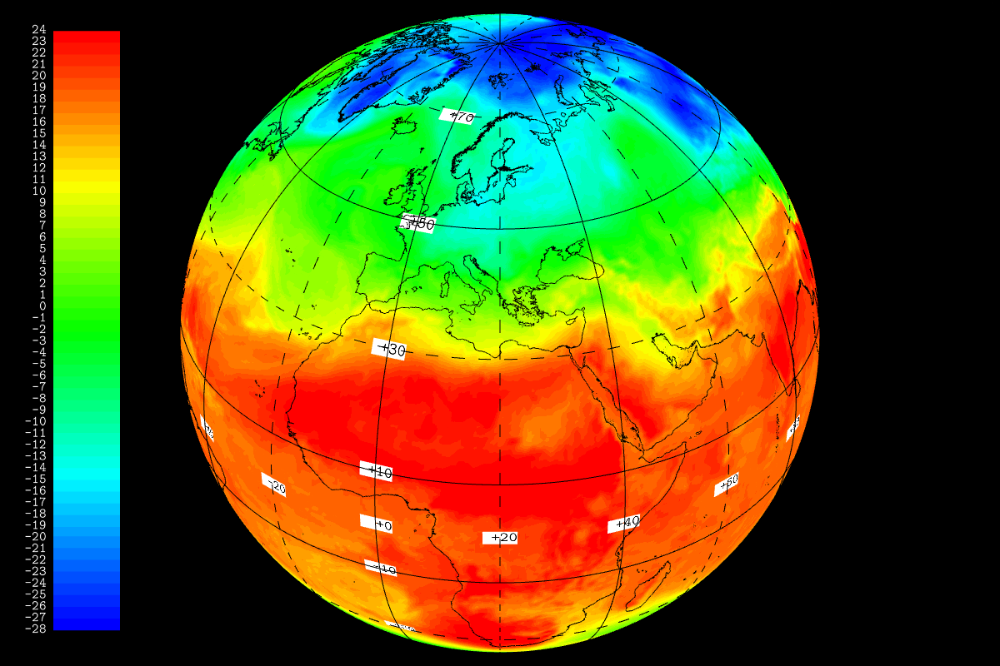

```
    --field[0].path share/data/t850.grb --field[0].palette.values 245.15 
    297.15 --field[0].palette.generate.on 
    --field[0].palette.generate.levels 53 --field[0].palette.colors blue 
    red --colorbar.on --window.width 1200 --field[0].palette.rainbow.on 
    --field[0].palette.rainbow.direct.off --field[0].palette.offset 
    -273.15 --coast.on --coast.lines.color black --grid.on --grid.color 
    black --grid.labels.on --grid.labels.font.color.foreground black 
    --grid.labels.font.color.background white --grid.labels.font.scale 
    0.04 --window.width 1200 --view.lat 34 --view.lon 20 
```
## Coastlines                                                        -- coastlines


```
    --landscape.on --landscape.scale 0.999 --land.on --landscape.color 
    white --rivers.on --rivers.lines.color blue --border.on 
    --border.lines.color red --coast.on --coast.lines.color black 
    --coast.lines.path coastlines/gshhg/GSHHS_bin/gshhs_i.b 
    --land.layers[0].path coastlines/shp/GSHHS_i_L1.shp 
    --land.layers[1].path coastlines/shp/GSHHS_i_L2.shp --view.fov 5 
    --view.lat 44.5394 --view.lon 27.5924 --window.width 1200 
```
## Rain, southern America                                            -- southamerica
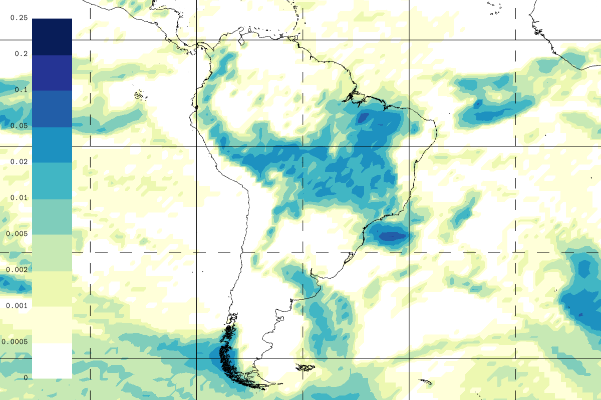

```
    --field[0].path share/data/total_precipitation.grib 
    --field[0].palette-{ --values 0. 0.0005 0.001 0.002 0.005 0.010 0.020 
    0.050 0.100 0.200 0.250 --colors white #ffffd9 #edf8b1 #c7e9b4 #7fcdbb 
    #41b6c4 #1d91c0 #225ea8 #253494 #081d58 }- --coast.on 
    --coast.lines.color black --field[0].palette.linear.on 1000. 
    --colorbar.on --window.width 1200 --colorbar.font.color.foreground 
    black --view.projection LATLON --view.fov 4 --view.lat -20.1373 
    --view.lon -60.4499 --grid.on --grid.color black 
```
## Grid ticks & labels                                               -- tickslabels
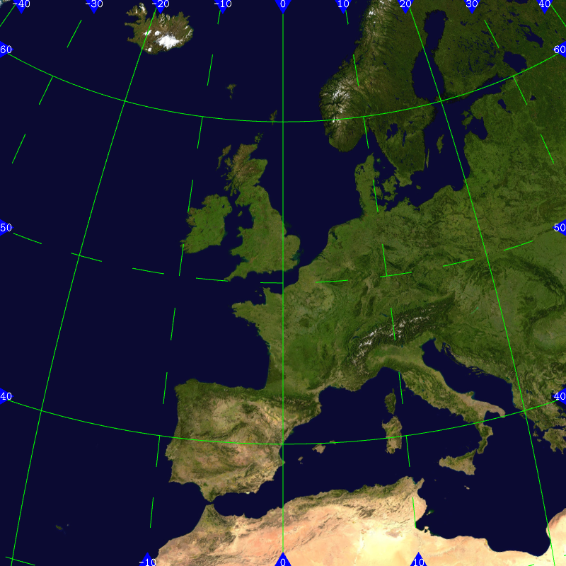

```
    --landscape-{ --on --scale 0.999 }- --grid-{ --on --resolution 18 }- 
    --ticks-{ --labels.on --labels.font.scale 0.02 --labels.format %.0f 
    --lines.on --lines.color blue --lines.width 0.03 --lines.kind 1 }- 
    --view.fov 7 --view.lat 50 --view.lon 0 
```
## Stream motion                                                     -- streammotion


```
    --field[0].stream.motion.on --field[0].path 
    share/data/advection_850.grib%shortName="u" 
    share/data/advection_850.grib%shortName="v" --field[0].type STREAM 
    --field[0].palette.name cold_hot --land.on --grid.on --grid.resolution 
    18 --grid.color black --landscape.on --landscape.path 
    landscape/white.bmp --landscape.scale 0.99 --view.lon -10.364 
    --view.lat 46.8244 --view.fov 5.3 --view.projection XYZ --window.width 
    1200 --field[0].stream.width 0.5 --field[0].scale 1.001 
    --ticks.labels.on --ticks.labels.font.color.foreground black 
    --window.offscreen.on --window.offscreen.frames 36 
```
## Zoom with Schmidt transform                                       -- zoomschmidt1
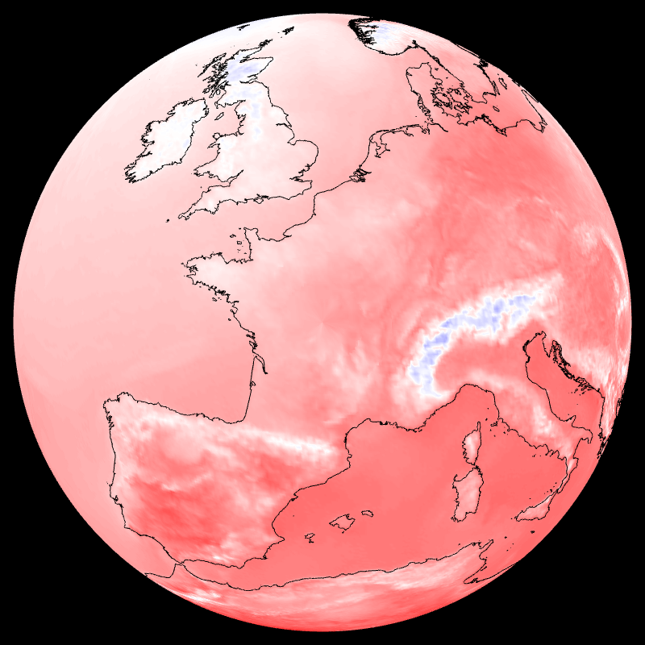

```
    --field[0].path share/data/wind+temp/t1798/S105TEMPERATURE.grb 
    --view.zoom.on --coast.on --coast.lines.color black --view.lon 2 
    --view.lat 46.7 --view.zoom.stretch 0.2 --grid.off 
```
## Temperature with fixed palette                                    -- fixedpaltemp
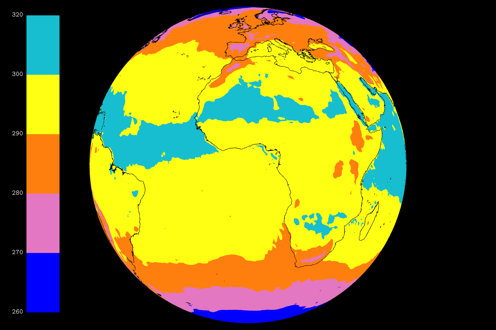

```
    --field[0].path share/data/wind+temp/t0224/S105TEMPERATURE.grb 
    --field[0].user_pref.off --field[0].palette-{ --colors blue pink 
    orange yellow cyan --values 260 270 280 290 300 320 --fixed.on 
    --linear.on }- --field[0].type ISOFILL --field[0].isofill.levels 260 
    270 280 290 300 320 --colorbar.on --window.width 1200 --coast.on 
    --coast.lines.color black 
```
## Temperature with fixed palette (smooth)                           -- fixedpalscalsmooth
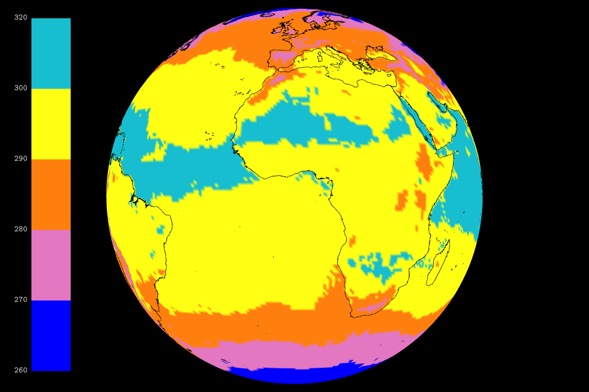

```
    --field[0].path share/data/wind+temp/t0224/S105TEMPERATURE.grb 
    --field[0].user_pref.off --field[0].palette-{ --colors blue pink 
    orange yellow cyan --values 260 270 280 290 300 320 --fixed.on 
    --linear.on }- --colorbar.on --window.width 1200 --coast.on 
    --coast.lines.color black --field[0].scalar.smooth.on 
```
## Temperature with fixed palette (rough)                            -- fixedpalscalrough
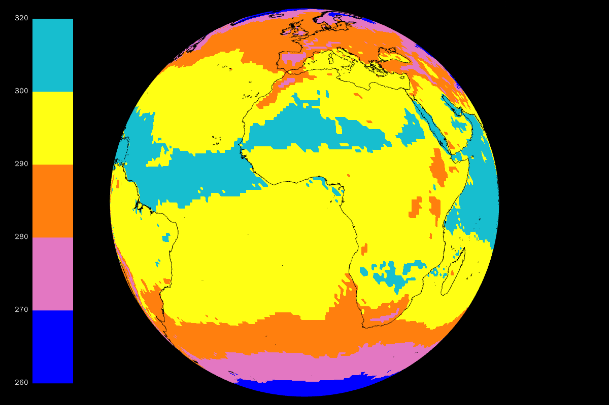

```
    --field[0].path share/data/wind+temp/t0224/S105TEMPERATURE.grb 
    --field[0].user_pref.off --field[0].palette-{ --colors blue pink 
    orange yellow cyan --values 260 270 280 290 300 320 --fixed.on 
    --linear.on }- --colorbar.on --window.width 1200 --coast.on 
    --coast.lines.color black 
```
## SSMI satellite data                                               -- ssmigeopoints


```
    --geopoints.path share/data/geopoints/ssmis_light.nc --geopoints.on 
    --geopoints.points.palette.name cold_hot --landscape.on 
    --geopoints.points.size.value 0.5 --grid.on --grid.color black 
    --coast.on --coast.lines.color black --colorbar.on 
    --geopoints.points.palette.min 200 --geopoints.points.palette.max 240 
    --geopoints.lon col_4 --geopoints.lat col_3 --geopoints.val col_5 
```
