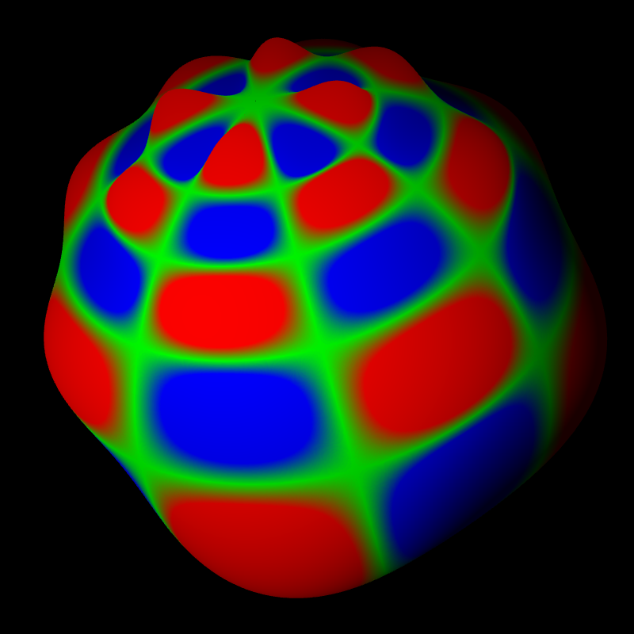

## Spherical harmonic (T1198)                                        -- harmonic


```
    --field[0].path share/data/harmonics/SPEC.+0008.+0004.grb 
    --field[0].palette-{ --colors blue green red --values -1 0. 1 }- 
    --field[0].geometry.height.on --field[0].geometry.height.scale 0.2 
    --view.fov 25 --view.lon 20 --scene.light.on 
```
## Spherical harmonic (T1198C2.2)                                    -- harmonic_stretch


```
    --field[0].path share/data/harmonics/SPEC.+0008.+0004_stretched.grb 
    --field[0].palette-{ --colors blue green red --values -1 0. 1 }- 
    --field[0].geometry.height.on --field[0].geometry.height.scale 0.2 
    --view.fov 25 --view.lon 20 --scene.light.on 
```
