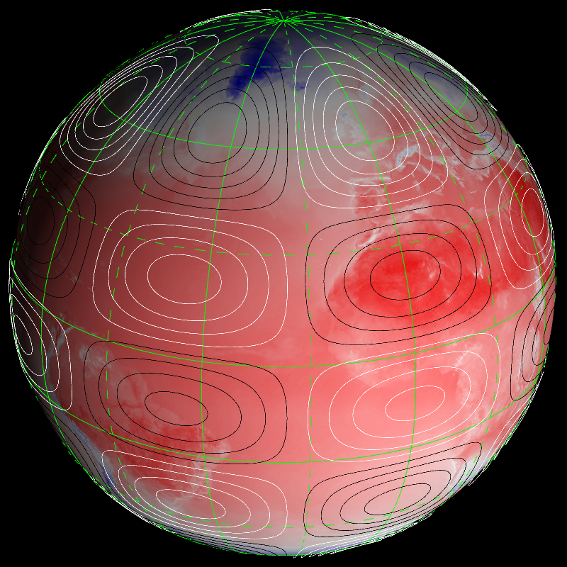
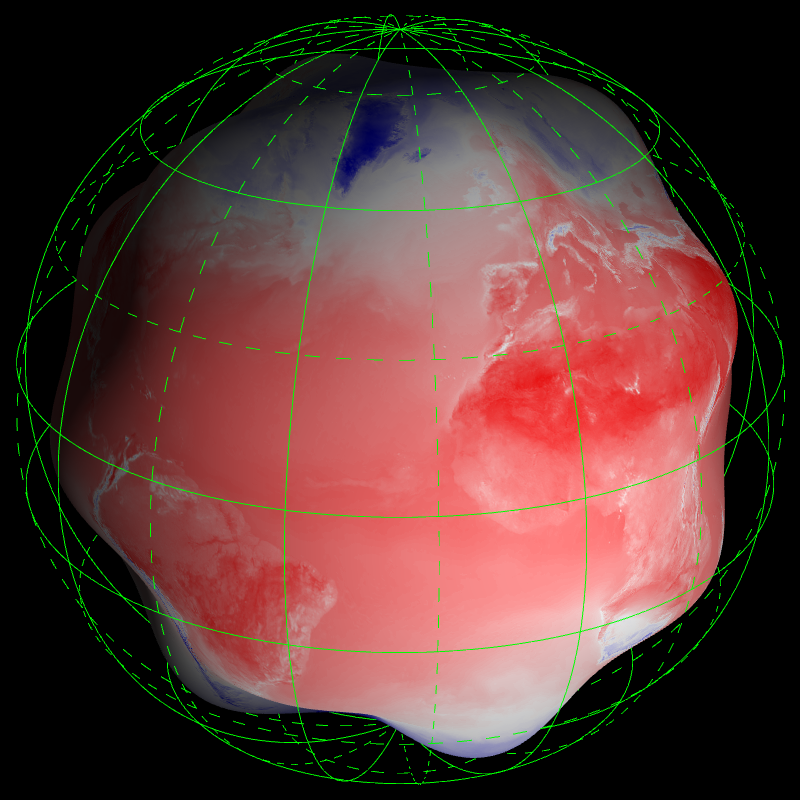
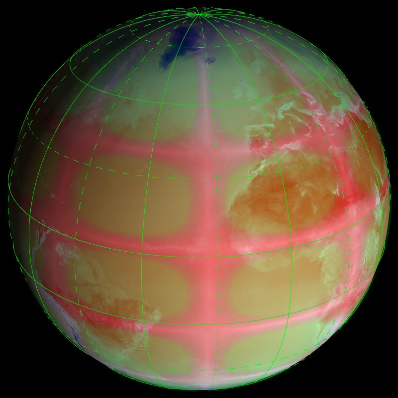

## Spherical harmonic (T1198) -- harmonic


```
    --field[0].path share/data/harmonics/SPEC.+0008.+0004.grb 
    --field[0].palette-{ --colors blue green red --values -1 0. 1 }- 
    --field[0].geometry.height.on --field[0].geometry.height.scale 0.2 
    --view.fov 25 --view.lon 20 --scene.light.on 
```
## Spherical harmonic (T1198C2.2) -- harmonic_stretch


```
    --field[0].path share/data/harmonics/SPEC.+0008.+0004_stretched.grb 
    --field[0].palette-{ --colors blue green red --values -1 0. 1 }- 
    --field[0].geometry.height.on --field[0].geometry.height.scale 0.2 
    --view.fov 25 --view.lon 20 --scene.light.on 
```
## Spherical harmonic (T1198) -- tharmonic1


```
    --field[0].path share/data/wind+temp/t1198/S105TEMPERATURE.grb 
    --field[1].path share/data/harmonics/SPEC.+0008.+0004.grb 
    --field[1].scale 1.01 --field[1].type CONTOUR 
    --field[1].palette.colors black white --view.lon -25 --view.lat 25 
    --scene.light.on --grid.on 
```
## Spherical harmonic (T1198) -- tharmonic2


```
    --field[0].path share/data/wind+temp/t1198/S105TEMPERATURE.grb 
    --field[0].geometry.height.on --field[0].geometry.height.scale 0.2 
    --field[0].geometry.height.path 
    share/data/harmonics/SPEC.+0008.+0004.grb --field[0].scale 0.8 
    --scene.light.on --grid.on --view.lon -25 --view.lat 25 
```
## Spherical harmonic (T1198) -- tharmonic3


```
    --field[0].path share/data/wind+temp/t1198/S105TEMPERATURE.grb 
    --field[1].path share/data/harmonics/SPEC.+0008.+0004.grb 
    --field[1].scale 1.01 --field[1].palette.colors #00ff0044 #00000100 
    #00ff0044 --field[1].palette.values -1 0. +1 --view.lon -25 --view.lat 
    25 --scene.light.on --grid.on 
```
