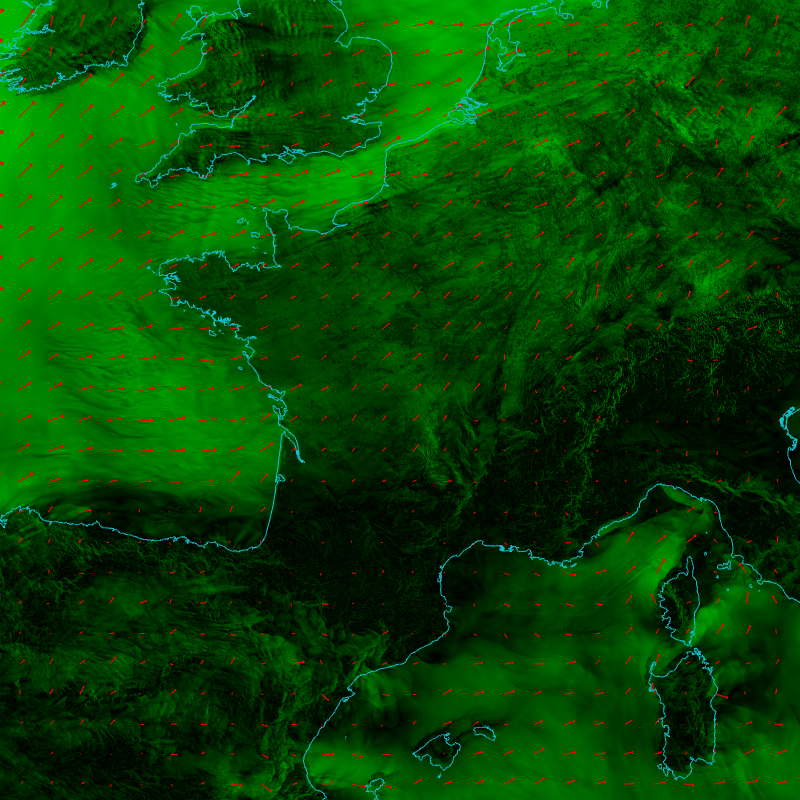
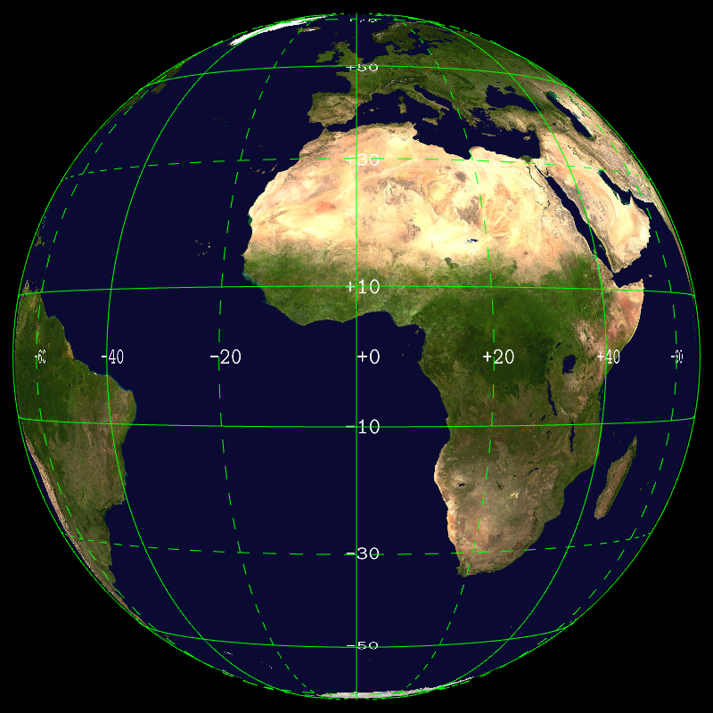

Display GRIB2 fields with OpenGL. Raster, contour, vector, colorbar, mapscale, coastlines, borders. Lat/lon, lambert, gaussian grid.
GLFW backend for interactive display, EGL backend for batch processing without X11 display.

Perl/Tk interface.

Tested on :

* VGA compatible controller: Intel Corporation Xeon E3-1200 v3/4th Gen Core Processor Integrated Graphics Controller (rev 06) 
* VGA compatible controller: Intel Corporation HD Graphics 530 (rev 06) 
* VGA compatible controller: Advanced Micro Devices, Inc. [AMD/ATI] Wani [Radeon R5/R6/R7 Graphics] (rev c8) 
* 3D controller: NVIDIA Corporation GV100GL [Tesla V100S PCIe 32GB] (rev a1) 

  


  # [Cloud ...](CLOUD.md)
## Clouds, 3 layers, t1198c2.2 -- t1198_3l


```
    --landscape.on --landscape.grid.path 
    share/glgrib/testdata/t1198c2.2/Z.grb --field[0].path 
    share/glgrib/testdata/t1198c2.2/SURFNEBUL.BASSE.grb --field[1].path 
    share/glgrib/testdata/t1198c2.2/SURFNEBUL.MOYENN.grb --field[2].path 
    share/glgrib/testdata/t1198c2.2/SURFNEBUL.HAUTE.grb --field[0].scale 
    1.03 --field[1].scale 1.04 --field[2].scale 1.05 
    --field[0].palette.name cloud --field[1].palette.name cloud 
    --field[2].palette.name cloud 
```
# [Lambert ...](LAMBERT.md)
## AROME 1.3km -- arome13


```
    --field[0].path share/glgrib/testdata/aro1.3/CLSVENT.ZONAL.grb 
    share/glgrib/testdata/aro1.3/CLSVENT.MERIDIEN.grb --field[0].type 
    VECTOR --view-{ --lon 2 --lat 46.2 --fov 3 }- 
    --field[0].palette.colors black green --field[0].palette.values 0. 20. 
    --field[0].vector.arrow.color red --coast.lines.color cyan --coast.on 
```
# [String ...](STRING.md)
## Contour with labels -- contourlabels2


```
    --landscape.on --field[0].path share/glgrib/testdata/z500.grb 
    --field[0].scale 1.01 --field[0].type CONTOUR --view.lat 56 --view.lon 
    20 --field[0].contour.labels.on --grid.on --grid.color black 
    --field[0].palette.colors red --field[0].contour.levels 48000 48500 
    49000 49500 50000 50500 51000 51500 52000 52500 53000 53500 54000 
    54500 55000 55500 56000 56500 57000 57500 --field[0].contour.labels-{ 
    --font.color.foreground white --font.color.background black 
    --font.bitmap.scale 0.04 --format %.0f }- --coast.on 
    --coast.lines.color pink 
```
# [Misc ...](MISC.md)
## Cities -- cities


```
    --landscape.on --cities.on --cities.points.scale 1.01 
    --cities.points.size.value 1 --cities.points.size.variable.on 
    --view.lat 46.7 --view.lon 2 --view.fov 2 --cities.points.size.value 2 
    --cities.labels.on --cities.labels.font.color.foreground red 
    --cities.labels.font.bitmap.scale 0.04 
```
# [Palette ...](PALETTE.md)
## Display field with palette gradient color -- palette_values_grad


```
    --landscape.on --landscape.grid.path 
    share/glgrib/testdata/t1198c2.2/Z.grb --field[0].path 
    share/glgrib/testdata/t1198c2.2/N.grb --field[0].scale 1.03 
    --field[0].palette-{ --colors #00000000 #008bff #01f8e9 #05cf66 
    #34c00c #b6e904 #ffe600 #ffb500 #ff6900 #ff0f00 #b3003e #570088 
    --values 0 2 6 10 14 18 22 26 30 34 38 42 --min 0 --max 46 }- 
    --colorbar.on --render.width 1200 
```
# [Contour ...](CONTOUR.md)
## Medium-res contour and raster, global geometry -- contour_latlon4


```
    --render.width 1024 --render.height 1024 --field[0].path 
    share/glgrib/testdata/glob025/lfpw_0_0_0_pl_1000_t.grib2 
    --field[1].path 
    share/glgrib/testdata/glob025/lfpw_0_0_0_pl_1000_t.grib2 
    --field[1].palette.colors black --field[1].type CONTOUR 
    --field[1].scale 1.001 
```
# [Diff ...](DIFF.md)
## Contour in diff mode, global lat/lon geometry -- contour_diff


```
    --field[0].diff.on --field[0].type CONTOUR --field[0].path 
    share/glgrib/testdata/glob01/lfpw_0_3_1_sfc_0_prmsl+0000.grib2 
    share/glgrib/testdata/glob01/lfpw_0_3_1_sfc_0_prmsl+0102.grib2 
    --field[0].scale 1.01 --landscape.on --landscape.color white 
    --field[0].user_pref.off 
```
# [Scalar ...](SCALAR.md)
## Surface temperature, global lat/lon field -- glob01


```
    --field[0].path share/glgrib/testdata/glob01/lfpw_0_0_0_sfc_0_t.grib2 
    --field[0].scale 1.00 --field[0].palette.name cold_hot_temp --coast.on 
    --grid.on 
```
# [Landscape ...](LANDSCAPE.md)
## Landscape over Europe only -- landscape_eurat01


```
    --landscape.on --landscape.grid.path 
    share/glgrib/testdata/eurat01/lfpw_0_0_0_pl_1000_t.grib2 --coast.on 
    --grid.on 
```
# [Projection ...](PROJECTION.md)
## Display contour field using Mercator projection -- mercator


```
    --field[0].diff.on --field[0].user_pref.off --field[0].type CONTOUR 
    --field[0].path 
    share/glgrib/testdata/glob01/lfpw_0_3_1_sfc_0_prmsl+0000.grib2 
    share/glgrib/testdata/glob01/lfpw_0_3_1_sfc_0_prmsl+0102.grib2 
    --field[0].scale 1.01 --view.projection MERCATOR --landscape.on 
```
# [Shell ...](SHELL.md)
## Test interactive shell -- shell


```
    --landscape.on --landscape.grid.path 
    share/glgrib/testdata/t1198c2.2/Z.grb --field[0].path 
    share/glgrib/testdata/t1198c2.2/N.grb --field[0].scale 1.03 --shell.on 
```
# [Vector ...](VECTOR.md)
## Wind Australia -- windaustralia3


```
    --field[0].path share/glgrib/testdata/uv200.grib%paramId=131 
    share/glgrib/testdata/uv200.grib%paramId=132 --field[0].type VECTOR 
    --coast.on --view.lat -37 --view.lon 140 --view.fov 3 
    --field[0].vector.norm.off --land.on --landscape.on --landscape.color 
    #333333 --landscape.scale 0.999 --coast.on --coast.lines.color black 
    --coast.lines.path share/glgrib/coastlines/gshhg/GSHHS_bin/gshhs_i.b 
    --field[0].vector.scale 1 --render.width 1200 --field[0].scale 1.001 
    --view.projection LATLON --field[0].vector.density 10 
    --field[0].palette.colors #1cb8a6 #19c25c #24cb15 #80d511 #e0d50d 
    #ea7209 #f50408 #ff007f --field[0].palette.values 20 30 40 50 60 70 80 
    90 100 --field[0].vector.arrow.color #00000000 
    --field[0].vector.arrow.fixed.on --field[0].vector.arrow.min 10 
    --land.layers[0].color black --coast.on --coast.lines.color #555555 
    --colorbar.on --field[0].vector.density 20 --field[0].vector.scale 2 
```
# [Stream ...](STREAM.md)
## Streamlines on t1198c2.2 (surface) -- stream_t1198c22


```
    --field[0].scale 1.01 --field[0].path 
    share/glgrib/testdata/wind+temp/t1198c2.2/S105WIND.U.PHYS.grb 
    share/glgrib/testdata/wind+temp/t1198c2.2/S105WIND.V.PHYS.grb 
    --field[0].type STREAM --field[0].palette-{ --colors grey green --min 
    0. --max 40. --values 0. 40. }- --field[0].stream.width 1.0 
    --field[0].stream.density 1.0 --field[1].scale 1.01 --field[1].path 
    share/glgrib/testdata/wind+temp/t1198c2.2/S105WIND.U.PHYS.grb 
    share/glgrib/testdata/wind+temp/t1198c2.2/S105WIND.V.PHYS.grb 
    --field[1].type VECTOR --field[1].vector.norm.off 
    --field[1].vector.arrow.color red --grid.on --grid.color red 
    --grid.scale 1.02 --coast.lines.scale 1.02 --coast.on 
    --coast.lines.color red --landscape.on --landscape.path 
    landscape/white.png 
```
# [Points ...](POINTS.md)
## Gaussian grid wireframe -- gauss_wireframe


```
    --field[0]-{ --path 
    share/glgrib/testdata/wind+temp/t0149c2.2/S105TEMPERATURE.grb 
    --scalar.wireframe.on }- --coast.on --view.lon 2 --view.lat 46.7 
    --view.fov 5 
```
# [Spectral ...](SPECTRAL.md)
## Spherical harmonic (T1198) -- harmonic


```
    --field[0].path share/glgrib/testdata/harmonics/SPEC.+0008.+0004.grb 
    --field[0].palette-{ --colors blue green red --values -1 0. 1 }- 
    --field[0].geometry.height.on --field[0].geometry.height.scale 0.2 
    --view.fov 25 --view.lon 20 --scene.light.on 
```
# [Height ...](HEIGHT.md)
## Orography (raster & contour) with height -- contour_height


```
    --field[0].path share/glgrib/testdata/t479/Z.grb --field[0].scale 
    1.005 --field[0].type CONTOUR --field[1].geometry.height.on 
    --field[0].palette.colors black --field[1].path 
    share/glgrib/testdata/t479/Z.grb --field[0].geometry.height.on 
    --view.lat -16 --view.lon 134 
```
# [Grid ...](GRID.md)
## Grid labels -- grid_labels


```
    --grid.on --grid.labels.on --landscape.on 
```
# [Mpi ...](MPI.md)
## Display sphere partitionning (t1198) -- myproc


```
    --field[0].scalar.discrete.on --field[0].path 
    share/glgrib/testdata/discrete/MYPROC.grb --field[0].palette.colors 
    green --field[0].scalar.discrete.missing_color black 
    --field[0].palette.colors #00000000 --field[1].path 
    share/glgrib/testdata/discrete/SURFTEMPERATURE.grb --field[1]-{ 
    --palette.max 313.15 --palette.min 253.15 --palette.name cold_hot_temp 
    }- --view.lat 36 --view.lon -15 
```
# [Land ...](LAND.md)
## Display land surface -- land


```
    --land.on 
```
# [Isofill ...](ISOFILL.md)
## Isofill test -- isofill


```
    --field[0].path 
    share/glgrib/testdata/wind+temp/t1798/S105TEMPERATURE.grb 
    --field[0].type ISOFILL --field[0]-{ --palette.min 294 --palette.max 
    296 --user_pref.off --isofill.min 294 --isofill.max 296 --palette.name 
    cold_hot_temp }- --view.lat 2.32 --view.lon 14.12 --view.fov 0.5 
    --render.width 1200 
```
# [Satellite ...](SATELLITE.md)
## SSMI satellite data -- ssmigeopoints


```
    --geopoints[0].path share/glgrib/testdata/geopoints/ssmis_light.nc 
    --geopoints[0].on --geopoints[0].points.scale 1.005 
    --geopoints[0].points.palette.name cold_hot --landscape.on 
    --geopoints[0].points.size.value 0.5 --grid.on --grid.color black 
    --coast.on --coast.lines.color black --colorbar.on 
    --geopoints[0].points.palette.min 200 
    --geopoints[0].points.palette.max 240 --geopoints[0].lon col_4 
    --geopoints[0].lat col_3 --geopoints[0].val col_5 --render.width 1200 
    --view.lat -32.736 --view.lon 41.909 
```
# [Vertical ...](VERTICAL.md)
## TKE vertical profiles -- glob025verticaltke


```
    --landscape.on --colorbar.on --render.width 1200 --grid.on --view.fov 
    25 --field[0].type VERTICAL --field[0].vertical.lon 0. 30. 60. 90. 
    120. 150. 180. 210. 240. 270. 300. 330. 0. --field[0].vertical.lat +60 
    -60 +60 -60 +60 -60 +60 -60 +60 -60 +60 -60 +60 
    --field[0].vertical.height.constant.on 
    --field[0].vertical.height.constant.levels 0.002 0.05 0.1 0.15 0.20 
    0.25 0.30 --field[0].palette.min 0 --field[0].palette.max 5 
    --field[0].palette.colors #85c68855 #c1afcf #f2bc92 #fef896 #4777ae 
    --field[0].path share/glgrib/testdata/glob025/sfc_20_tke.grib2 
    share/glgrib/testdata/glob025/sfc_500_tke.grib2 
    share/glgrib/testdata/glob025/sfc_1000_tke.grib2 
    share/glgrib/testdata/glob025/sfc_1500_tke.grib2 
    share/glgrib/testdata/glob025/sfc_2000_tke.grib2 
    share/glgrib/testdata/glob025/sfc_2500_tke.grib2 
    share/glgrib/testdata/glob025/sfc_3000_tke.grib2 
```
