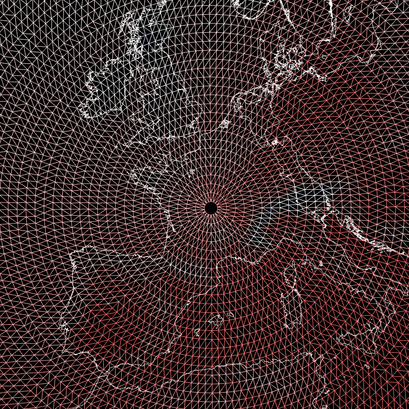
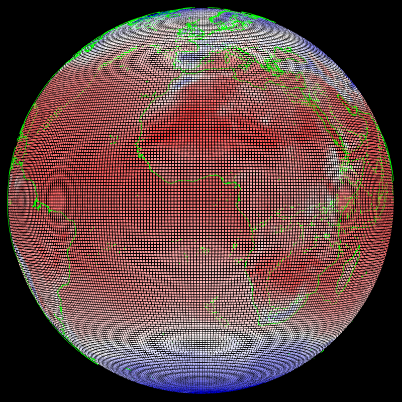
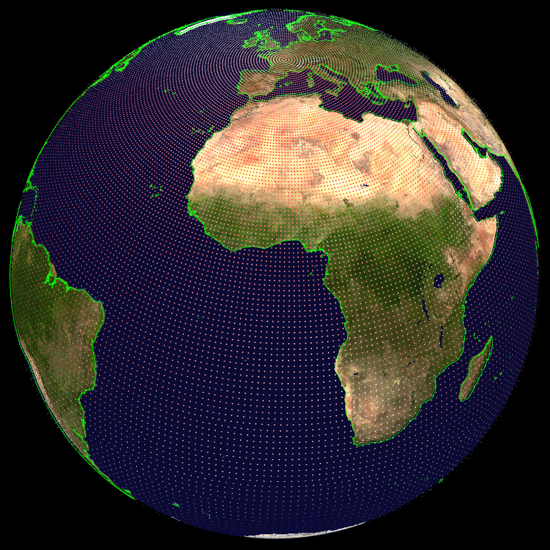
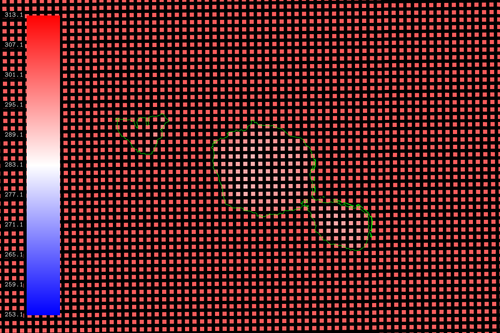

## Gaussian grid wireframe -- gauss_wireframe


```
    --field[0]-{ --path 
    share/glgrib/testdata/wind+temp/t0149c2.2/S105TEMPERATURE.grb 
    --scalar.wireframe.on }- --coast.on --view.lon 2 --view.lat 46.7 
    --view.fov 5 
```
## Scalar field displayed using points -- points_scalar


```
    --field[0]-{ --path 
    share/glgrib/testdata/wind+temp/t0224/S105TEMPERATURE.grb 
    --scalar.points-{ --on --size.value 0.5 --size.variable.on 
    --size.factor.off }- }- --coast.on --coast.lines.color green 
```
## Scalar field with points (stretched/rotated grid) -- points_scalar_rot


```
    --field[0]-{ --scale 1.01 --path 
    share/glgrib/testdata/wind+temp/t0149c2.2/S105TEMPERATURE.grb 
    --scalar.points-{ --on --size.value 0.2 --size.variable.on 
    --size.factor.on }- }- --coast.on --coast.lines.color green 
    --landscape.on 
```
## Polynesie -- polynesie


```
    --field[0].path share/glgrib/testdata/polynesie/SURFTEMPERATURE.grb 
    --view.lat -17.63 --view.lon -149.5 --view.fov 0.2 --coast.lines.color 
    green --coast.on --field[0].scalar.points.on --colorbar.on 
    --render.width 1200 --colorbar.font.color.background black 
```
