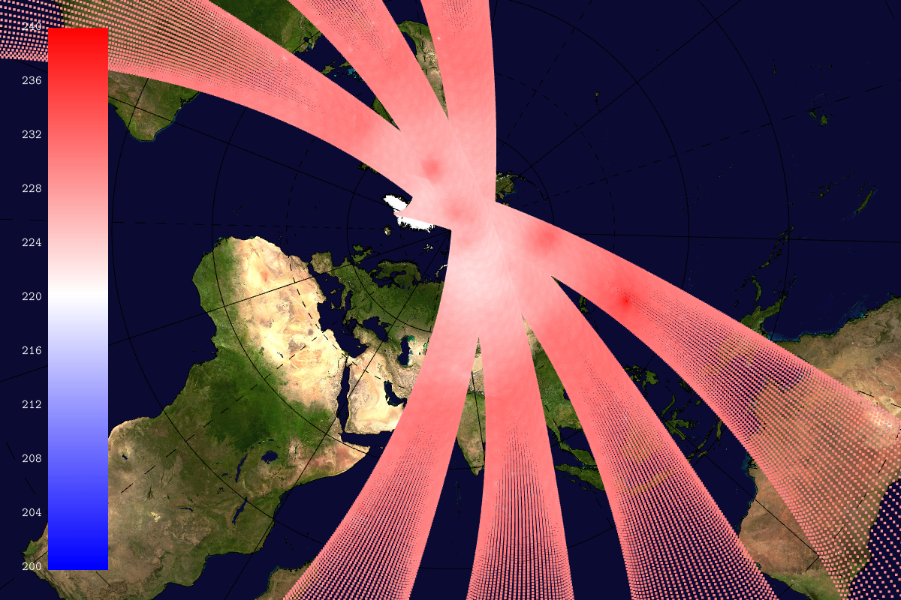
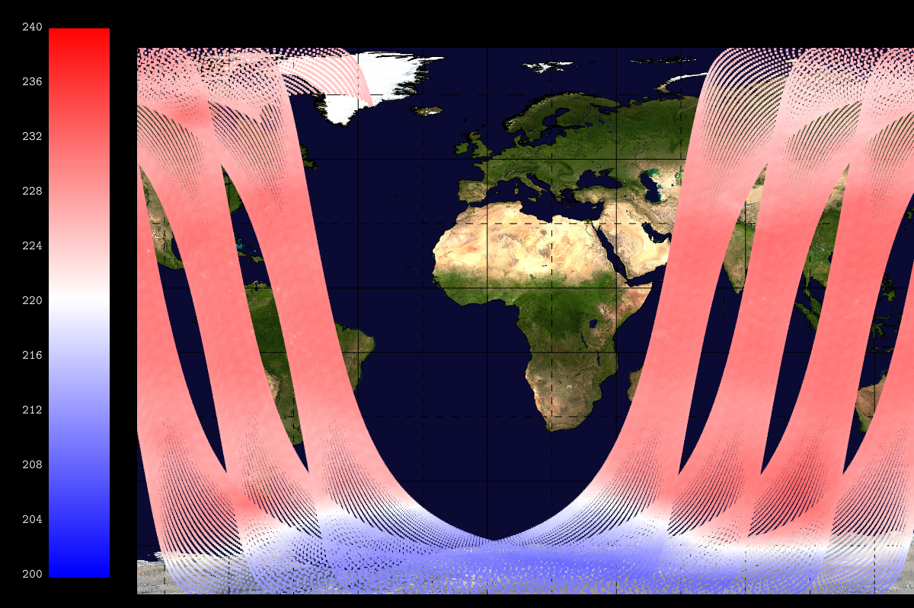

## SSMI satellite data -- ssmigeopoints


```
    --geopoints[0].path share/glgrib/testdata/geopoints/ssmis_light.nc 
    --geopoints[0].on --geopoints[0].points.scale 1.005 
    --geopoints[0].points.palette.name cold_hot --landscape.on 
    --geopoints[0].points.size.value 0.5 --grid.on --grid.color black 
    --coast.on --coast.lines.color black --colorbar.on 
    --geopoints[0].points.palette.min 200 
    --geopoints[0].points.palette.max 240 --geopoints[0].lon col_4 
    --geopoints[0].lat col_3 --geopoints[0].val col_5 --render.width 1200 
    --view.lat -32.736 --view.lon 41.909 
```
## SSMI satellite data (polar projection) -- ssmigeopointspolar


```
    --geopoints[0].path share/glgrib/testdata/geopoints/ssmis_light.nc 
    --geopoints[0].on --geopoints[0].points.palette.name cold_hot 
    --landscape.on --geopoints[0].points.size.value 0.5 --grid.on 
    --grid.color black --coast.on --coast.lines.color black --colorbar.on 
    --geopoints[0].points.palette.min 200 
    --geopoints[0].points.palette.max 240 --geopoints[0].lon col_4 
    --geopoints[0].lat col_3 --geopoints[0].val col_5 --render.width 1200 
    --view.lat 62.577 --view.lon 71.4523 --view.projection POLAR_NORTH 
```
## SSMI satellite data (lat/lon) -- ssmigeopointlatlon


```
    --geopoints[0].path share/glgrib/testdata/geopoints/ssmis_light.nc 
    --geopoints[0].on --geopoints[0].points.palette.name cold_hot 
    --landscape.on --geopoints[0].points.size.value 0.5 --grid.on 
    --grid.color black --coast.on --coast.lines.color black --colorbar.on 
    --geopoints[0].points.palette.min 200 
    --geopoints[0].points.palette.max 240 --geopoints[0].lon col_4 
    --geopoints[0].lat col_3 --geopoints[0].val col_5 --render.width 1200 
    --view.fov 10 --view.lat 5.04296 --view.lon -9.39295 --view.projection 
    LATLON --view.clip.xmin 0.15 
```
