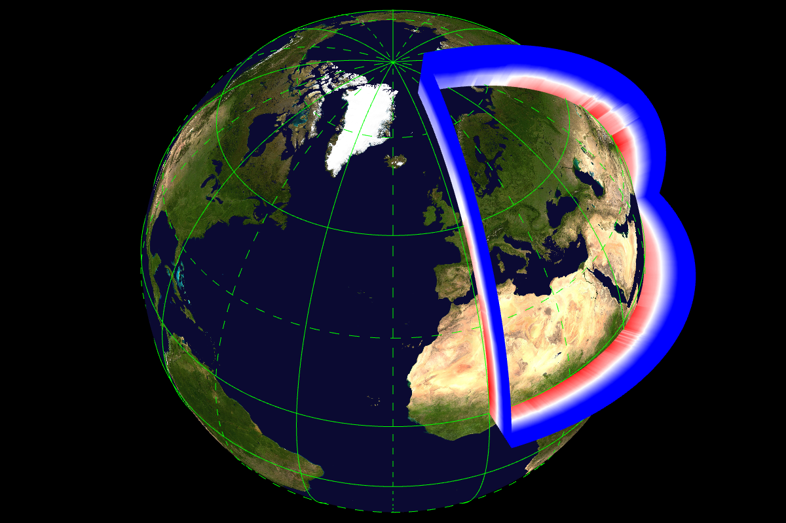
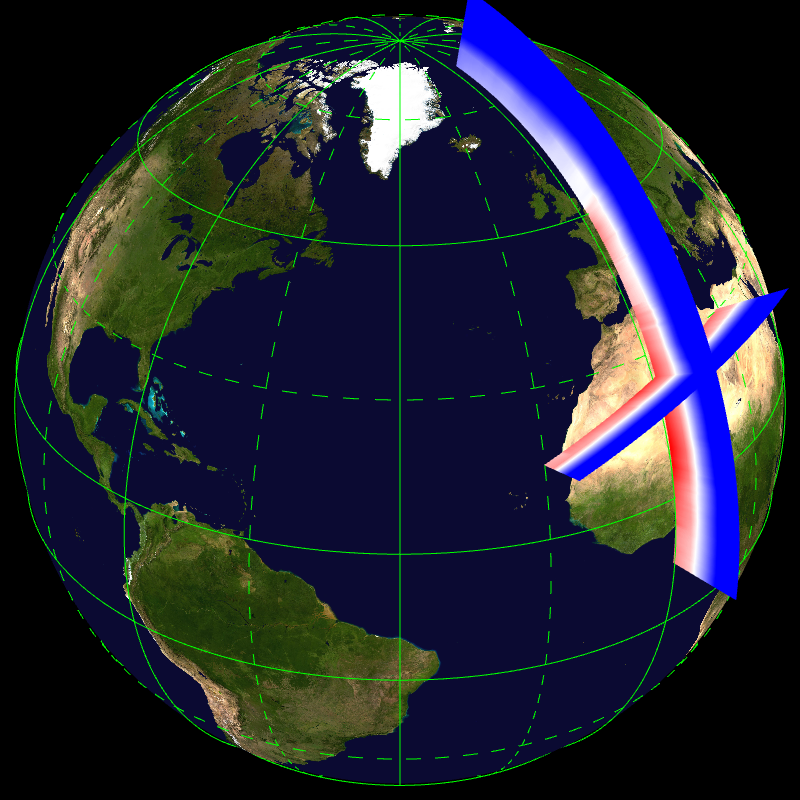
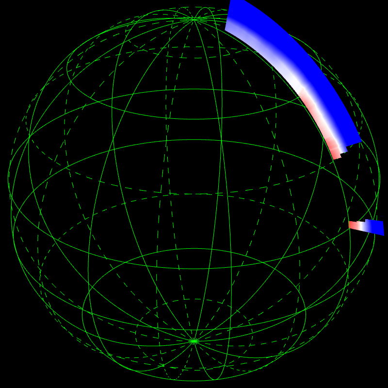
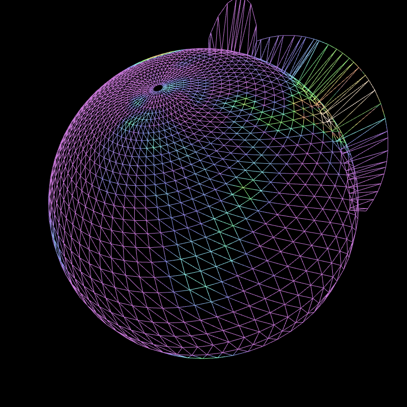

## TKE vertical sections -- glob025verticaltke


```
    --landscape.on --colorbar.on --render.width 1200 --grid.on --view.fov 
    25 --field[0].type VERTICAL --field[0].vertical.lon 0. 30. 60. 90. 
    120. 150. 180. 210. 240. 270. 300. 330. 0. --field[0].vertical.lat +60 
    -60 +60 -60 +60 -60 +60 -60 +60 -60 +60 -60 +60 
    --field[0].vertical.height.constant.on 
    --field[0].vertical.height.constant.levels 0.002 0.05 0.1 0.15 0.20 
    0.25 0.30 --field[0].palette.min 0 --field[0].palette.max 5 
    --field[0].palette.colors #85c68855 #c1afcf #f2bc92 #fef896 #4777ae 
    --field[0].path share/glgrib/testdata/glob025/sfc_20_tke.grib2 
    share/glgrib/testdata/glob025/sfc_500_tke.grib2 
    share/glgrib/testdata/glob025/sfc_1000_tke.grib2 
    share/glgrib/testdata/glob025/sfc_1500_tke.grib2 
    share/glgrib/testdata/glob025/sfc_2000_tke.grib2 
    share/glgrib/testdata/glob025/sfc_2500_tke.grib2 
    share/glgrib/testdata/glob025/sfc_3000_tke.grib2 
```
## Temperature vertical sections -- tempvertical1


```
    --render.width 1200 --landscape.on --grid.on --view.lon -20. 
    --view.lat 45. --field[0].vertical.lon 0. 10. 90. 0. 
    --field[0].vertical.lat 10. 80. 0. 10. 
    --field[0].vertical.height.constant.on 
    --field[0].vertical.height.constant.levels 0 0.05 0.10 0.20 
    --field[0].palette.name cold_hot --field[0].type VERTICAL 
    --field[0].path share/glgrib/testdata/atourx01/pl_1000_t.grib2 
    share/glgrib/testdata/atourx01/pl_850_t.grib2 
    share/glgrib/testdata/atourx01/pl_500_t.grib2 
    share/glgrib/testdata/atourx01/pl_200_t.grib2 
```
## Temperature vectical sections (discontinuous) -- tempvertical2


```
    --landscape.on --grid.on --view.lon 0. --view.lat 45. --field[0].type 
    VERTICAL --field[0].vertical.lon 0. 10. 9999. -20. +20. 
    --field[0].vertical.lat 0. 80. 9999. +20. +30. 
    --field[0].vertical.height.constant.on 
    --field[0].vertical.height.constant.levels 0 0.05 0.10 0.20 
    --field[0].palette.name cold_hot --view.lon -40 --view.lat 30 
    --field[0].path share/glgrib/testdata/atourx01/pl_1000_t.grib2 
    share/glgrib/testdata/atourx01/pl_850_t.grib2 
    share/glgrib/testdata/atourx01/pl_500_t.grib2 
    share/glgrib/testdata/atourx01/pl_200_t.grib2 
```
## Temperature vertical sections (missing values) -- tempvertical3


```
    --grid.on --view.lon -50 --view.lat 30 --field[0].type VERTICAL 
    --field[0].vertical.lon 0. 10. --field[0].vertical.lat 10. 80. 
    --field[0].vertical.height.constant.on 
    --field[0].vertical.height.constant.levels 0 0.05 0.10 0.20 
    --field[0].palette.name cold_hot --field[0].path 
    share/glgrib/testdata/atourx01miss/pl_1000_t.grib2 
    share/glgrib/testdata/atourx01miss/pl_850_t.grib2 
    share/glgrib/testdata/atourx01miss/pl_500_t.grib2 
    share/glgrib/testdata/atourx01miss/pl_200_t.grib2 
```
## Vertical sections (wireframe mode) -- wirevertical


```
    --view.lon 25 --view.lat 5 --view.fov 25 --field[0].path 
    share/glgrib/testdata/t31c2.4/Z.grb --field[0].scalar.wireframe.on 
    --field[1].palette.name cold_hot --field[1].type VERTICAL 
    --field[1].vertical.lon 87. 87. 30. --field[1].vertical.lat 0. 70. 70. 
    --field[1].vertical.wireframe.on --field[1].path 
    share/glgrib/testdata/t31c2.4/Z.grb 
    share/glgrib/testdata/t31c2.4/Z.grb 
```
