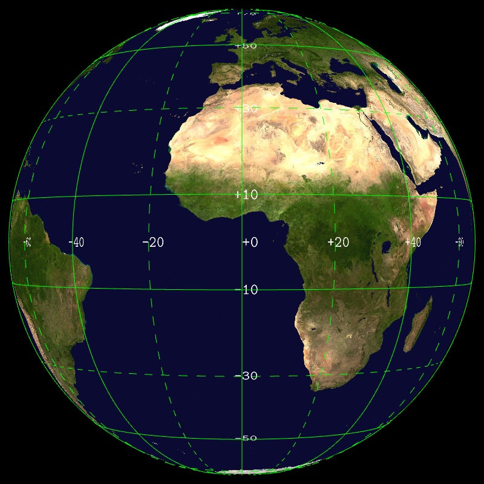
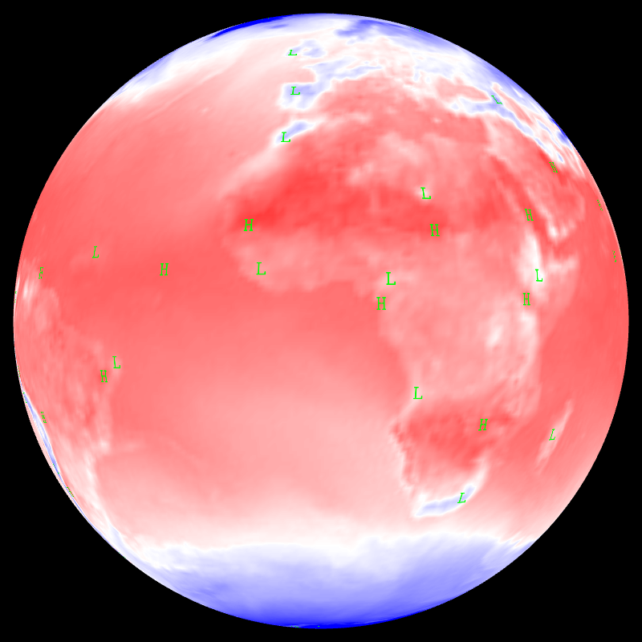
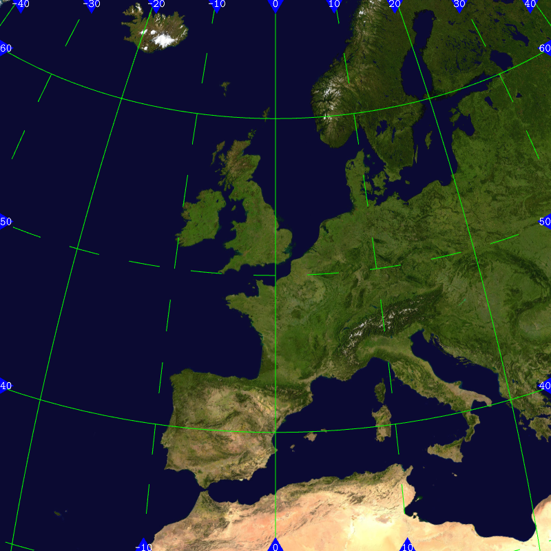

## Grid labels -- grid_labels


```
    --grid.on --grid.labels.on --landscape.on 
```
## Display low & high -- hilo


```
    --field[0].path share/glgrib/data/wind+temp/t0224/S105TEMPERATURE.grb 
    --field[0].hilo.on --field[0].hilo.font.color.foreground green 
```
## Grid ticks & labels -- tickslabels


```
    --landscape-{ --on --scale 0.999 }- --grid-{ --on --resolution 18 }- 
    --ticks-{ --labels.on --labels.font.bitmap.scale 0.02 --labels.format 
    %.0f --lines.on --lines.color blue --lines.width 0.03 --lines.kind 1 
    }- --view.fov 7 --view.lat 50 --view.lon 0 
```
