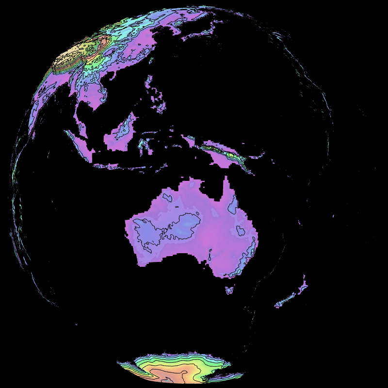
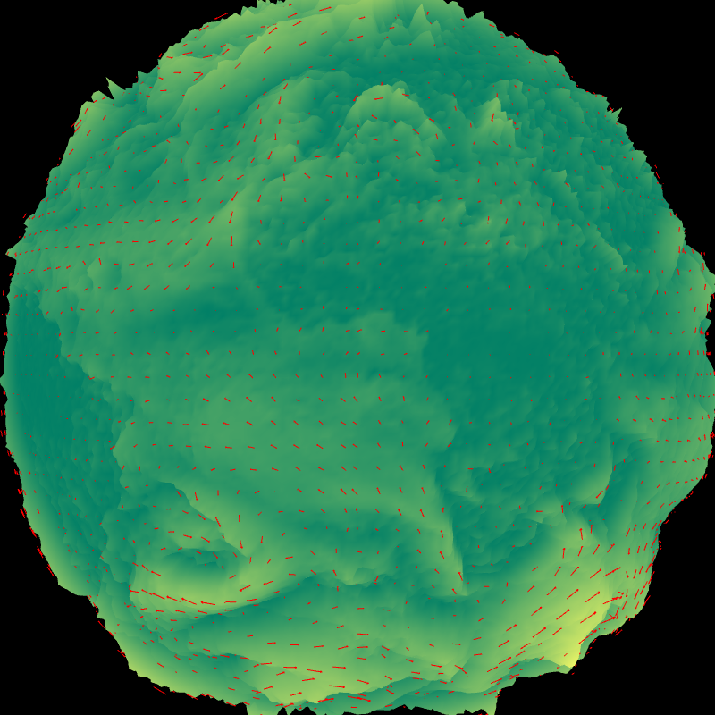
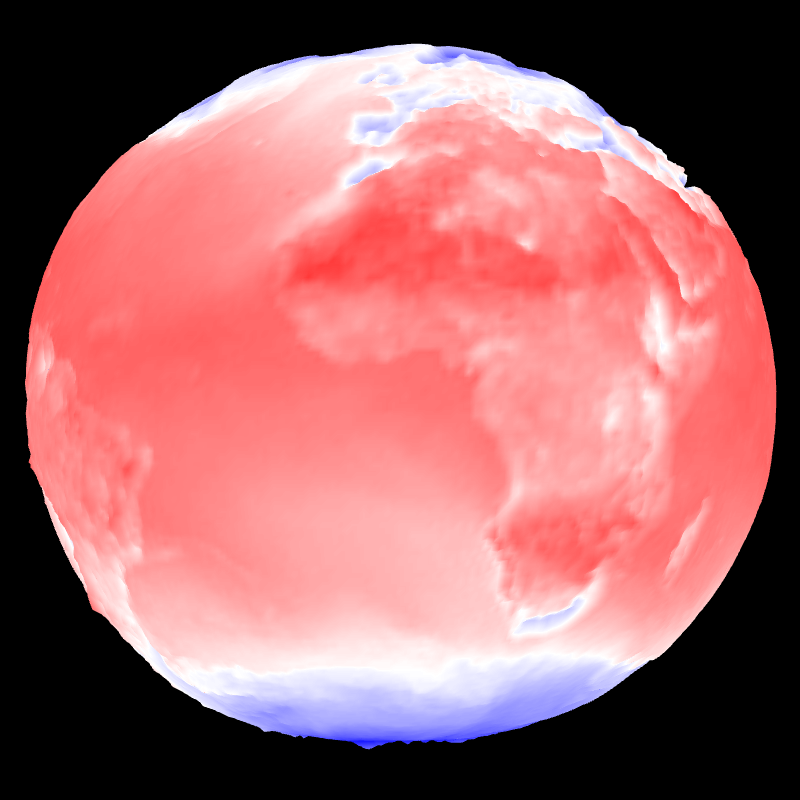

## Orography (raster & contour) with height -- contour_height


```
    --field[0].path share/glgrib/data/t479/Z.grb --field[0].scale 1.005 
    --field[0].type CONTOUR --field[1].geometry.height.on 
    --field[0].palette.colors black --field[1].path 
    share/glgrib/data/t479/Z.grb --field[0].geometry.height.on --view.lat 
    -16 --view.lon 134 
```
## Orography with height -- orography_height


```
    --field[0].path ./share/glgrib/data/t1798/Z.grb 
    --field[0].palette.name topo --field[0].scale 1.005 --landscape.on 
    --field[0].geometry.height.on 
```
## Height = vector norm value -- height_vector


```
    --field[0].type VECTOR --field[0].path 
    share/glgrib/data/wind+temp/t0224/S105WIND.U.PHYS.grb 
    share/glgrib/data/wind+temp/t0224/S105WIND.V.PHYS.grb 
    --field[0].geometry.height.on --field[0].geometry.height.scale 0.2 
    --field[0].vector.arrow.color red --field[0].palette.name summer 
```
## Height = scalar norm value -- height_scalar


```
    --field[0].path share/glgrib/data/wind+temp/t0224/S105TEMPERATURE.grb 
    --field[0].geometry.height.on --field[0].geometry.height.scale 0.2 
    --view.fov 24 
```
