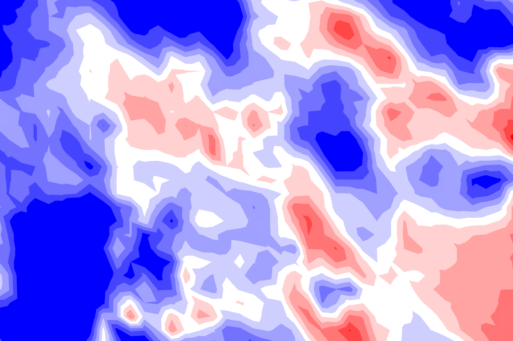
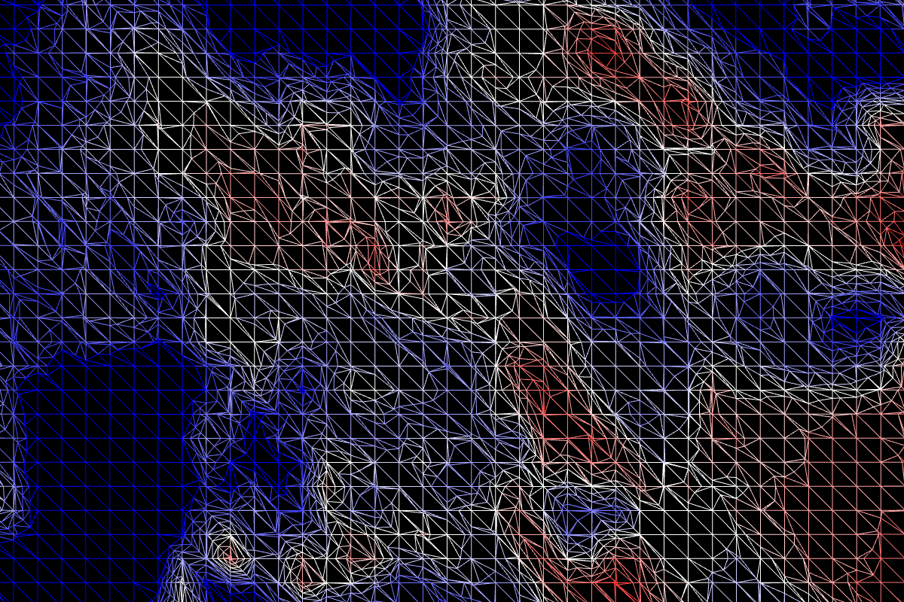
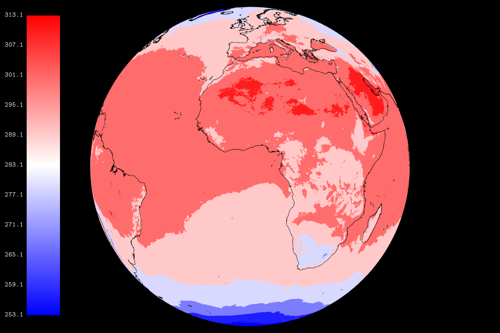
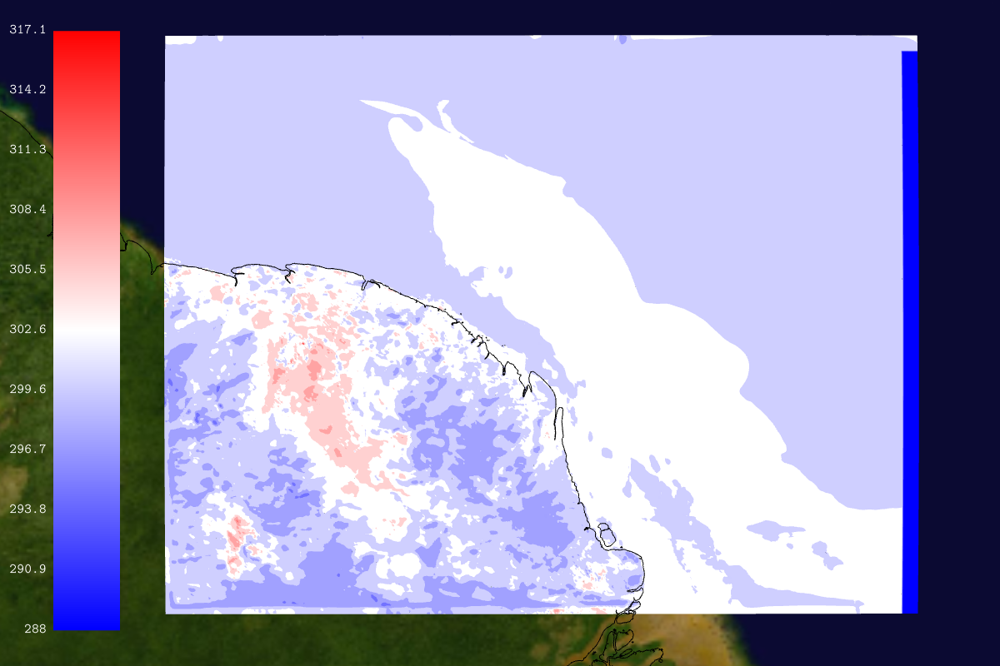
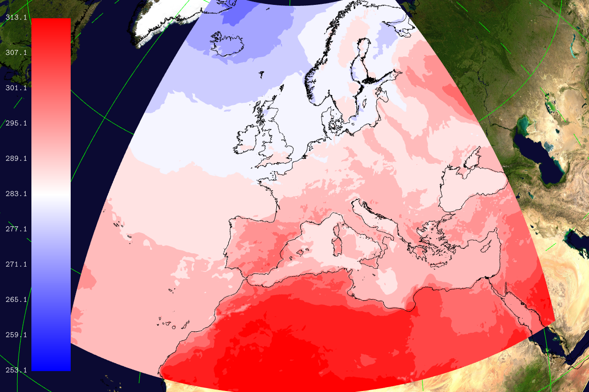

## Isofill test -- isofill


```
    --field[0].path share/glgrib/data/wind+temp/t1798/S105TEMPERATURE.grb 
    --field[0].type ISOFILL --field[0]-{ --palette.min 294 --palette.max 
    296 --user_pref.off --isofill.min 294 --isofill.max 296 --palette.name 
    cold_hot_temp }- --view.lat 2.32 --view.lon 14.12 --view.fov 0.5 
    --render.width 1200 
```
## Isofill test wireframe -- isofillwire


```
    --field[0].path share/glgrib/data/wind+temp/t1798/S105TEMPERATURE.grb 
    --field[0].type ISOFILL --field[0]-{ --scalar.wireframe.on 
    --palette.min 294 --palette.max 296 --user_pref.off --isofill.min 294 
    --isofill.max 296 --palette.name cold_hot_temp }- --view.lat 2.32 
    --view.lon 14.12 --view.fov 0.5 --render.width 1200 
```
## Isofill temperature -- isofilltemp


```
    --field[0].path share/glgrib/data/wind+temp/t1798/S105TEMPERATURE.grb 
    --field[0].type ISOFILL --field[0]-{ --palette.name cold_hot_temp }- 
    --colorbar.on --render.width 1200 --coast.on --coast.lines.color black 
```
## Isofill Lambert -- isofilllambert


```
    --landscape.on --field[0].type ISOFILL --field[0].user_pref.off 
    --field[0].path share/glgrib/data/aro_guyane/SURFTEMPERATURE.grb 
    --field[0].palette.name cold_hot_temp --field[0].scale 1.01 --view.lat 
    5 --view.lon -52 --view.fov 2 --coast.on --grid.on --colorbar.on 
    --render.width 1200 --coast.lines.scale 1.02 --coast.lines.color black 
```
## Isofill latlon -- isofilllatlon


```
    --landscape.on --field[0].type ISOFILL --field[0].path 
    share/glgrib/data/eurat01/lfpw_0_0_0_pl_1000_t.grib2 --field[0].scale 
    1.01 --view.lat 46.7 --view.lon 2 --view.fov 10 --coast.on --grid.on 
    --colorbar.on --render.width 1200 --coast.lines.scale 1.02 
    --coast.lines.color black 
```
