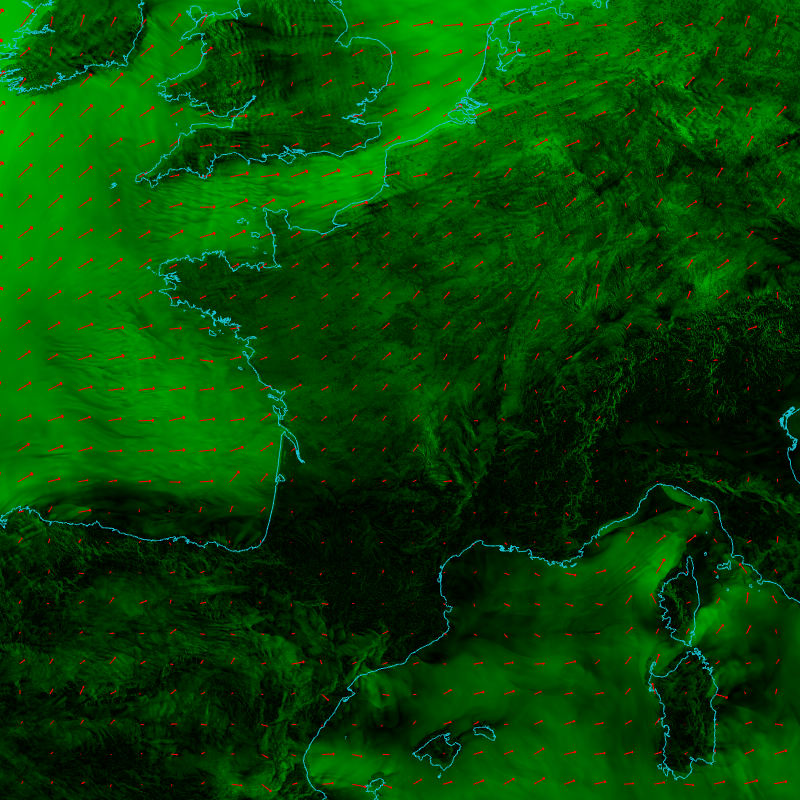
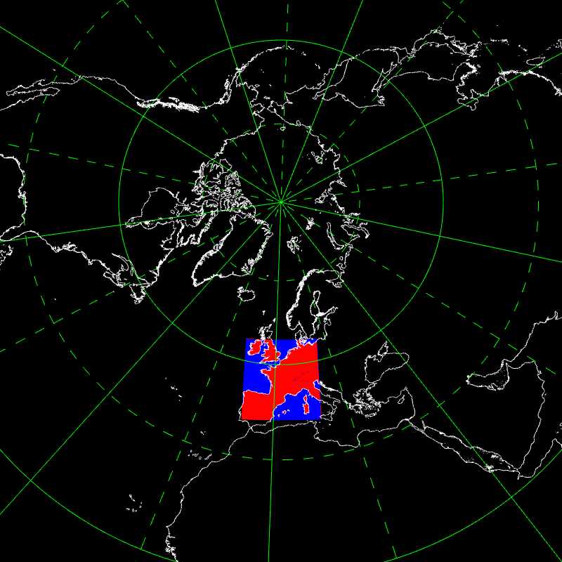

## AROME 1.3km -- arome13


```
    --field[0].path share/glgrib/data/aro1.3/CLSVENT.ZONAL.grb 
    share/glgrib/data/aro1.3/CLSVENT.MERIDIEN.grb --field[0].type VECTOR 
    --view-{ --lon 2 --lat 46.2 --fov 3 }- --field[0].palette.colors black 
    green --field[0].palette.values 0. 20. --field[0].vector.arrow.color 
    red --coast.lines.color cyan --coast.on 
```
## AROME, Lambert geometry -- aro


```
    --field[0].path share/glgrib/data/aro2.5/SURFIND.TERREMER.grb 
    --field[0].palette.name cold_hot --field[0].scale 1.00 --view.lat 46.2 
    --view.lon 2.0 --view.fov 5 --coast.on --grid.on 
```
## AROME, Lambert geometry, polar stereo -- aro_polar


```
    --field[0].path share/glgrib/data/aro2.5/SURFIND.TERREMER.grb 
    --field[0].palette.name cold_hot --field[0].scale 1.00 --view.lat 46.2 
    --view.lon 2.0 --view.fov 5 --coast.on --grid.on --view.projection 
    POLAR_NORTH --view.lat 70 --view.fov 12 
```
