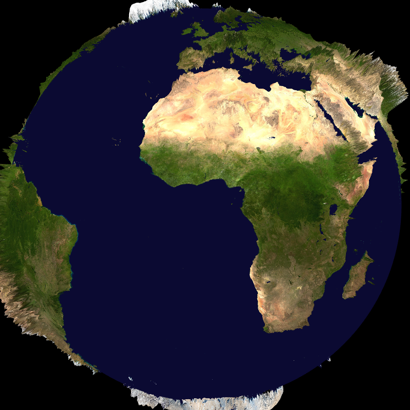

## Landscape over Europe only -- landscape_eurat01


```
    --landscape.on --landscape.grid.path 
    share/glgrib/data/eurat01/lfpw_0_0_0_pl_1000_t.grib2 --coast.on 
    --grid.on 
```
## Display landscape in WebMercator projection -- webmercator


```
    --landscape-{ --on --path 
    ./share/glgrib/landscape/WebMercator_00006_00021_00028_00037_00035.ORTHOIMAGERY.ORTHOPHOTOS.bmp 
    --projection WEBMERCATOR }- --grid.on 
```
## Landscape with orography (T479) -- land_orography


```
    --landscape.on --landscape.grid.path ./share/glgrib/data/t479/Z.grb 
    --landscape.geometry.height.on --landscape.geometry.height.scale 0.2 
    --landscape.geometry.height.path ./share/glgrib/data/t479/Z.grb 
    --landscape.flat.off 
```
