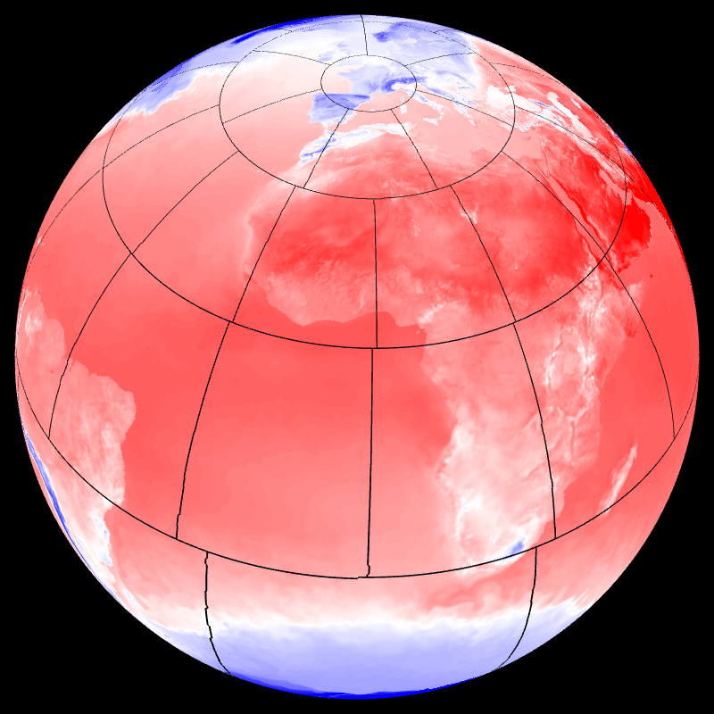
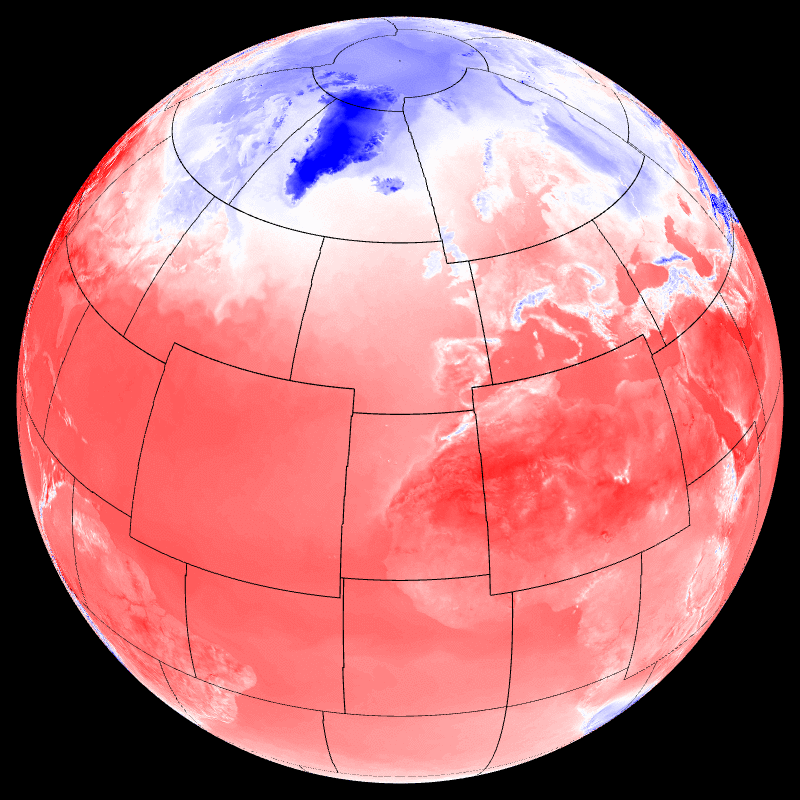
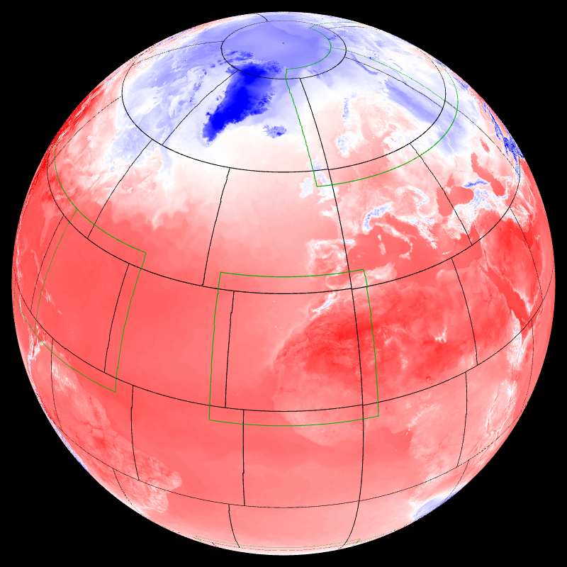
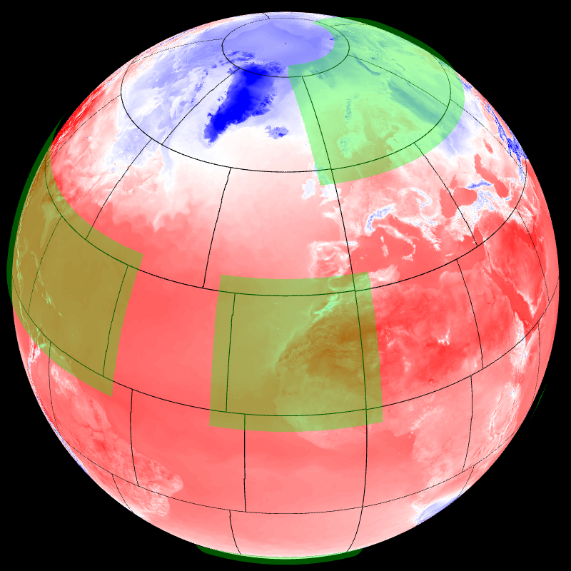
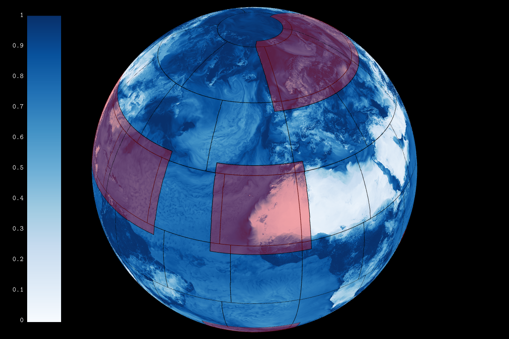

## Display sphere partitionning (t1198) -- myproc


```
    --field[0].scalar.discrete.on --field[0].path 
    share/glgrib/testdata/discrete/MYPROC.grb --field[0].palette.colors 
    green --field[0].scalar.discrete.missing_color black 
    --field[0].palette.colors #00000000 --field[1].path 
    share/glgrib/testdata/discrete/SURFTEMPERATURE.grb --field[1]-{ 
    --palette.max 313.15 --palette.min 253.15 --palette.name cold_hot_temp 
    }- --view.lat 36 --view.lon -15 
```
## Display sphere partitionning (t1192c2.2) -- myproc22


```
    --field[0].scalar.discrete.on --field[0].path 
    share/glgrib/testdata/discrete_stretched/MYPROC.grb 
    --field[0].palette.colors green 
    --field[0].scalar.discrete.missing_color black 
    --field[0].palette.colors #00000000 --field[1].path 
    share/glgrib/testdata/discrete_stretched/SURFTEMPERATURE.grb 
    --field[1]-{ --palette.max 313.15 --palette.min 253.15 --palette.name 
    cold_hot_temp }- 
```
## MPI view -- mpiview


```
    --field[0].path share/glgrib/testdata/discrete/SURFTEMPERATURE.grb 
    --field[0].mpiview.on --field[0].mpiview.path 
    share/glgrib/testdata/discrete/MYPROC.grb --field[0].mpiview.scale 0.2 
    --view.lon 31 --view.lat 41 
```
## MPI halo -- mpihalo


```
    --field[0].scalar.widen.on --field[0].scalar.widen.values 34.0 16.0 
    9.0 43.0 44.0 59.0 6.0 48.0 --field[0].scalar.widen.radius 20 
    --field[0].scalar.discrete.on --field[0].path 
    share/glgrib/testdata/discrete/MYPROC.grb --field[0].palette.colors 
    green --field[0].scalar.discrete.missing_color black 
    --field[0].palette.colors #00000000 --field[1].path 
    share/glgrib/testdata/discrete/SURFTEMPERATURE.grb --field[1]-{ 
    --palette.max 313.15 --palette.min 253.15 --palette.name cold_hot_temp 
    }- --view.lat 36 --view.lon -15 
```
## MPI transpositions -- mpitrans


```
    --field[0].scalar.discrete.on --field[0].path 
    share/glgrib/testdata/discrete/MYPROC.grb 
    --field[0].scalar.discrete.missing_color black 
    --field[0].palette.colors #00000000 --field[1].path 
    share/glgrib/testdata/discrete/SURFTEMPERATURE.grb --field[1]-{ 
    --palette.max 313.15 --palette.min 253.15 --palette.name cold_hot_temp 
    }- --view.lat 36 --view.lon -15 
```
## MPI halo -- mpihalo1


```
    --field[0].scalar.discrete.on --field[0].path 
    share/glgrib/testdata/discrete/MYPROC.grb 
    --field[0].scalar.discrete.missing_color black 
    --field[0].palette.colors #00000000 --field[1].scalar.widen.on 
    --field[1].scalar.widen.merge.on --field[1].scalar.widen.merge.value 
    -1 --field[1].scalar.widen.values 0 2 3 75 68 29 70 32 28 73 51 30 
    --field[1].scalar.widen.radius 20 --field[1].scalar.discrete.on 
    --field[1].path share/glgrib/testdata/discrete/MYPROC.grb 
    --field[1].scalar.discrete.missing_color #00aa00ff 
    --field[1].palette.colors #00000000 --field[1].scale 1.001 
    --field[2].path share/glgrib/testdata/discrete/SURFTEMPERATURE.grb 
    --field[2]-{ --palette.max 313.15 --palette.min 253.15 --palette.name 
    cold_hot_temp }- --view.lat 36 --view.lon -15 
```
## MPI halo -- mpihalo2


```
    --field[0].path share/glgrib/testdata/discrete/SURFTEMPERATURE.grb 
    --field[0]-{ --palette.max 313.15 --palette.min 253.15 --palette.name 
    cold_hot_temp }- --field[1].scalar.widen.on 
    --field[1].scalar.widen.merge.on --field[1].scalar.widen.values 0 2 3 
    75 68 29 70 32 28 73 51 30 --field[1].scalar.widen.radius 20 
    --field[1].path share/glgrib/testdata/discrete/MYPROC.grb 
    --field[1].palette.colors #00000000 #00ff0055 
    --field[1].palette.values 0 1 80 --field[1].scale 1.02 
    --field[2].scalar.discrete.on --field[2].path 
    share/glgrib/testdata/discrete/MYPROC.grb 
    --field[2].scalar.discrete.missing_color black 
    --field[2].palette.colors #00000000 --field[2].scale 1.01 --view.lat 
    36 --view.lon -15 
```
## MPI halo -- mpihalo3


```
    --field[0].path share/glgrib/testdata/t1798c2.2/SFX.HU2M.grb 
    --field[1].scalar.discrete.on --field[1].path 
    share/glgrib/testdata/discrete/MYPROC.grb 
    --field[1].scalar.discrete.missing_color black 
    --field[1].palette.colors #00000000 --field[1].scale 1.001 
    --field[2].palette.colors #00000000 #ff000055 
    --field[2].palette.values 0 1 80 --field[2].path 
    share/glgrib/testdata/discrete/MYPROC.grb 
    --field[2].scalar.discrete.missing_color black 
    --field[2].scalar.discrete.on --field[2].scalar.widen.merge.on 
    --field[2].scalar.widen.merge.value -1 --field[2].scalar.widen.on 
    --field[2].scalar.widen.radius 20 --field[2].scalar.widen.values 0 2 3 
    75 68 29 70 32 28 73 51 30 --field[2].scale 1.002 --view.lat 36 
    --view.lon -15 --colorbar.on --render.width 1200 
```
