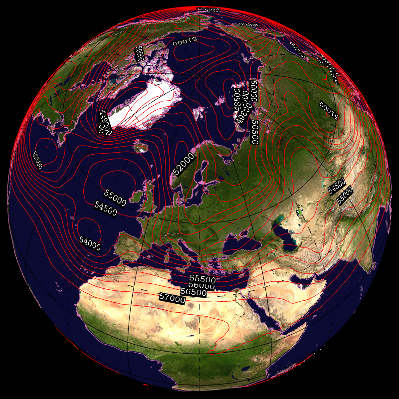
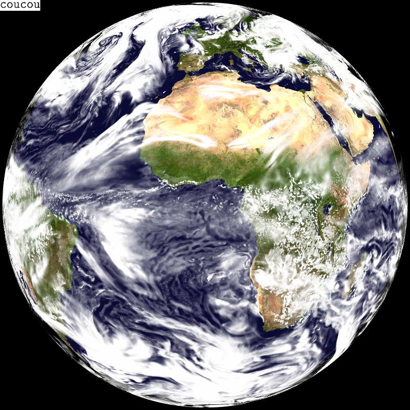
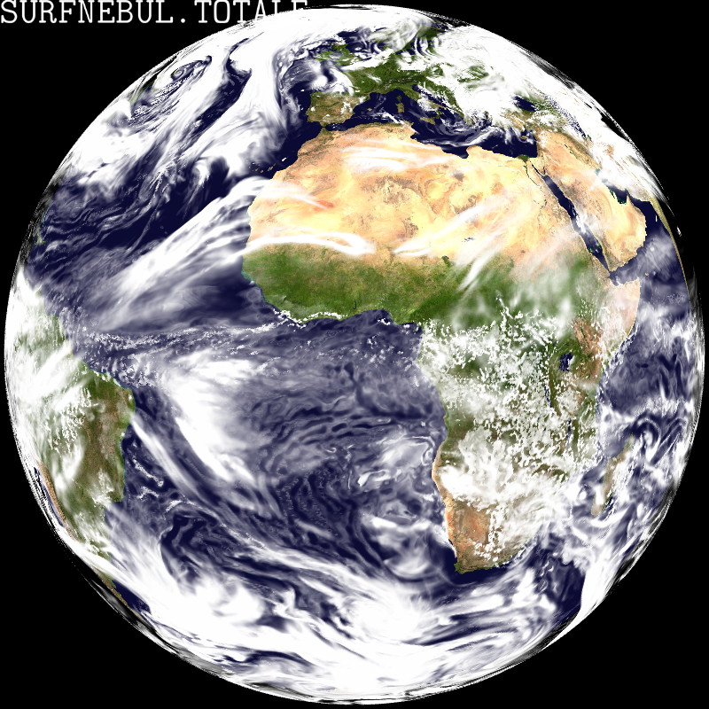
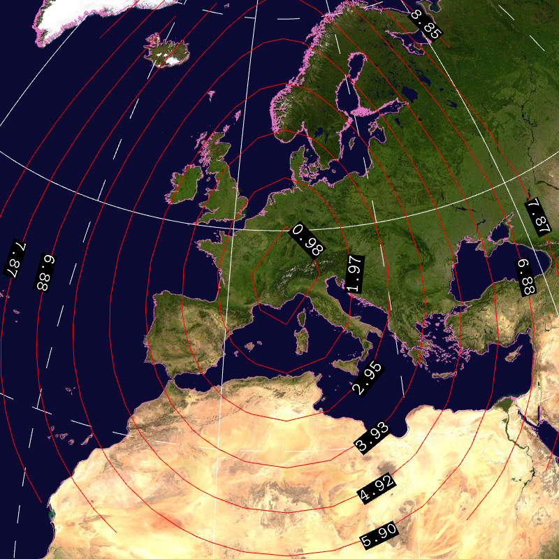

## Contour with labels -- contourlabels2


```
    --landscape.on --field[0].path share/glgrib/data/z500.grb 
    --field[0].scale 1.01 --field[0].type CONTOUR --view.lat 56 --view.lon 
    20 --field[0].contour.labels.on --grid.on --grid.color black 
    --field[0].palette.colors red --field[0].contour.levels 48000 48500 
    49000 49500 50000 50500 51000 51500 52000 52500 53000 53500 54000 
    54500 55000 55500 56000 56500 57000 57500 --field[0].contour.labels-{ 
    --font.color.foreground white --font.color.background black 
    --font.bitmap.scale 0.04 --format %.0f }- --coast.on 
    --coast.lines.color pink 
```
## Font background color -- background


```
    --landscape.on --landscape.grid.path share/glgrib/data/t1198c2.2/Z.grb 
    --field[0].path share/glgrib/data/t1198c2.2/N.grb --field[0].scale 
    1.03 --scene.date.on --scene.date.font.bitmap.scale 0.03 
    --scene.date.font.color.foreground red 
    --scene.date.font.color.background white 
```
## Display text -- text


```
    --landscape.on --landscape.grid.path share/glgrib/data/t1198c2.2/Z.grb 
    --field[0].path share/glgrib/data/t1198c2.2/N.grb --field[0].scale 
    1.03 --scene.text.on --scene.text.s coucou --scene.text.x 0.0 
    --scene.text.y 1.0 --scene.text.a NW --scene.text.font.bitmap.scale 
    0.03 --scene.text.font.color.foreground black 
    --scene.text.font.color.background white 
```
## Display title (field name) -- title


```
    --landscape.on --landscape.grid.path share/glgrib/data/t1198c2.2/Z.grb 
    --field[0].path share/glgrib/data/t1198c2.2/N.grb --field[0].scale 
    1.03 --scene.title.on 
```
## Contour with labels (dummy field) -- contourlabels


```
    --landscape.on --field[0].path 
    share/glgrib/data/contour/latlon18x13.grb --field[0].scale 1.03 
    --field[0].type CONTOUR --view.lat 45.65 --view.lon 6.39 
    --field[0].contour.labels.on --grid.on --view.fov 10 --grid.color 
    white --field[0].palette.colors red --field[0].contour.labels-{ 
    --font.color.foreground white --font.color.background black }- 
    --coast.on --coast.lines.color pink 
```
